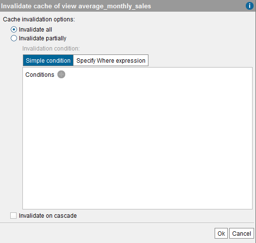
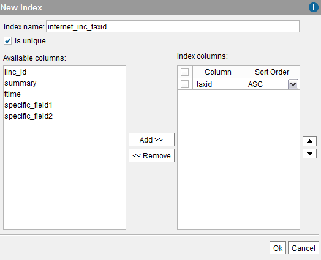

===============================
Configuring the Cache of a View
===============================

Before enabling the cache in a specific view, you have to enable the
cache module in the Server (see section :ref:`Configuring the Cache`).

To enable the cache of a view, open the view, click **Options** and
select one of the following cache modes:

-  **Partial**. When a query is executed against the view, the Server
   checks if the cache contains the data required to answer the query.
   If not, it queries the data source directly.
-  **Full**. The Server assumes that the cache contains all the tuples
   of the view. Therefore, queries on this view will always use the
   cached data and will never “hit” the data source. The data source
   will be only accessed for refreshing cache data. The cache is always
   loaded explicitly, meaning that you need to execute query to load the
   cache.
-  **Full incremental**. With this mode, the queries to this view will
   be “incremental queries”. That is, the queries to this view merge the
   results obtained from the cache with the most recent data retrieved
   from the source. The main benefit of this mode is that the queries
   will always return fully up to date results without needing to
   retrieve the full result set from the data source, just the rows that
   are added/changed since the last cache refresh.
   
   To be able to use this mode, the view has to have a field that contains when a row was last inserted/updated. 
   For example, if the view has a field ``last_modified_date``, you have to enter a condition like   
   ``last_modified_date > '@LASTCACHEREFRESH'``.  

   When executing the query, the variable ``@LASTCACHEREFRESH`` is replaced with the timestamp of the last time a query to load the cache was executed and finished successfully.

   As it is a variant of the full mode, unlike with partial mode, the cache of the view still needs to be loaded explicitly (i.e. you have to execute a query with the appropriate parameters to load the cache).
   
   .. warning:: The incremental mode has several requirements and limitations that you need to be aware of.
      The section :ref:`Incremental Mode` lists them. 
   

The section :ref:`Cache Modes` explains in detail how these cache modes
work.

|

**Time to Live (seconds)** is the *Time to live* in seconds of the
entries stored in the view’s cache. Once this limit is reached, these
entries expire and the next query will retrieve the data from the data
source, instead of from the cache. If you select **Never expire**, the
Server will never invalidate the entries stored in the cache. However,
you still can invalidate the cache manually by clicking on **Invalidate
cache**.

The **Default** time to live is the Time to live defined for the
database in the “Cache configuration” dialog of the database
(Administration > Database Management dialog). If the database does not
set the “Time to live”, the cache module uses the global value of this
property, which is defined in the “Cache” tab of the Server
Configuration dialog.

|

The rows obtained from the source are inserted in cache in batches. The
**Batch insert size (rows)** determines the number of rows per batch.
The **Default** value is the Batch size defined for the database in the
“Cache configuration” dialog of the database (Administration > Database
Management dialog). If the database does not set the “Batch size”, the
cache module uses the global value of this property, which is defined in
the “Cache” tab of the Server Configuration dialog.

   Cache settings: invalidating the cache of a view

The entries of the cache of a view expire when they reach their Time to
live. However, you can invalidate these entries manually. To do it,
click on **Invalidate cache** and select the following options:

-  **Invalidate all**. Remove all the cache content for the view.
-  **Invalidate partially**. Remove only the entries that match the
   condition in the **Edit condition** dialog.
-  **Invalidate on cascade**. If selected, the cache module also
   invalidates the cache of the subviews of this view.
   This option is disabled for views with “Full” cache mode. In
   addition, if you invalidate on cascade a view, the cache of the
   subviews whose cache mode is “Full” will not be invalidated.

See the section :ref:`Invalidate Cache` for information about invalidating
the cache content of more than one view at a time.

.. _administration_guide_cache_indexes:

Cache Indexes
=================================================================================

When enabling the cache for a view, the Cache Module creates a table in
the cache’s database that will store the cached data of this view. You
can define “Cache indexes” for this view to speed up the retrieval of
data from the view’s cache.

The difference between the cache indexes and the indexes defined in the
“Indexes” tab is that the latter ones represent the indexes defined in
the source. The cache module actually creates the “Cache indexes” in the
cache’s database, when they are defined in this tab.

When the cache is enabled for a view and its cache mode is “Full”, the
indexes propagated to its derived views and to the ODBC and JDBC
clients, are the “Cache indexes” and not the indexes defined in the
“Indexes” tab. That is because the queries of the view will always
retrieve the data from the cache and not from the source.

|

To create a cache index, follow these steps:

#. If the view has indexes (see the “Indexes” tab), you can replicate them
   in the table that will store the view’s cached data, by clicking on
   **Import indexes from view**.
   
   Note that the indexes will not be created until you click **Ok** to
   close the dialog.

#. To define more indexes in the cache table, click **Add index** and
   follow these steps:

   a. Enter the name of the index.
   
      .. note:: Depending on the database you are using to store the cache,
         the name of the index may need to be unique across the entire Virtual
         DataPort database and not just the view you are editing. That is
         because some databases do not allow defining two indexes with the
         same name, even if they are defined over different tables.
         
   b. Select **Is unique** if the index represents a unicity index.
   
   c. In the left side of the dialog, there is a list of the fields of the
      view. Select the ones that belong to the index and click **Add >>**.
      To select several fields at once, hold Ctrl or Shift and click on the
      fields you want to select.
      
      To change the order of the fields in the index, select the check box
      of the field you want to move and click on |image1| and |image2|.
   
      To remove a field from the index, select its check box in the list of
      the right side and click **<< Remove**.

   d. Click **Ok** to create the index.
      
      
#. To edit a cache index, select its check box and click **Edit selected
   index**.

#. To remove a cache index, select its check box and click **Remove
   selected index**.

.. _

   Cache settings: defining a new "cache index"

.. |image2| image:: ../../common_images/icon-black-arrow-up.gif

