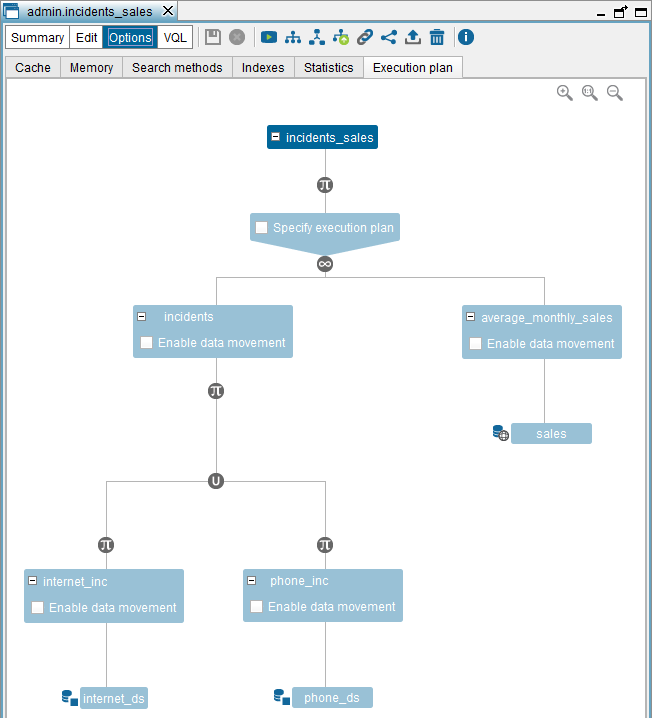

==========================
Editing the Execution Plan
==========================

A key aspect of query optimizations in Virtual DataPort is the execution
strategy of the join operations involved in the query

As described in the section :ref:`Creating Join Views`, when creating a join
view you can specify its execution strategy in the “Join Conditions” tab
of the wizard. The execution strategy of a join operation has two
parameters (see section :ref:`Optimizing DF Data Sources` for more details):

-  Execution method:

   -  Merge
   -  Hash
   -  Nested
   -  Or, nested parallel.

-  Order in which the input views are considered. If **Ordered** is
   selected, the view in the left side of the Execution Plan tree is
   considered the first view. If **Reverse order** is selected, the view in
   the right side is considered the first view of the join.

For these parameters, if you select ``ANY``, the Server selects the
option that considers appropriate.

**Example**: Suppose there is a join view ``V3`` with attributes ``A``,
``B`` and ``C``. Its input views are ``V1`` (with attributes ``A`` and
``B``) and ``V2`` (with attributes ``B`` and ``C``).

Let us also suppose that queries on ``V3`` are using the ``nested``
execution method. Common optimization practice on using this execution
method involves ordering the input relations so that the first is the
one to provide least tuples to the join operation.

In our example, suppose that the number of input tuples to the join from
``V1`` is normally less than that of ``V2`` and, therefore, ``V3`` is
usually queried by considering ``V1`` as the first relation.

Now suppose that you want to create a new view ``V4`` that is a
selection view on ``V3`` by applying the condition ``C= C``. Also,
suppose that there are few tuples in ``V2`` that verify this condition.
Then, on running a query on ``V4``, the most common situation will be
for the join view ``V3`` to be given less tuples from ``V2`` than from
``V1``. Therefore, when ``V4`` is run, ``V2`` should be considered the
first relation, unlike the general case where the opposite is sought.

To deal with these cases, in any derived view ``V`` it is possible to
define the preferred run strategy for each join view involved in its
definition. These strategies will only be used to run queries on ``V``
and will not overwrite the default execution preferences of these join
views.

   Editing the Execution Plan of a view

If you change the execution plan of ``V``, the execution plan of its
subviews or its derived views does *not* change.

To edit the execution plan of a derived view, open the “Options” dialog
of the view and click the **Execution plan** tab. The Tool will display
the execution plan of the view. The :ref:`Editing the Execution Plan of a
view` shows the execution plan of the view
``inc_grouped_by_pref_clients`` created in the section :ref:`Creating Selection
Views`.

This dialog displays the view definition tree. For each join operation,
you can select the **Specify execution plan** check box to enable the
two boxes and select the execution method and the order of the input
view. If **ANY** is selected, the Server will use its internal cost
information to choose the best strategy.

.. note:: Virtual DataPort can also configure the execution plan
   preferences for a specific query using the VQL ``CONTEXT`` clause (see
   section :ref:`Context clause` of the VQL Guide.
