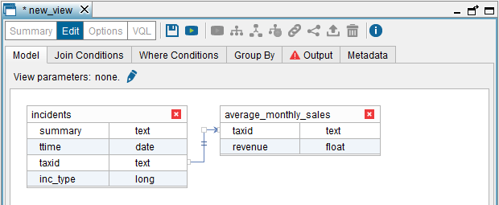
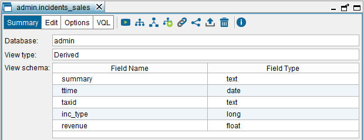

===================
Creating Join Views
===================

A join view executes the relational algebra operation JOIN on a series
of input views. These views can belong to different databases.

To create a join view, click **Join** on the **File** > **New** menu or,
right-click the Server Explorer and click **Join** on the menu **New**.

The Tool will open the “Join view” dialog and it will add the view that
is currently selected in the Server Explorer. To add more views to the
join view, click the **Model** tab and drag the views from the Server Explorer to this tab.

You can join more than two views in the same join view.

In our example, we will join the view ``incidents`` created in the
previous section and the Web service view ``average_monthly_sales``,
created in the section :ref:`Creating Base Views from a SOAP Web Service`.

|

The “Join view” dialog has six tabs:

1. **Model**: drag the views that will form the join.

   You can define simple join conditions graphically, by linking a field
   of one view with another field of the other view. To configure the
   operator used in the condition, double-click the arrow that joins both
   fields and select the appropriate operator. To add more complex join
   conditions, go to the “Join Conditions” tab.
   
   To define a cross join, just drag the views into the dialog and do not
   link any field.
   
   In this tab, you can add “View parameters”. See more about this in the
   section :ref:`Parameters of Derived Views`.

#. **Join Conditions**: tab where you can define the join strategy and the
   join conditions:

   a. Configure the join strategy. To do this, click on the icon |image0| 
      located between the names involved in the join. The options
      are:

      i. **Join type**: Inner, Left outer, Right outer and Full.
      
      #. **Execution method**: Hash, Merge, Nested and Nested parallel. If you
         select nested parallel, you have to provide the maximum number of
         parallel subqueries (“Nested parallel number”).
         If you select the option “Any” method, the Server will try to select
         the best suitable join method.
           
      #. **Order in which the input views are considered**. If it is “Ordered”, the
         view on the left of the join will be considered the first view.
           
      #. If you want to define a join condition between a field of a simple type
         (int, long, etc.) and a subfield of a compound type, the subfield of the
         compound type has to be placed in the left side of the join condition.
      
         For example, let us say that you want to create a join view with these
         two views:
           
         1. ``view_a``, which has a field ``f1`` of type ``int``
         #. ``view_b``, which has a field ``f2`` of type ``array``. This
            ``array`` has two ``int`` subfields: ``f2_a`` and ``f2_b``.
           
         If you want the join condition to be ``f1 = f2_b``, you have to
         define the join condition as
         ``... JOIN ... ON (f2).f2_b = f1`` That is, the subfield of the
         array must be placed on the left side of the join condition.
      
      .. note:: These preferences may have a significant impact on the
         performance of queries. Read the section :ref:`Optimizing Join Operations`
         for more information about this.

   b. Edit the join conditions added in the “Model” tab, by clicking on
      them.
      
      Click **Add new condition** to define a new join condition and **Add
      cross join** to define a cross join between two views.
      
      In simple scenarios, you can define join conditions and cross joins
      graphically from the “Model” tab. However, in complex situations you
      need to define these from the “Join Conditions tab”:
   
      
      i. By default, the conditions added with the “New Join Condition” dialog
         are added to the most internal join that contains all the fields of
         the condition.
        
         In complex joins, you may need to specify to which join the new
         condition belongs. To do that, from the “New Join Condition” dialog,
         select the check box at the bottom and select the views involved in
         the target join.
      
   
      #. From the “Model” tab, you cannot specify a join between a view and the
         result of a cross join of two views. E.g.:
         
         .. code-block:: sql
         
            (view_a CROSS JOIN view_b) INNER JOIN view_c ON view_a.field1 = view_c.fieldA
           
         To create this view, follow these steps:
   
         1.  Drag the three views into the “Model” tab.
         2.  In the “Join Conditions” tab, click **Add cross join**, select
             ``view_a`` and ``view_b`` and click **Ok**.
         3.  Click **Add join condition** and enter the condition
             ``view_a.field1 = view_c.fieldA``. Then, select the check box at the
             bottom of the dialog. In the **Left subview** list, select
             ``(view_a CROSS JOIN view_b)`` and in **Right subview**, ``view_c``.
         
   The section :ref:`Join Conditions with Similarity Operators` explains the
   meaning of the operator ``~``.

   .. note::
     To create Cross Join views, you just have to drag the views
     into the “Model” tab and do not define any join condition in the “Model”
     tab, the “Join” tab or the “Where condition” tab.
  
   .. note::
      Do not use fields that are “View parameters” in the join conditions.

3. **Where Conditions**: tab that allows you to add WHERE conditions to the
   definition of the view.
  
  
4. **Group By**: tab that allows you to add GROUP BY attributes to the
   view.
  
  
5. **Output**: tab that allows you to configure the output of the view.
   That is, renaming the view and its fields, add derived attributes,
   define the primary key of the view, etc.
  
  
6. **Metadata**: tab that allows you to define the folder where the new
   view will be stored and provide a description for the new view.
  

The tabs **Where Conditions**, **Group By**, **Output** and **Metadata**
work in the same way as in the Union view dialog. The section :ref:`Creating
Union Views` explains in more detail how to use them.

   Constructing the incidents and average_monthly_sales join view ("Model" tab)

In our example:

-  Click on **Join** on the menu **File** > **New**.

-  Drag the views ``incidents`` and ``average_monthly_sales`` to the
   “Model” tab.

-  Add the join condition ``incidents.taxId=average_monthly_sales.taxId``
   by dragging the name of the field ``taxId`` of one of the tables, to the
   field ``taxId`` of the other table.

-  In the “Output” tab:

   -  Rename the view to ``incidents_sales``.
   -  Remove the field ``incidents.taxId``. To do this, select this field
      and click on **Remove selected**.
    

After this, click **Save** (|image2|) to create the view. Then, the
Tool will display the schema of the new view.

   Schema of the incidents_sales join view

Join Conditions with Similarity Operators
=================================================================================

Virtual DataPort supports join conditions that use the similarity
operator. This operator returns a value between ``0`` and ``1`` that
estimates the similarity between the operands using a certain algorithm.
As well as the operands to compare, this operator receives the
similarity algorithm to use and a *minimum* *similarity threshold* as
parameters. Where the similarity between operands reaches the threshold,
the condition is true. Otherwise, it is false.

The operator ~ (Alt-126) evaluates the similarity between operands of
type ``text``. The algorithms available are based on the edition
distance between two texts:

-  ``ScaledLevenshtein``
-  ``JaroWinkler``
-  ``Jaro``
-  ``Level2Jaro``
-  ``MongeElkan``
-  ``Level2MongeElkan``

It also includes algorithms based on the appearance of words in both
texts:

-  ``TFIDF``
-  ``Jaccard``
-  ``UnsmoothedJS``

Besides, it incorporates combinations of some of these algorithms. I.e.
``JaroWinklerTFIDF``.

If no algorithm is specified, Virtual DataPort chooses the one to apply.
In that case, only the similarity threshold has to be specified.

**Example**: consider a variation of the example in which customers are
identified by their name instead of their ``taxId``. Unfortunately, the
name of the customers in the incidents databases does not exactly match
their name in the sales Web Service and, therefore, a join operation
with the equality operator will not give good results. In this case, a
join can be used with a similarity operator to solve this problem.

The incidents example included with the Denodo Platform can be used to
reproduce this situation. Two additional relational tables are included
known as ``internet_inc_cname`` and ``phone_inc_cname``. These tables
are similar to the ``internet_inc`` and ``phone_inc`` tables used in the
example, although they include a ``customer_name`` attribute to indicate
the name of the customer instead of the ``taxId`` attribute. The sales
Web Service also includes an operation known as
``GetAverageMonthlyRevenueCName`` that returns a compound data element
containing the name and the monthly revenue of all the customers. To
solve the problem posed by this example, follow the steps below:

#. Create the JDBC base views for the tables ``internet_inc_cname`` and
   ``phone_inc_cname`` tables (see section :ref:`Creating Base Views from a
   JDBC Data Source`).
   
#. Open the Web service “sales”, click on **Create base view** beside
   the operation ``GetAverageMonthlyRevenueCName`` operation and select
   **Do not stream output**. Then, click **Ok** to see the schema of the
   new view and click **Save** to create the view.
   
#. Join the base views created for ``internet_inc_cname`` and
   ``phone_inc_cname`` (see section :ref:`Creating Join Views`).
   
#. “Flatten” the compound data element returned by the view created from
   the ``GetAverageMonthlyRevenueCName`` operation. See section
   :ref:`Creating Flatten Views` for a detailed explanation of the
   “flattening” process.
   
#. Define a join view using the ``customer_name`` field between the view
   obtained as a result of step 3 and the view obtained as a result of
   step 4. Specify operator ~ as the join operator and set the
   similarity threshold to 0.7.

#. Run the view obtained in step 5. The join is made correctly, despite
   the fact that the customer names in the input views are not exactly
   the same.

