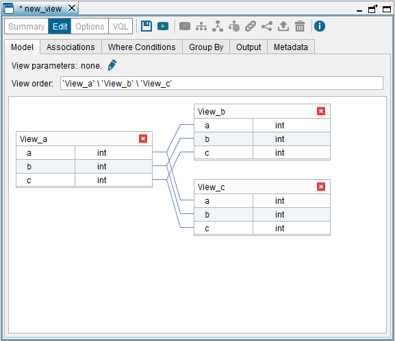

====================
Creating Minus Views
====================

A Minus view selects all the rows from the first input view and then
removes from the result the rows of the second view. If the minus view
has a third input view, its rows are also removed from the result. Minus
views can have two or more input views. These views can belong to
different databases.

For example, if we have three views with the following contents:

 

.. table:: 

   +--------+--------+
   | View_A          |
   +========+========+
   | **A**  | **B**  | 
   +--------+--------+
   | 1      | a      |
   +--------+--------+
   | 2      | b      |
   +--------+--------+
   | 4      | d      |
   +--------+--------+
 
.. table:: 

   +--------+--------+
   | View_B          |
   +========+========+
   | **A**  | **B**  | 
   +--------+--------+
   | 1      | a      |
   +--------+--------+
   | 5      | e      |
   +--------+--------+
   | 6      | f      |
   +--------+--------+
   
.. table:: 

   +--------+--------+
   | View_C          |
   +========+========+
   | **A**  | **B**  | 
   +--------+--------+
   | 2      | b      |
   +--------+--------+
   | 5      | e      |
   +--------+--------+
   | 6      | f      |
   +--------+--------+

If we create a minus view over the views ``View_A``, ``View_B`` and
``View_C`` and query this new view, the Server executes the query
``View_A minus View_B`` first. The result is the following:

 
.. table:: 

   +---------------------+
   | View A Minus View B |
   +==========+==========+
   | **A**    | **B**    | 
   +----------+----------+
   | 2        | b        |
   +----------+----------+
   | 4        | d        |
   +----------+----------+

``View_B`` contains the first row of ``View_A`` so it is removed from
the result.

Then, the Server executes
``<first intermediate result> minus View_C``.

The result of querying the view
``View A Minus View B Minus View C`` is the following:

.. table:: 

   +---------------------------------------+
   | View A Minus View B Minus View C      |
   +===================+===================+
   | **A**             | **B**             | 
   +-------------------+-------------------+
   | 4                 | d                 |
   +-------------------+-------------------+ 

As you can see, the second row of ``View_A`` is removed from the result
because ``View_C`` also contains this row.

The wizard to create new minus views is very similar to the wizard of
union views (see section :ref:`Creating Union Views`)

To create a minus view, click **Minus** on the **File** > **New** menu or
right-click the Server Explorer and click **Minus** on the menu **New**.

The Tool will open the “Minus view” dialog and it will add the view(s)
that are currently selected in the Server Explorer. To add more views,
click the **Model** tab and drag the views from the Server Explorer to
this tab.

.. important:: All the input views of a minus view must have the same
   number of fields.

The “Minus view” dialog has six tabs:

#. **Model**: tab where you drag the input views of the new minus view
   and associate the fields of the views. The wizard automatically
   associates the fields with the same name, but you have to associate
   the rest.
   
   It is mandatory to add associations between *all* the fields of the
   input views.
   
   In the **View order** box, you have to indicate the order in which the minus operation is 
   performed. Note that the view order may affect the results of the view.  

   E.g. if the view order is ``View_a \ View_b \ View_c``, the Server performs the minus 
   operation between ``View_a`` and ``View_b`` and then, between this intermediate result and ``View_c``.    

   If the view order is ``View_c \ View_b \ View_a``, the Server performs the minus operation 
   between ``View_c`` and ``View_b`` and then, between this intermediate result and ``View_a``. 
   Although in both “View orders” the views involved are the same, the result may be different.  

   In this tab, you can add “View parameters”. See more about this in the section 
   :ref:`Parameters of Derived Views`.
   
#. **Associations**: tab that lists the associations between fields. You
   can delete them by clicking on
#. **Where Conditions**: tab that allows you to add WHERE conditions to
   the definition of the view.
#. **Group By**: tab that allows you to add GROUP BY attributes to the
   view.
#. **Output**: tab that allows you to configure the output of the view.
   That is, renaming the view and its fields, add derived attributes,
   etc.
#. **Metadata**: tab that allows you to define the folder where the new
   view will be stored and provide a description for the new view.

The tabs **Where Conditions**, **Group By**, **Output** and **Metadata**
work in the same way as in the Union view dialog (see section :ref:`Creating
Union Views`).

   Creating a minus view with three input views

