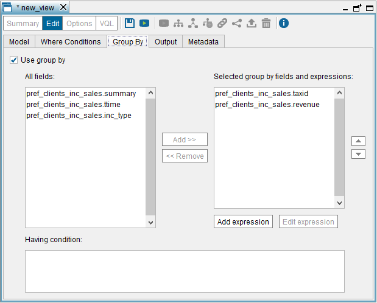
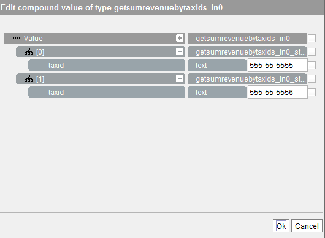
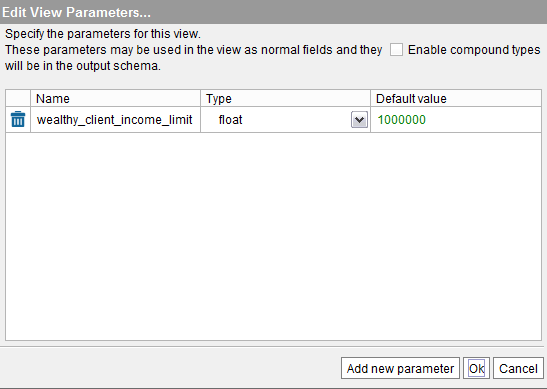

========================
Creating Selection Views
========================

A Selection view executes the relational algebra operations of selection
(filtering) and projection on an input view. This view can belong to a
different database.

To create a selection view, click **Selection** on the **File**
> **New** menu or right-click on the Server Explorer and click
**Selection** on the **New** menu.

The Tool will open the “Selection view” dialog and it will add the view
that is currently selected in the Server Explorer. To change the input
view, click the button |image0| to remove the current view from the
“Model” tab and drag another view from the Server Explorer.

In our example, we will drag the view ``incidents_sales`` created in the
section :ref:`Creating Join Views`.

The “Selection view” dialog has five tabs:

1. **Model**: tab where you have to drag the view that will be the source
   of the new view. You can drag a view from another database.

   In this tab, you can add “View parameters”. See more about this in the
   section :ref:`Parameters of Derived Views`.

2. **Where Conditions**: tab that allows you to add WHERE conditions to
   the definition of the view.

   If you add WHERE conditions, you have to select one of the **WITH
   CHECK OPTION** **clause** options to decide if you want to force every
   row that is inserted or updated, to conform to the definition of this
   view (see section :ref:`Use of WITH CHECK OPTION` of the 
   VQL Guide). The available options are:

   a. **None**: nothing is checked when a client executes INSERT operations
      on this view.
   b. **Local**: the selection condition of this view is checked when a row
      is inserted or updated. It does not check the conditions of the
      lower-level views (the views that participate in the definition of
      this view).
   c. **Cascade**: the projection conditions of this view and the
      lower-level views are checked when a row is inserted or updated.
   
   If the “Automatic simplification of queries” is enabled, when
   executing an ``INSERT``/``UPDATE``/``DELETE`` query over a derived
   view, the Server assumes that this view was created with the option
   “WITH CHECK OPTION”. As a result, the Server checks that the data
   inserted/updated/deleted meets the ``WHERE`` condition of the
   definition of the view.

   To check if this option is enabled, click “Queries optimization” on
   the menu Administration > Server configuration.

#. **Group By**: tab that allows you to add GROUP BY fields to the view.

4. **Output**: tab that allows you to configure the output of the view.
   That is, renaming the view and its fields, add derived attributes,
   define the primary key of the view, etc.
   

5. **Metadata**: tab that allows you to define the folder where the new
   view will be stored and provide a description for the new view.

The tabs **Where Conditions**, **Group By**, **Output** and **Metadata**
work in the same way as in the Union view dialog. The section :ref:`Creating
Union Views` explains in more detail how to use them.

You will now create two views for our example:

-  Right-click on the view ``incidents_sales`` in the Server Explorer and
   click on **Selection**, on the menu **File** > **New**.
   You can see that the Tool has added this view to the **Model** tab.
-  In the **Where Conditions** tab, add the condition
   ``revenue>600`` to obtain data only of those clients with an
   average monthly volume of sales that exceeds 600 euros.
-  In the **Output** tab, rename the view to ``pref_clients_inc_sales``.

After this, click **Save** to create the view. Then, the Tool will
display the schema of the new view.

Now, you have to create the second view, which has a GROUP BY field:

-  Right-click on the view ``pref_clients_inc_sales`` in the Server Explorer
   and click **Select**, on the **File** > **New** menu.

-  In the **Group By** tab, do the following:

   -  Select the **Use group by** check box.
   -  Select the ``taxId`` and ``revenue`` fields and click **Add >>**.
   
-  In the **Output** tab, do the following:

   -  Rename the view to inc_grouped_by_pref_clients.
   -  Click **New Aggr. expression**. The name of the new field is
      ``num_incidents`` and the expression is ``COUNT(*)``.
      

-  Click **Save**.

    
   Creating the selection view ``inc_grouped_by_pref_clients`` ("Group By" tab)

Creating Conditions with the Compound Values Editor
=================================================================================

All the dialogs to create and edit derived views (join, union, minus,
intersect, flatten and selection) have a **Where Conditions** tab to add
WHERE conditions to the definition of the view. When using the **Simple
condition** mode of this tab, you have two options to create constants
of compound types (``register`` or ``array``):

#. Write the value directly in VQL syntax.
   E.g. ``{ ROW( 'B78596011' ), ROW( 'B78596012' ) }``
   
   See section :ref:`Conditions with Compound Values` of the VQL Guide for more details about this syntax.
   
#. Or, use the Compound values editor. To open it, click on |image1| beside the 
   right operand (only available for register or array fields).

As an example, we explain how to create a new Selection view that has a
WHERE condition with a compound value. But first, we need to create a
new base view:

#. Open the Web Service data source ``sales`` (created in the section
   :ref:`Importing SOAP Web Service Sources`) and click **Create base
   view**.
#. Click **Create base view** beside the operation
   ``getSumRevenueByTaxIds``.
#. Rename the new base view to ``RevenueSum``.
#. Rename its input attribute to ``clients`` and the return one, to
   ``totalrevenue``.
#. The ``clients`` attribute is an array of registers of the type
   ``getsumrevenuebyids_in0``. Virtual DataPort generates this type
   automatically when it creates the view.
#. Each element in this array will be a ``register`` of the type
   ``getsumrevenuebyids_in0_string``, which is also automatically
   generated by Virtual DataPort.
#. Rename the element of the ``clients`` array to ``taxId``.
#. Click **Save** (|image2|) to create the base view.

Now, we will create a selection view over the base view ``RevenueSum``,
to obtain the sum of the revenue of the clients with tax ids
``B78596011`` and ``B78596012``. The constant operand of the
selection condition will be created using the “Compound values editor”.

Follow these steps:

#. Right-click on the view ``RevenueSum`` in the Server Explorer and click
   on **Selection** on the menu **New**.
   The view ``RevenueSum`` has been added to the “Model” tab.
#. Click the tab **Where Condition**.
#. Click on |image4| to add a condition.
#. Select the field ``CLIENTS`` and the operator ``=``.
#. Click |image1| to open the Compound Values editor.
#. Click twice on |image5| beside “Value” to create two elements of the type ``getSumRevenuebyTaxIds_in0_string``.
#. Click on the new elements to expand them and edit the values of each
   array element.
#. Enter the value ``B78596011`` in the field ``taxId`` of the first
   register and ``B78596012`` in the same field of the second register
   (like in the figure :ref:`below <Creating a value of type getSumRevenuebyTaxIds_IN0>`)
#. Click **Ok** to close the editor.
#. Click **Save** (|image2|) to create the selection view.

   Creating a value of type ``getSumRevenuebyTaxIds_IN0``

Parameters of Derived Views
=================================================================================

A view in Denodo can include not only regular columns but also parameters.
Parameters are useful when you want to build a view containing a where condition but you do not want to
specify a fixed filter value on the view definition, as you want it to be dependent on the query instead.

For example, let us say that we have two views:

#. A base view ``CLIENT`` with these fields: ``name``, ``income`` and
   ``state``.
#. And a view ``WEALTHY_CLIENT_BY_STATE`` defined as:

   .. code-block:: sql
   
      CREATE VIEW WEALTHY_CLIENT_BY_STATE AS 
      SELECT state, COUNT(*) 
      FROM client 
      WHERE income > 1000000 
      GROUP BY state

There is a limitation in the second view: the limit of income to
consider a client wealthy is static. Therefore, we have to know this
limit before creating the view. If we wanted to change this limit at
runtime, we could remove the ``WHERE`` condition and add the field
``income`` to the ``GROUP BY`` fields. But then, we would have to add
this field to the ``GROUP BY`` clause and we might not want to do that.

To avoid this problem, you can add a “View parameter” to the view.

If you define a view parameter on a view, that parameter will be part of
the output schema and you can use it in the same places you can use a
regular field. However, view parameters are a special type of fields:

- If the parameter does not have a default value it will be mandatory to
  specify a value in a WHERE or JOIN condition
- To assign a value to a view parameter you can use a regular WHERE condition
  like ``VIEW_PARAMETER = <value>``. A condition using a view parameter is
  considered an assignment if:

  - it includes the equals operator (or also IN if the view parameter
    is mandatory) and,
  - ``value`` is a literal, a function of literals or another view
    parameter.
- Assignments just specify what is the value Denodo should assume for that
  parameter in a query. For this reason, they are not considered conditions
  and therefore, they do not filter rows. Any other condition using a view
  parameter that is not an assignment will act as a regular filter condition.

Using view parameters, you can modify our previous example so you can specify
the limit of income at runtime. To do this, edit the view and follow these steps:

-  Click on the **Model** tab and click |image1| beside "View parameters". 
   In this dialog, click *Add new parameter* to add the new view parameter.
   
   Set the name of the parameter to ``wealthy_client_income_limit``, select the 
   type ``long`` and set the default value of the parameter to ``1000000``.
   
-  Click on **Where Conditions** and set the condition
   ``income > wealthy_client_income_limit``.

   Adding a view parameter

The view will have a new output field ``wealthy_client_income_limit``,
which you can use to change the condition at runtime. For example,

.. code-block:: sql

   SELECT * 
   FROM WEALTHY_CLIENT_BY_STATE
   WHERE wealthy_client_income_limit = 250000

Will take into account clients with an income greater than 250,000.

As the parameter has a default value, if you execute

.. code-block:: sql

   SELECT * 
   FROM WEALTHY_CLIENT_BY_STATE

The query will take into account clients with an income greater than
1,000,000.

.. important:: Do not assign the result of a subquery to a view
   parameter. The query will not work as expected or return an error
   depending on if the parameter has a default value or not.

For example, following the example above, let us say that you execute
the following:

.. code-block:: sql

   SELECT *
   FROM WEALTHY_CLIENT_BY_STATE
   WHERE wealthy_client_income_limit = (
      SELECT MAX(income_limit) FROM state_limit WHERE state = 'CA'
   )

In this case, the result of the subquery
(``SELECT MAX(income_limit) FROM``...) will not be assigned to the
parameter ``wealthy_client_income_limit`` so the query will return the
accounts with an income greater than 1,000,000, which is the default
value of the parameter.

If the parameter did not have a default value, the query would return an
error immediately.

When Should You Use View Parameters
-----------------------------------

There are four main situations where view parameters are useful:

- Enforce a filter condition
- Group By Bypass
- Outer Join Bypass
- Partitioned UNIONs

Enforce a Filter Condition
^^^^^^^^^^^^^^^^^^^^^^^^^^

You can add a parameter to force the user to always query a view specifying some filter.
For instance, in cases where a facts table contains a high volume of data,
you could use view parameters to force users to always query within a
range of dates (start_date,  end_date).

Group By Bypass
^^^^^^^^^^^^^^^

When you define an aggregation view, there are situations where you may
want to query the view specifying a filter condition over a field that
is not part of the group by. The previous example is a group by
bypass scenario.

Outer Join Bypass
^^^^^^^^^^^^^^^^^^^

In a similar way as the group by bypass, there are situations where you may
want to define an OUTER JOIN applying a filter on the inner side without
filtering any of the rows coming from the outer side.

For example, let us say we are a retailer company and we want to obtain the list
of all our products, and for the ones that have been returned by customers,
we want the reason why the product was returned.
We could create a view items_return_details as:

.. code-block:: sql

   CREATE VIEW items_return_details AS
   SELECT p.prod_name, p.prod_category, r.reason_cat, r.comments
   FROM item p LEFT JOIN returns r ON(p.product_id = r.product_id)

Now imagine that we want the same information from all products but we
only want the return information if the product was returned within the last
12 months. If we use the following query:

.. code-block:: sql

   SELECT prod_name, prod_category, reason_cat, comments
   FROM items_return_details
   WHERE return_date >= addmonth(now(), -12)

We would not get the complete list of products, but only the ones that were
returned in the last 12 months. The reason for this is that in SQL the WHERE clause
is applied after the JOIN clause. Therefore, after obtaining all the products with
the return information it will filter all the ones that were not returned in the
last 12 months, and that includes all the products that were not returned at all.

Editing the view items_return_details and adding the condition to the 'WHERE
conditions' tab would have the same problem as the conditions specified there
are applied after the JOIN, not before.

In order to get the desired query, the SQL should look like the following:

.. code-block:: sql

  SELECT p.prod_name, p.prod_category, r.reason_cat, r.comments
  FROM PRODUCT p LEFT JOIN
  (SELECT * from returns WHERE return_date >= addmonth(now(), -12)) r
  ON(p.product_id = r.product_id)

But if you want to use a predefined view like items_return_details and still allow
certain filters over the INNER side of an OUTER, you can follow these steps:

-  Create an auxiliary view over the view that you want to filter. In this case, we can create a view called ``recent_returns`` as a select view over returns.

-  Define a new view parameter in this auxiliary view that will pass the value to the filter condition. In our example we can create a view parameter called ``num_months``.

-  Add a where condition using the new view parameter. In this case: ``return_date >= addmonth(now(), -1 * num_months)``.

-  Edit the view containing the OUTER JOIN to use the new auxiliary view instead.

As we are not providing a default value for ``num_months``, this parameter becomes mandatory. Therefore, all the queries would have to provide the number of months that you want to
check. For example:

.. code-block:: none

  SELECT prod_name, prod_category, reason_cat, comments
  FROM items_return_details
  WHERE num_months = 12

In this case, although the WHERE condition is set after the JOIN, as num_months is not a regular
field but a view parameter, ``num_months = 12`` is considered a parameter assignment and it will
not filter any of the rows coming from the LEFT JOIN.
If we don’t want to force the user to specify a number of months, and we want it to be optional,
we could edit our recent_returns view in the following way:

- Edit the view parameter to add a new default value 0
- Change the condition to: ``return_date >= addmonth(now(), -1 * num_months) OR num_months = 0``

Partitioned UNIONs
^^^^^^^^^^^^^^^^^^

When you are building a :ref:`partitioned UNION <Creating Partitioned Union Views>`, each union branch needs to have a condition specifying
the partitioning criterion. However, sometimes the tables do not contain a column that can be used
for defining this criterion and you can use a view parameter instead.
For example, let us imagine our company sells products worldwide and the sales information is
partitioned in three systems:

- One containing the information for EMEA (Europe, the Middle East and Africa)
- One containing the information for America
- One containing the information for APAC (Asia-Pacific)

The partition in this case is made by region, but we do not have a column in sales specifying a region.
In order to do the partitioned UNION you can create the intermediate selections using view parameters.
For example, for the APAC region you can:

1. Create a selection over the sales table from the APAC partition
2. Create a new view parameter ‘region‘ on that view with default value ‘APAC’
3. Add a WHERE condition region = ‘APAC’ on that new view

The same process would be needed for the views from the other partitions, replacing the ‘APAC’ value
for the region corresponding to each partition.

.. |image0| image:: ../../common_images/close.png
.. |image1| image:: ../../common_images/edit.png
.. |image2| image:: ../../common_images/save.png
.. |image4| image:: ../../common_images/icon-plus3.png

