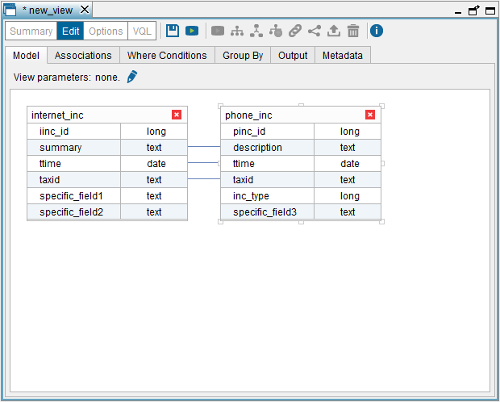
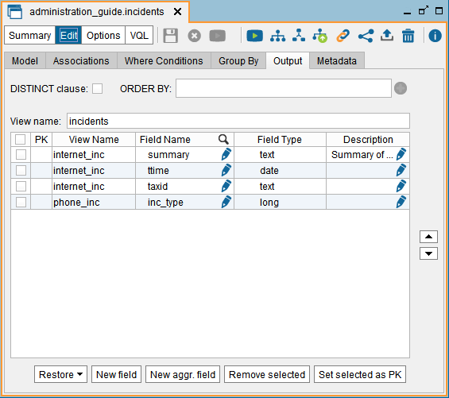
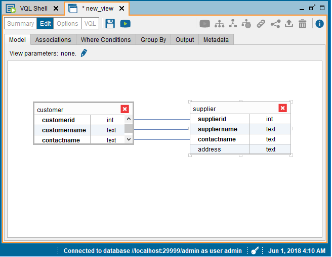

====================
Creating Union Views
====================

A union view merges the tuples from various views into a single view.
These views can belong to different databases.

In standard relational algebra, all the relations or tables must have
the same schema (same attributes with the same type). However, Virtual
DataPort uses an *extended union*, whereby if any of the input views has
an attribute that is not present in the other views, it is added to the
output view.

To create a union view, right-click on the Server Explorer and click
**New** > **Union**.

The Tool will open the “Union view” dialog and it will add the view that
is selected in the Server Explorer. To add views to the union view, drag
them from the Server Explorer to this dialog. You can drag views from
different databases.

In our example, we will drag the base views ``phone_inc`` and
``internet_inc`` (we explain how to create these views in the section
:ref:`Creating Base Views from a JDBC Data Source`).

The “Union view” dialog has six tabs:

#. **Model**: tab where you have to drag the views that will form the
   union and establish the associations between the fields of the views.
   The fields linked by an association are considered a sole attribute in
   the output schema of the view.

   By default, the Tool will create associations between the attributes
   of the same name and type. You can also add more associations by
   graphically linking an attribute of one view with other attribute of
   the other view. In views with many fields, you can use the **Find**
   option to locate the desired field in a view (right-click on the
   view).
  
   In order to associate two fields, they must have the same type or
   compatible. For example, you can associate a ``float`` field with a
   ``double``, an ``int`` with a ``long``, etc.

   If you want to delete a view from the union, click the button |image0| 
   (on the top-right side of the view).

   In this tab, you can add “View parameters” by clicking on |image1|,
   at the top of the dialog. See more about this in the section
   :ref:`Parameters of Derived Views`.

#. **Associations**: tab that lists the associations between fields. You
   can delete them by clicking on |image2|.

#. **Where Conditions**: tab that allows you to add WHERE conditions to the
   definition of the view. There are two modes to add WHERE conditions:

   a. **Simple condition mode**: use it to create a list of conditions
      combined with the AND operator, where each condition has an attribute
      of the view as left operand.
      
      To add a new condition, click on |image3|. For each condition you have to indicate:

      i. An attribute of the view.
      
      #. The operator of the condition: ``=``, ``<>``, ``contains``, etc.
      
         The condition operators are described in detail in the section
         :doc:`/vdp/vql/language_for_defining_and_processing_data_vql/comparison_operators/comparison_operators` of the VQL Guide.
         
      #. The right operand. It can be either any expression using constants,
         view attributes and functions (see section :ref:`Functions for
         Conditions and Derived Attributes` of the VQL Guide).
         
         Click on the menu **Help > Functions list** to display the list of
         existing functions.
         
         If you want to enter a constant and depending on the type of the
         selected field, you can open the “Value editor” of the condition by
         clicking on |image4|:

         1. If the type of the field is ``text`` or ``xml``, it will open the
            “Value editor”.
            
            This editor will surround the value with single quotes (``'``). If
            the value contains single quotes, it will escape them when you click
            **Ok** to close the editor.
            
         #. If the type of the selected field is compound (``register`` or
            ``array``), it will open the “Compound value editor” (see section
            :ref:`Creating Conditions with the Compound Values Editor`)

   b. **Specify Where condition** mode: used to write any condition. This is
      required, for instance, when you need to use the ``OR`` and ``NOT``
      operators, or when the left operand of the condition is an expression.
      Press Ctrl+Space to display the auto-complete list that will help you
      form syntactically valid expressions.

4. **Group By**: tab that allows you to add GROUP BY fields to the view.
   To do this, select the **Use group by** check box, select a field of
   one of the views in the **All fields** list and click **Add >>**.
   
   To select two or more fields, hold Ctrl or Shift and click on each
   field.
   
   If the input views have many fields, press Ctrl+F to display a search
   box that will help you find the field you are looking for.
   
   Besides adding fields, you can define Group By expressions by clicking
   **Add expression**.
   
   To change the order of a field in the Group By clause of the view,
   select a field in the **Selected group by fields and expressions**
   list and click on the buttons |image5| and |image6|.

   After adding one or more group by fields or expressions, you can
   define a HAVING condition in the **Having condition** box.
   
   You can define aggregation expressions by clicking on the **New aggr.
   field** button of the **Output** tab.

   Note that if you add Group By fields, the view can only have Group By
   fields and aggregation expressions (see section :ref:`Group By Clause` of
   the VQL Guide).

#. **Output**: in this tab you configure the output of the view:
   
   a. Change the name of the view.
   #. Change the fields’ name.
      If the view has many fields, press Ctrl+F to display a search box
      that will help you find the field you are looking for.
   #. Reorder the projected fields. To do this, select the check box beside
      the type of the field you want to reorder and click |image5| or |image6| 
      to move the field up or down.

   #. Project the subfields of a register field by right-clicking it and
      then, on **Project subfields of...**
      
      Virtual DataPort models data types with a complex structure using the
      types ``register`` (indicated with the icon |image9|) and ``array`` 
      (indicated with the icon |image10|).
      
      In this tab, you can project the inner fields of ``register`` fields.
      To do this, right-click on the field and then, on **Project subfields
      of…** Instead of projecting all the fields of a register, you can
      project only some of them by right-clicking on each field and then, on
      **Project subfield...**

      To project the content of an ``array`` field, create a Flatten view
      (see section :ref:`Creating Flatten Views`).
      
   #. Sort the fields alphabetically: right-click on the table of fields and click **Sort fields alphabetically**.

   #. Add derived attributes: click **New field** to open the expressions
      editor.
      
      You can edit these attributes later by clicking on |image1|, on the "Field Type" column.
      
      In this editor, you have to specify the name of the new field and an
      expression. This expression can have constants, attributes of the
      projected views and functions (see the section "Functions for
      Conditions and Derived Attributes" of the VQL Guide).
      
      Click on the menu **Help > Functions** list to display the list of
      existing functions.
      
      Press Ctrl+Space to display the auto-complete list that will help you
      form syntactically valid expressions.
      
      After defining a derived field, you can set its “Source type
      properties” by clicking on |image1|, in the cell that displays the
      field’s type. The section :ref:`Viewing the Schema of a Base View`
      explains what these properties are used for.

   #. If you have selected the **Use group by** check box in the **Group
      by** tab, you can add aggregation expressions to the view by clicking
      **New. aggr. expression**.
      
   #. Delete fields: select the check boxes of the fields you want to
      delete and click **Remove Selected**.
      
      .. note:: To select several fields at once, select the first field,
         press Shift and then, select the last field.
         Also, you can right-click on each field and click **Drop**.
      
   #. If you have deleted one or more fields from the output of the view
      and you want to restore them, click **Restore** > **Fields**. The
      Tool will display the “Restore Fields” dialog where you have to
      select the fields that you want to add again to the output.
      
      If you want to reset the entire output schema of the view, click
      **Restore** > **Schema**. This will remove the Group by definition of
      the view and add to the “Output” all the fields from the source
      views.
      
   #. Remove the duplicate rows from the output: select the **DISTINCT
      clause** check box.
      
   #. Order the output by one or more fields: select a field in the **ORDER
      BY fields** drop-down and click on |image3|. After adding an ORDER BY field, select if you want to order
      the output in ascending (ASC) or descending (DESC) order.

   #. Define the primary key of the view: select the check box beside the
      type of the fields that form the primary key and click on **Set
      selected as PK**. In addition, you can right-click on the field and
      click **Set field as PK**.
      
      See more about the primary key of a view in the section :ref:`Primary Keys
      of Views`.
   #. Add a description to the field by clicking on  |image1|, on the column “Description”. You can obtain the description of the fields from:

      -  The JDBC interface. 
      -  The ODBC interface.
   
      -  The Denodo stored procedure CATALOG_VDP_METADATA_VIEWS. The section :ref:`CATALOG_VDP_METADATA_VIEWS` of the VQL Guide describes this procedure.
 

#. **Metadata**: tab to define the folder where the new view will be stored
   and provide a description for the new view.

#. Click **Save** (|image17|).

In our example:

-  Click on the menu **File** > **New** > **Union**.

-  Drag the views ``phone_inc`` and ``internet_inc`` to the “Model” tab and
   add the association ``internet_inc.summary = phone_inc.description``.
   See `Creating the union view of phone_inc and internet_inc
   ("Model" tab)`_.

-  In the “Output” tab (see `Creating the union view of phone_inc and
   internet_inc ("Output" tab)`_):

   -  Rename the view to ``incidents``.
   
   -  Remove the fields ``pinc_id``, ``iinc_id``, ``specific_field1``,
      ``specific_field2`` and ``specific_field3``. To do this, select these
      fields and click on **Remove selected**.
      
   -  Define the primary key of the view with the field ``taxid``. To do
      this, select the check box beside the type of ``taxid`` and click on
      **Set selected as PK**.

After this, click **Save** to create the view. Then, the Tool will
display the schema of the new view.

   Creating the union view of ``phone_inc`` and ``internet_inc`` (“Model” tab)

   Creating the union view of ``phone_inc`` and ``internet_inc`` (“Output” tab)
   
Creating Standard Union Views
=============================

It is possible to make Virtual DataPort to have the same behavior than
the standard union operation of the relational algebra. To do that, follow
the steps defined in the section :ref:`Enabling the Standard SQL Union`.

Once standard union is enabled, the administration tool will offer two
different wizards to create union views:

  * **Extended union all**. This option will open the same wizard that
    was described above, allowing to create extended unions.
  * **Union**. This will open the new wizard to create standard union views.
    This wizard is similar to the previous one but with some restrictions.
  
To create a standard union from the administration tool, follow these steps:

  #. Click the menu **File** > **New** > **Union**.
  #. In the **Model** tab:    
  
      * Drop the views to this tab. The views do not need to have the same number of fields.
      * The first view added will be considered the “left view” of the union. This view will 
        be highlighted with a thicker border.
      * The schema of this new view will be composed by the fields of the left view that are 
        linked with fields of the other views. The fields that are not linked will not participate 
        in the UNION.
      * An association is completed when it links a field of all views. In that case, the linked 
        fields will be highlighted in bold and their “representative field”, the one in the left
        view, can be used in a condition in the **Where** tab, as group by field or in the having 
        condition in the **Group by** tab, or projected in the **Output** tab.
      
        * When an association does not link a field of all views, fields will be highlighted in 
          red and the tool will ask for completing the association or removing it.
        * Fields that are not associated with other fields, do not participate in the UNION, 
          so they will be ignored and cannot be used in the condition, group by or output tab.
        * The fields of the left view will be projected in its original order, and the fields 
          of the other views will be reordered to match the specified associations.      
  
  #. The tabs **Associations**, **Where Conditions**, **Group By** and **Metadata** work in 
     the same way as in the other derived views.
  #. **Output** tab: by default, this wizard creates a UNION ALL view (i.e. the duplicate 
     rows are not removed). To create a UNION, which removes duplicated rows, clear the check 
     box **Union ALL**.

For example:  

   Creating the standard union view of ``customer`` and ``supplier`` (“Model” tab)   
      
In the screenshot above,
two views were added to the wizard. This will generate the following UNION ALL:

.. code-block:: sql
    
     SELECT customerid, customername, contactname FROM customer
     UNION ALL
     SELECT supplierid, suppliername, contactname FROM supplier
     Note that address is not included in the UNION.
     
Then if, for example, you add some where condition, enable group by and add a new aggregation field you can obtain something like this:

.. code-block:: sql

     SELECT count(*) FROM (
         SELECT customerid, customername, contactname FROM customer
         UNION ALL
         SELECT supplierid, suppliername, contactname FROM supplier
     ) WHERE customername like 'someregex' GROUP BY customername

Creating Partitioned Union Views
================================

In a logical data warehouse scenario, it is common that the data from the facts table (and sometimes the dimensions) is
located in two different systems. For example, let us say we are a retailer company and the information about sales is
stored in two systems: an enterprise data warehouse and a data lake based on Hadoop.
In this case, in order to create the canonical view containing all the sales information, you can create a view in
Denodo called ``sales`` defined as a UNION of both tables.

However, we know that each system has a specific part of the data, defined by a certain criterion:

- The enterprise data warehouse contains the sales data from the current year
- The data lake based on Hadoop contains the sales data from previous years

Therefore, if a query asks for the sales from 2016, for instance, it is not necessary (and it would not be efficient)
to access the data warehouse system as we know that the information from past years is in the data lake only.
In cases like this, you need an extra step to provide Denodo the information about the partition criterion.
What you need to do to build this partitioned union is:

- create an intermediate selection view over each partition containing the condition that partition fulfills, and
- create the union as the union of these intermediate selections.

The conditions in our example would be:

- ``year = getyear(now())`` for the data warehouse, and
- ``year < getyear(now())`` for the data lake

This way, if a query contains a filter condition that is not compatible with some of the partitions, the query optimizer
will detect that situation and it will remove all the union branches that are not necessary for that particular query.
Using the previous example, if the query contains the condition year = 2016 it will detect the condition
``year = getyear(now())`` is not compatible with the current selection and the only partition that is compatible is the
one accessing the Hadoop system.

Finally, there are cases where the partitioning criterion is not defined by a pre-existing field.
For example, let us imagine our company sells products worldwide and the sales information is partitioned in three
systems:

- One containing the information for EMEA (Europe, the Middle East and Africa)
- One containing the information for America
- One containing the information for APAC (Asia-Pacific)

The partition in this case is made by region, but we do not have a column in sales specifying a region. In order to
build the partitioned UNION, you can create the intermediate selections using view parameters.
You can find an example of this scenario in the section :ref:`Parameters of Derived Views`.

.. |image0| image:: ../../common_images/close.png
.. |image1| image:: ../../common_images/edit.png

.. |image3| image:: ../../common_images/icon-plus3.png
.. |image4| image:: ../../common_images/edit.png
.. |image5| image:: ../../common_images/icon-black-arrow-down.gif
.. |image6| image:: ../../common_images/icon-black-arrow-up.gif

.. |image17| image:: ../../common_images/save.png
