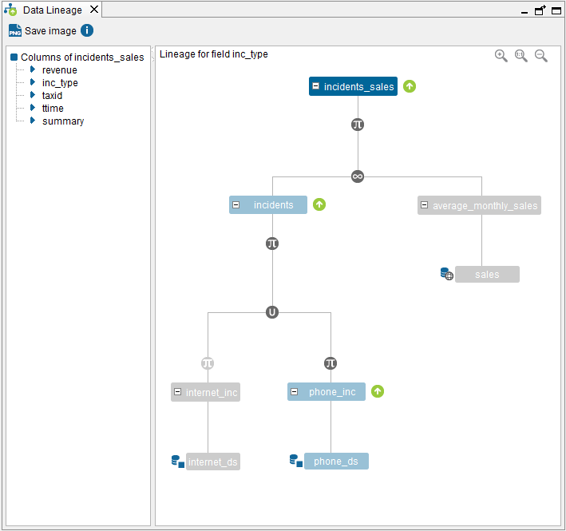

============
Data Lineage
============

This dialog displays a diagram of the data sources and views used to
build the current view. It also displays the source where the
information of each field comes from.

To open this dialog, double-click on the view in the Server Explorer and then, 
click |image0|.

On the left side of the dialog, there is a list of all the view’s
fields. By clicking on one of the fields, all the views and data sources
that participate in the creation of this field will be highlighted. For
instance, if a field *f* is obtained by evaluating an expression
involving two fields *f1* and *f2* from different data sources, Virtual DataPort
will highlight the data sources (and their associated views) providing
*f1* and *f2*, and the view where the expression to obtain the value of
*f* is defined.

The available options in this dialog are the following:

-  Click on the tree nodes representing combination operations (joins,
   unions, selections, etc.) to display their main properties.
-  View the details of the data sources by clicking on them (only if
   connected in administrator mode)
-  Click on a view to open the dialog showing its schema.
-  Click **Save image** to export the current *Data Lineage Tree* into
   an image file.

   Data lineage of ``incidents_sales``

You can obtain the same information displayed in this dialog
programmatically by invoking the stored procedure
``COLUMN_DEPENDENCIES``.

For example,

.. code-block:: sql

   CALL VIEW_DEPENDENCIES ('admin', 'incidents_sales', 'inc_type')

See more about this procedure in the section :ref:`COLUMN_DEPENDENCIES` of
the VQL Guide.

