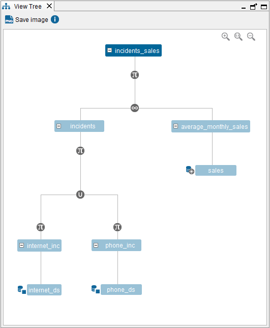

=========
Tree View
=========

The Tree View displays the successive levels of views that have been
composed to construct this view.

To open this dialog, double-click on the view in the Server Explorer and
click |image0|.

The available options in this dialog are:

-  Click on any view to open its schema.
-  Click on the tree nodes representing combining operations (joins,
   unions, selections, etc.) to display their main properties. For
   example, for selection operations, it will display their select
   condition.
-  Click on a data source (leaf nodes) to see its properties (only in
   administration mode)
   Sensitive information such as passwords is not displayed.
-  Click **Save image** to export the Tree View to a file (a PNG file).

   Tree view of ``incidents_sales``

You can obtain the same information displayed in this dialog
programmatically by invoking the stored procedure ``VIEW_DEPENDENCIES``.

For example,

.. code-block:: sql

   CALL VIEW_DEPENDENCIES ('admin', 'incidents_sales')

See more about this procedure in the section :ref:`VIEW_DEPENDENCIES` of the
VQL Guide.

