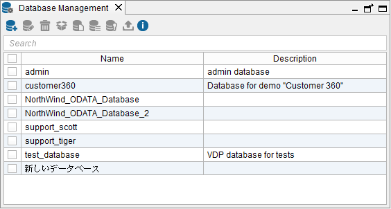
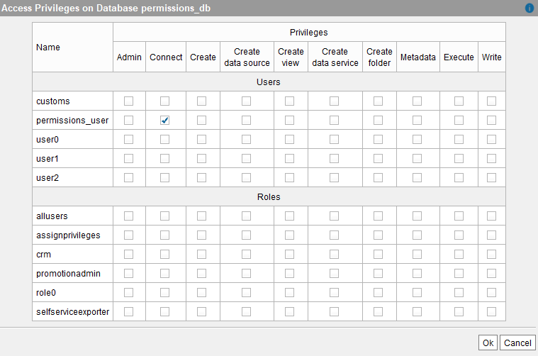

==================================
Configuring and Deleting Databases
==================================

To view the current list of databases of the Virtual DataPort server,
click **Database management** on the menu **Administration** (see
`List of existing Virtual DataPort databases`_).

   List of existing Virtual DataPort databases

To perform any operation on the database, select it on the list of
databases and then, click on the appropriate button at the bottom of the
dialog. If you have many databases, you can search one by typing its
name in the box at the top of the dialog.

-  Click **Edit** to:

   -  Change the description of the database.
   -  Enable or disable the Unicode support of the database.
   -  Enable or disable the cost-based optimization feature. See more about
      this feature in the section :ref:`Cost-Based Optimization`.
   -  Enable or disable the simplification of queries. See more about this
      feature in the section :ref:`Automatic Simplification of Queries`.
   -  Enable Kerberos authentication for this database for clients that connect to this Server using the ODBC interface. The JDBC clients and the administration tools can select if they want to use regular authentication or Kerberos. However, the authentication method used in the ODBC interface is set by the Server, not the client.
   -  Change the “Authentication type” of the database to “Normal” or
      “LDAP” (see the section :doc:`./creating_databases` or more information
      about authentication types).

-  Click **Delete** to delete the database.
   
   .. important:: When a database is deleted, all its elements are deleted as well: data sources, views, etc. The tables
      in the underlying databases will not be deleted nor the tables created with the 
      :doc:`remote tables </vdp/administration/remote_tables/remote_tables>` feature.
      
-  The buttons **I18N**, **Memory Usage** and **Cache** open the dialogs
   to change the internationalization settings (see section :ref:`Configuring
   the Default Internationalization`), memory usage and swapping
   policies (see section :ref:`Configuring the Memory Usage and Swapping
   Policy`) and cache settings (see section :ref:`Configuring the Cache`),
   respectively, for the selected database.

   In these three dialogs, if the **Default Configuration** check box is
   selected, the Server configuration will be used. If it is cleared, the
   settings of the database override the global settings of the Server.

-  Click on **Assign privileges** to set the privileges of all the
   Virtual DataPort roles and users who are not administrators, over this
   database. For each user/role, you can specify whether she has global
   connection, creation, read and/or write access rights to the database
   (see :ref:`Assigning privileges to users/roles over a database`).
   
   For more information about user privileges, read section :ref:`Types of
   Access Rights`.
   
   .. note:: This option is only enabled for databases with
      “Authentication type” “Normal”.

-  Click on **Export** to export the metadata of the database to a VQL
   file, so that it can be easily recreated in another Virtual DataPort
   installation.
   
   Neither the users nor its access rights for the database are included
   in the export process. The database creation statement is not included
   either.
   
   To export all the metadata of the server instead of just one database,
   click **Export** on the menu **File** (see section :ref:`Exporting and
   Importing the Server Metadata`).

   Assigning privileges to users/roles over a database

