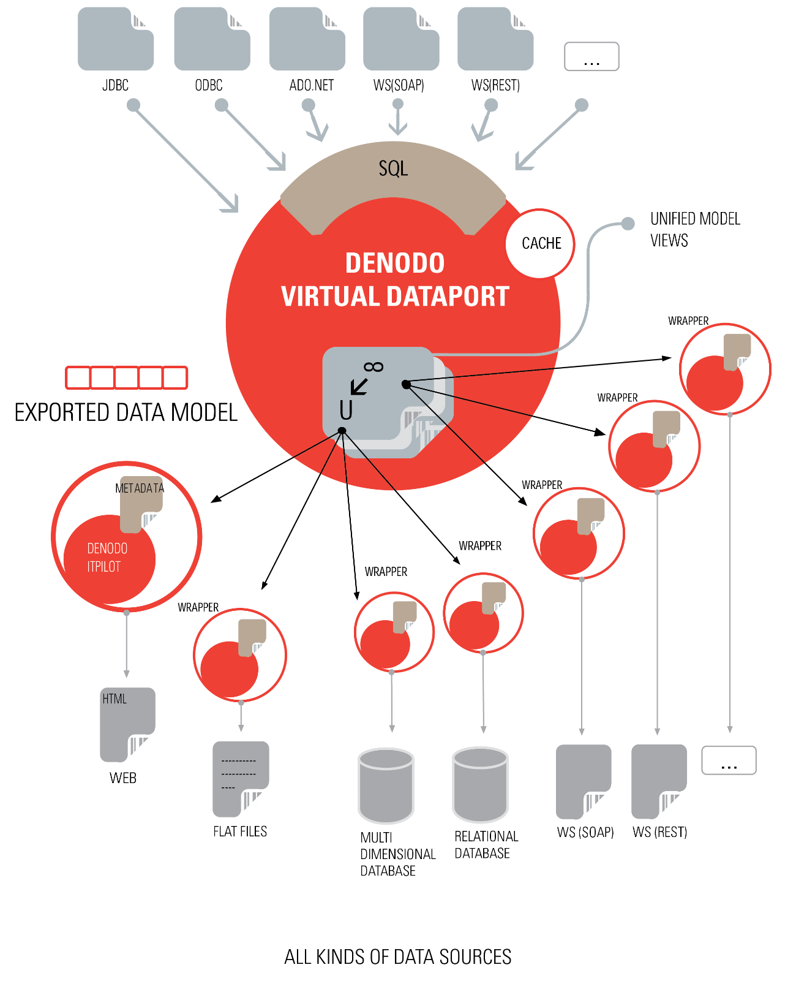

=====================
General Architecture
=====================

.. toctree::
   :hidden:
   
   physical_layer/physical_layer.rst
   logical_layer/logical_layer.rst
   user_layer/user_layer.rst

In outline, Virtual DataPort enables business applications to process a
series of distributed and heterogeneous data sources, including external
sources, as though the data were contained in a large "Virtual"
Database. This “virtual database” allows creating views that combine and
integrate said data.

Virtual DataPort acts as a mediator that provides a structured and
unified view of the data contained in all the data sources included in
the system. The system can easily deal with a wide range of structured,
semi-structured and unstructured data sources such as databases, Web
sites, spreadsheets, XML documents, Web Services, LDAP servers, flat
text files, indices on unstructured information, etc.

The system allows easily importing each data source into the “virtual
database”. Then, a SQL-like language called *Denodo VQL (Virtual Query
Language)* is used to create views that arbitrarily combine the data
of these relations using operations such as selections, projections,
unions, joins, groups, etc., thus creating unified views of the source
data. In this process, Virtual DataPort is able to work with sources
that have limited query capacity (for example, in many Web services only
queries specifying certain mandatory parameters are allowed).
Furthermore, the Virtual DataPort query engine is capable of querying
non-structured data and combining it with structured and semi-structured
data.

When the system receives a VQL query on a previously defined view, it
can generate an execution plan for the query, which consists of a list
of subqueries that are sent in real-time to the various sources involved
and a series of operations combining the data obtained from each source.

Furthermore, Virtual DataPort incorporates a system (called *cache
module*) which allows the administrator to decide on the mechanism to be
used for accessing the source data:

-  The system can access the source data in real time, thus providing
   totally updated data.
-  Caches can be created and configured for the sources or views as
   required.

Virtual DataPort also allows the updating of data sources, provided that
these are capable of supporting transactions.

The data integration system provided by Virtual DataPort is modeled on
three separate layers: the user layer, the logical layer and the
physical layer (*wrappers*). `Virtual DataPort Architecture`_ provides a
general overview of the system architecture. Each of these layers is
described below.

   Virtual DataPort Architecture
