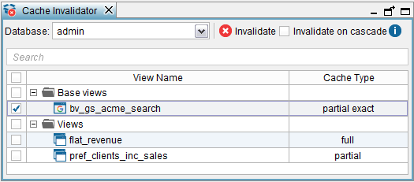

================
Invalidate Cache
================

The Invalidate cache tool can invalidate the cache of several views at
once. To open it, click **Invalidate Cache**, on the menu
**Tools** (see `Invalidate Cache tool`_). The section :ref:`Configuring the Cache of a View`
explains what the cache of a view
is and the effect of invalidating it.

   Invalidate Cache tool

To invalidate the cache content of one or more views, select these views
and click **Invalidate**.

Select the **Invalidate on cascade** check box to invalidate the cache
of all the underlying views of the selected views.

Example: there is a view named V3, which is a projection of the base
views BV1 and BV2. If you invalidate the cache on cascade of the view
V3, the Server will invalidate the cached data of the views V3, BV1 and
BV2.

The cache of views with “Full” cache mode cannot be invalidated on
cascade. In the previous example, if the cache mode of BV1 is Full, it
will not be invalidated.

In addition, the “Invalidate on cascade” check box is disabled when a
view with “Full” cache is selected. That is because the cache of these
views cannot be invalidated on cascade.

 

