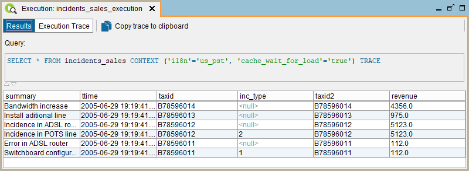
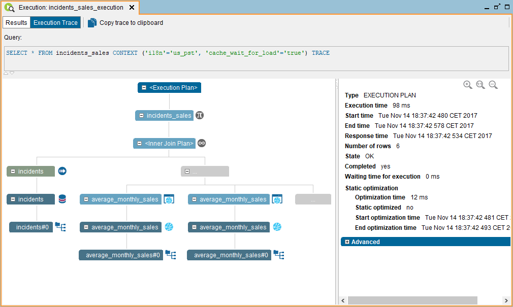

=============
Trace Viewer
=============

After executing a statement, you can :ref:`save the execution <export-result-to-zip>`
in a zip file. The Trace viewer allows you to load this file. executions. To open it, click the menu **Tools** > **Trace viewer** and select the file that contains the execution details of a query.

Its main use is to analyze the execution trace of queries that were executed in the past or in another administration tool.

   Execution results in the Trace viewer

   Execution trace in the Trace viewer
