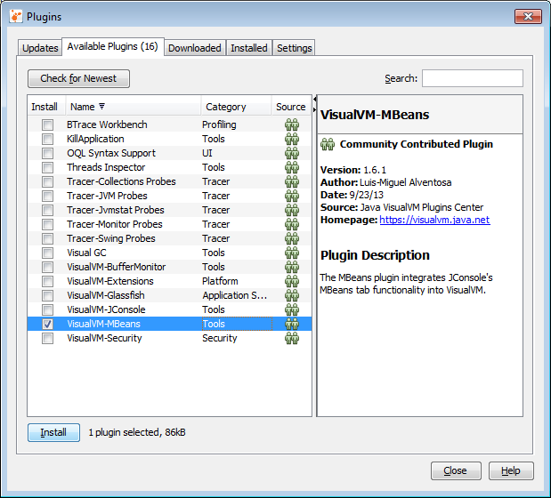
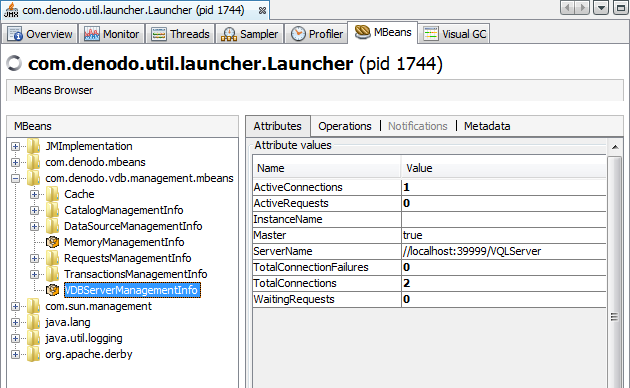
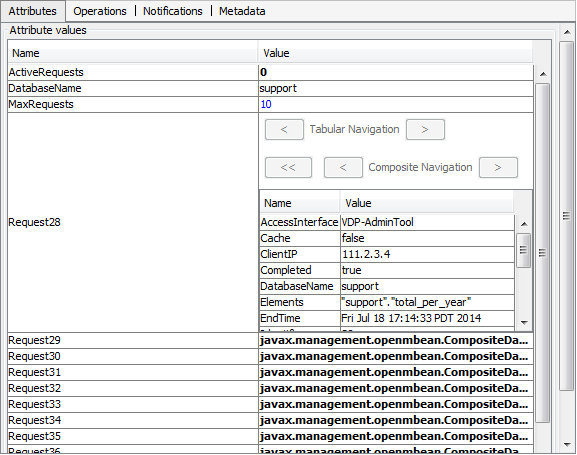
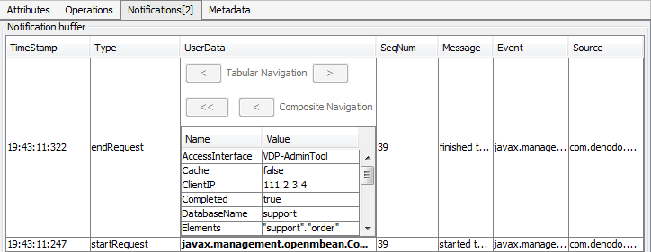

=====================
Using JavaTM VisualVM
=====================

`Java VisualVM <https://visualvm.github.io/>`_ is a JMX client included with the Java
Development Kit (JDK) version 6 or higher. This section explains how to
use VisualVM to monitor Virtual DataPort.

To run VisualVM, execute: ``<JAVA_HOME>/bin/jvisualvm``

.. note:: VisualVM is not included with the Denodo Platform. To obtain it,
   download the Java Development Kit (JDK). The Java
   Runtime Environment (JRE) does *not* include it either.

After launching it, install the “VisualVM-MBeans” plugin. To do this,
click **Plugins** on the **Tools** menu. Click the **Available plugins**
tab, select the “VisualVM-MBeans” check box and then, **Install**. In
the wizard, click **Next** to proceed with the installation of the
plugin.

   JavaTM VisualVM: Installing the MBeans plugin

After installing the plugin, connect to the JMX interface of Virtual
DataPort. To do this, click **Add JMX Connection** on the **File** menu.
In this dialog, in the **Connection** text field, enter
<hostname>:<Virtual DataPort server port>. E.g.: ``localhost:9999``.
Then, select **Use security credentials**, enter the credentials of an
administrator user and click **Ok**. After this, there will be a new
element in the list of processes on the left-side of JVisualVM.
Double-click it to open it. You can check that you have opened the right
process by making sure that in the “Overview” tab, the “Arguments” label
starts with “com.denodo.vdb.vdbinterface.server.VDBManagerImpl”

By clicking the different tabs of the process, you can obtain several
information about the Virtual DataPort server: CPU consumption, memory
consumption, activity of the Java garbage collector, etc. In this
section, we will talk about the specific information provided by Virtual
DataPort through its MBeans.

Click the **MBeans** tab to see the MBeans published by Virtual
DataPort. Virtual DataPort server.

   Virtual DataPort MBeans: ``VDBServerManagementInfo`` MBean

The information and events provided by each *MBean* is described in the
following sections.

The information and events regarding DML statements (``SELECT``,
``INSERT``, ``UPDATE``, ``DELETE``, etc.) are accessible via the MBeans
of the category
``com.denodo.vdb.management.mbeans:type=RequestsManagementInfo`` (see
section :ref:`Information and Events on the Running of Statements`). Unfold
this folder to see the list of the existing databases and unfold each
database to get information about the DML statements run on this
database. For example, `Attributes tab of the RequestsManagementInfo
MBean`_ shows the information on the queries run on the *support*
database, total number of requests executed (``TotalRequests`` property)
and number of active requests at that time (``ActiveRequests``
property).

To view more details about a request, double-click its “Value” cell. The
data about each statement includes the type of statement executed
(``SELECT``, ``INSERT``, etc.), the user who has run it, the time at
which it was run, the VQL statement, etc.

   *Attributes* tab of the RequestsManagementInfo MBean

The events related to DML statements from the *support* database can be
seen by clicking on the **Notifications** tab and then the **Subscribe**
button. From then on, every time the Server executes a DML statement,
VisualVM will display a new notification in this tab. Double-click the
**UserData** cell for details on the statement run (see `Details of a
notification`_).

   Details of a notification

.. include:: <isonum.txt>