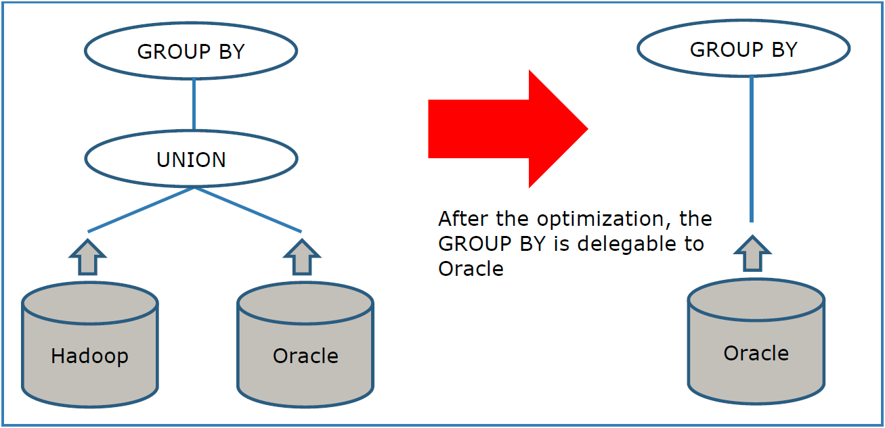

===========================================================
Removing Redundant Branches of Queries (Partitioned Unions)
===========================================================

When the conditions of a query are incompatible with the definition of
one of the queried views, the Execution Engine removes the branch of
that view from the query plan because it knows it will return zero rows.

This is useful in views whose data comes from two or more horizontal
partitions (or shards) and each partition is stored in a different data
source. For example, when the sales data of the current year are stored
in an Oracle database and the sales data from previous years, in a
Hadoop cluster.

In this scenario, you usually define a union view formed by the views
that represent each partition. Very often, the queries to this type of
union views only obtain data from one of the sources. E.g. quite a few
queries involve the data of the sales of the current year, but not from
previous year.

In this type of union views and depending on the WHERE condition, the
Execution Engine of Virtual DataPort can prune the branch that will not
be queried. This allows delegating to the data source all the operations
on top of the union view.

There are two ways of creating a partitioned union depending on if the
data has an attribute that distinguishes the data that is stored in one
data source from the data that is stored in the other.

|

**Creating a partitioned union when there is an attribute that
differentiates the data**

For example, let us say that you have these base views:

-  ``sales_oracle``: returns the sales of the current year.
-  ``sales_hadoop``: returns the sales from earlier years.

Both views have a field ``sale_date`` that indicates when the view was
performed.

In this scenario, follow these steps to create a partitioned union:

#. Create a selection view over ``sales_oracle`` with the condition
   ``sale_date >= TRUNC(NOW(), 'Y')``.
   
   This function returns the date value of the first day of the current year.
   
#. Create another selection view over ``sales_hadoop`` with the
   condition ``sale_date < TRUNC(NOW(), 'Y')``.
   
#. Create a union of these selection views.

If you query the union view without WHERE conditions, you will obtain
the sales from Oracle and Hadoop.

If you query the union with a condition that involves the ``sale_date``
field, the Execution Engine will remove from the execution plan the
views with a WHERE condition that is incompatible with the WHERE
condition of the query. This is why, the selection views with a WHERE
condition are necessary.

For example, to obtain the sales of the last seven days you have to
execute this query:

.. code-block:: sql 

   SELECT *
   FROM sales
   WHERE sale_date >= ADDDAY(NOW(), -7)

If we are in the day number 8 or later of the year, the Execution Engine
will detect that it only has to query the base view ``sales_oracle`` and
will prune the branch of the ``sales_hadoop`` view from the execution
plan.

The benefit of removing one of the branches, is that the Execution
Engine can push down more operations to the source, instead of having to
run them in Virtual DataPort. This leads to a better performance of the
query.

For example, if you execute the following query, the ``GROUP BY`` can be
pushed down to the source.

.. code-block:: sql 

   SELECT sales_rep, SUM(total)
   FROM sales
   WHERE sale_date >= ADDDAY(NOW, -7)
   GROUP BY sales_rep

The figure below displays the query plan before and after this
optimization.

If the WHERE condition was not there, the query would return the sales
data from Oracle and Hadoop and would not be able to push down the GROUP
BY.

|

**Creating a partitioned union when there are no attributes that
differentiate the data**

It is also possible to do a union of views that do not have a field that
distinguish them. To do this, you have to create, over each base view, a
selection view with a synthetic field, selection views with a condition
over that field and then, do the union over these selection views. For
example, let us say that you have the sales data of one territory stored
in one database and the sales data of another territory in another
database:

-  ``sales_eu``: returns the sales in Europe
-  ``sales_na``: returns the sales in North America.

None of the views have a field that allows to distinguish where the sale
was originated.

In this scenario, follow these steps to create a partitioned union:

#. Create a selection view over ``sales_eu`` called ``p_sales_eu``, with
   a field ``territory`` with the value ``'EU'``. E.g.
   
   .. code-block:: sql
   
      CREATE VIEW p_sales_eu AS 
      SELECT *, 'EU' as territory 
      FROM sales_eu
 
#. Create a selection view over ``p_sales_eu`` with the ``WHERE``
   condition ``territory = 'EU'``. E.g.
   
   .. code-block:: sql

      CREATE VIEW p_p_sales_eu AS 
      SELECT * 
      FROM p_sales_eu
      WHERE territory = 'EU'
  
#. Create a selection view over ``sales_na`` called ``p_sales_na``. E.g.
   
   .. code-block:: sql

      CREATE VIEW p_sales_na AS 
      SELECT *, 'NA' as territory 
      FROM sales_na;

#. Create a selection view over ``p_sales_na`` with the ``WHERE``
   condition ``territory = 'NA``.
   
   .. code-block:: sql
   
      CREATE VIEW p_p_sales_na AS 
      SELECT * 
      FROM p_sales_na
      WHERE territory = 'NA'
 
#. Create a union of the two selection views.

When you query the union view, the Execution Engine will apply the same
optimizations as in the previous example.

