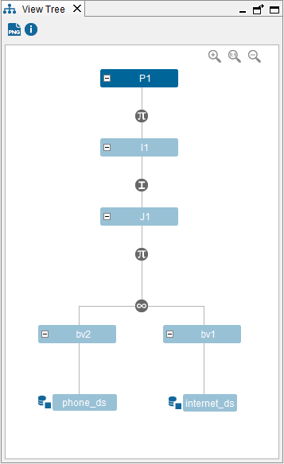

=================
Known Limitations
=================

-  A view with sub-queries in the ``WHERE`` clause cannot be moved.
-  When querying an interface view or creating/querying a view derived
   from an interface view, you cannot define a data movement for the
   subviews of the interface view. However, if you have defined data
   movements over the subviews of the interface view, they will be
   executed.
   The views derived from interface views cannot define data movements
   over the subviews of an interface because the interfaces act as an
   isolation layer that ensures that changes in the implementation do
   not affect the “consumers” of the interface.

For example, let us say that you the following views:

-  Two base views: “BV1” and “BV2”
-  A join view “J1” of “BV1” and “BV2”
-  An interface view “I1” whose implementation is “J1”
-  A selection view “P1” over “I1”

   Data Movement example

If in the “Execution plan” dialog of “P1” you define a data movement for
“BV2” to the data source “internet\_ds”, when you query “P1”, the data
movement will not be executed.

If in the “Execution plan” dialog of “J1” you define the same movement,
when you query “P1”, the data movement will be executed.

If you create a view “P2” over “J1”, you can define a data movement for
“BV2” and it will be executed. The reason is that there is not an
interface view between “P2” and “BV2”

