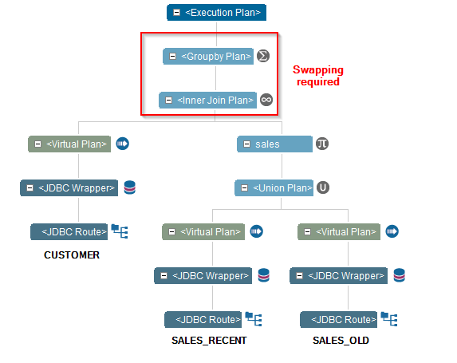
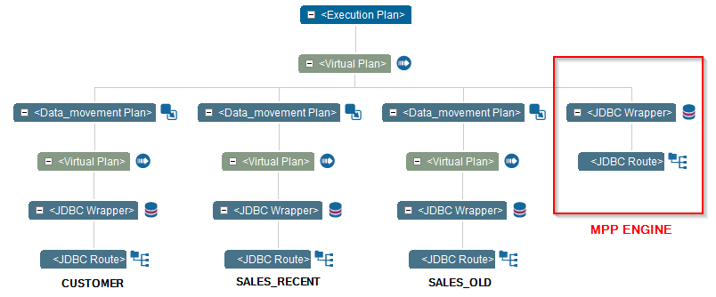

===================
Parallel Processing
===================

The Denodo optimizer provides native integration with several Massive Parallel Processing (MPP)
systems to accelerate certain queries that require significant processing.

Denodo supports integration with the following Hadoop-based MPP systems:

* Impala version 2.3)
* Spark version 1.5, 1.6 and 2.x
* Presto version 0.1x

This optimization works combined with the cost-based optimizer to detect operations that
would benefit from it. Pushing of query processing to the MPP engine will be used when the
query requires the processing of large amounts of data to be done in Denodo, and that processing
cannot be done in streaming mode. In that case, the processing most likely will require the
offloading to disk of part of the data to avoid exhausting the server resources.

The optimizer decides when is best to use the MPP on a query basis, the decision is based on the
type of operations specified in the query, the view statistics and the server configuration.
These are the types of operations that could benefit from its use:

* Operations that can be parallelized by an MPP, like aggregations
* Operations that if post-processed by Denodo would trigger swapping to disk:

  * Hash JOINS
  * Group By
  * Order By
  * DISTINCT

Let us consider the following example:

We have a view *customer* in the data source *DS1* that contains 10
million rows.

We have a view *sales* which is a union of two base views. One of the base
views is *recent_sales* and contains the sales for the recent year. The other base
view is *old_sales* and contains the sales information of previous years. The
base view *recent_sales* is in the data source *DS2* and contains one hundred
million rows. *old_sales* is in the data source *DS3* and contains one billion rows.
These base views have an attribute *customer\_id* that indicates the
customer that a product was sold to in a particular sale. Therefore, on average, we have approximately 110
sales for each customer.

The following query obtains the amount of sales of each customer:

.. code-block:: sql

   SELECT c.id as CustomerId, SUM(s.amount) as TotalSales
   FROM Customer c JOIN Sales s ON c.id = s.customer_id
   GROUP BY c.id

The Denodo optimizer will apply the aggregation push down optimization. This will
aggregate the sales in each data source, reducing the number of rows returned from
the data sources.

With this optimization, there are approximately 30 million rows transferred through the
network, the 10 million customers and 10 million from each sales database. But Denodo
would have to perform a join with 10 and 20 million rows in each branch respectively,
and then aggregate the 20 million rows resulting from the join. The join and group by
operations have to process a high volume of data, which will require the use of swapping
to disk to avoid excessive memory consumption.

   Parallel Processing: aggregation push down

With the parallel processing optimization enabled, the query optimizer, after applying
the aggregation push down will move the customer data and the aggregated sales data to the
MPP engine, executing the join and the aggregation leveraging the cluster resources.

   Parallel Processing: aggregation push down and parallel processing

Use of an MPP Engine as Cache
=============================

The parallel processing capabilities of an MPP engine can be combined with the use of
the same engine as the Denodo cache. This allows to take advantage of cached data that
can be combined with the datasets moved to the MPP for query acceleration.

In some cases, a Denodo administrator might want to setup a different cache system for
some databases, while allowing or disabling at the same time MPP query acceleration on those databases.

In this section we describe two examples of how to configure the server to achieve that behavior

* Server cache with MPP enabled, with some VDP databases using the same cache with MPP disabled.

  1) Configure the server cache with the MPP engine, enabling parallel processing in the data source settings.
  2) In the queries optimization section of the server configuration, enable parallel processing and select the cache data source
  3) Configure the databases with a custom cache data source, using the same connection parameters than the global cache, but without allowing MPP movements in the data source "Read & Write" configuration (Do not select parallel processing in the query optimization settings).

* Server cache with MPP enabled, with some databases using a different cache system, allowing also MPP movements to the global cache.

  1) Create a data source configured with the connection parameters to the MPP, with parallel processing enabled
  2) In the server cache configuration, select that data source as the cache data source.
  3) In the queries optimization section of the server configuration, enable parallel processing and select the same data source (with the option "Custom data source")
  4) Configure the databases with a different cache system using its own data source.

Force Movement of Views to the MPP Engine Using the CONTEXT Clause
==================================================================

It is possible to specify a ``CONTEXT`` clause when executing a query or creating a view
indicating the names of the views that should be moved to the MPP system. The syntax is
similar to the clause used to specify data movements, with the difference that the name of the context token is
``MPPMOVEMENTPLAN``.

The clause allows to specify one or several view names and for each appearance of the view in the query:

* ``(ON)`` to move the view to the MPP
* ``(OFF)`` to disable movement of the view to the MPP
* ``()`` to avoid indicating a preference for that occurrence of the view

.. code-block:: sql

   SELECT c.id as CustomerId, SUM(s.amount) as TotalSales
   FROM customer c JOIN sales s ON c.id = s.customer_id
   GROUP BY c.id CONTEXT(MPPMOVEMENTPLAN = customer: (ON)  store_sales_oracle: (ON))
