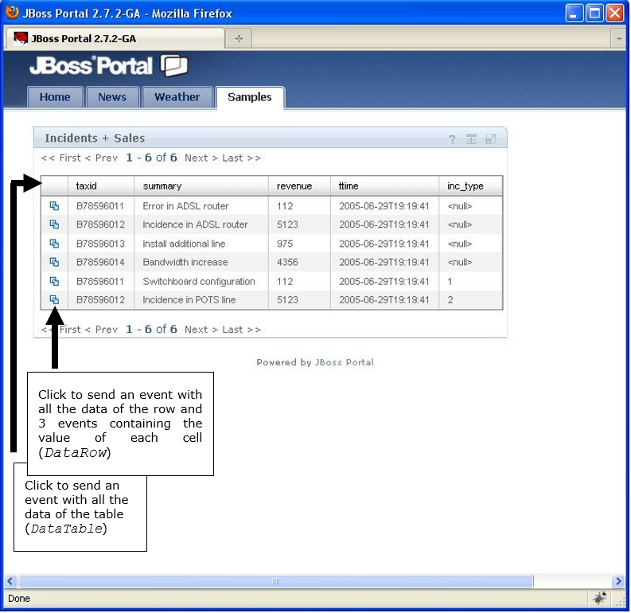
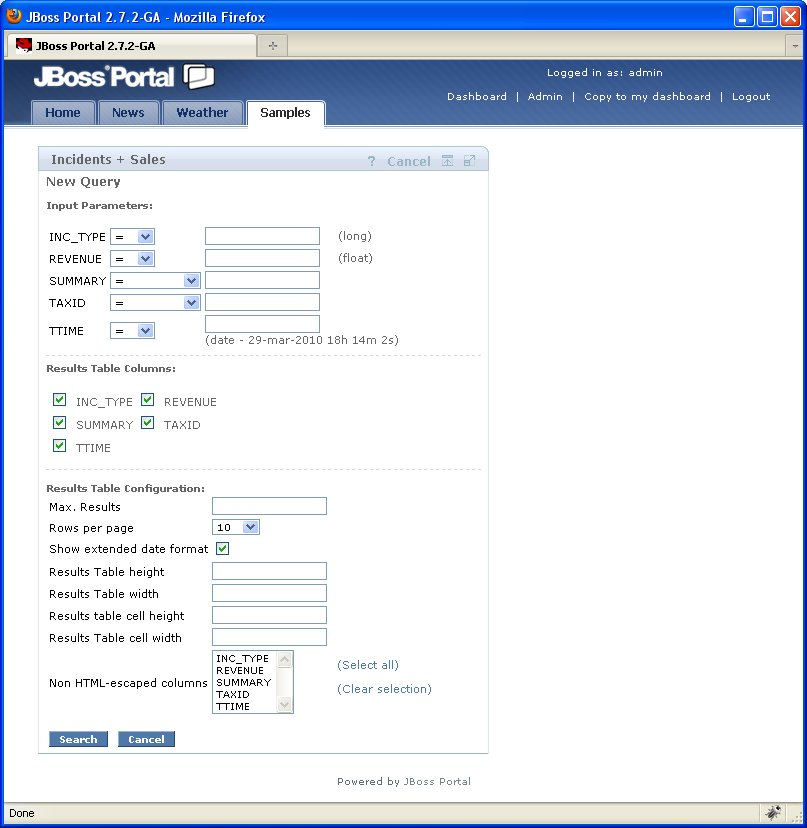

====================================
Export to JSR-168 or JSR-286 Portlet
====================================

.. note:: Publishing views as widgets is a deprecated feature and it may be removed in future
   major versions of the Denodo Platform.
   
   The section :ref:`Features Deprecated in Virtual DataPort 7.0` lists all the features that are deprecated.

A widget can be exported to a JSR-168 or JSR-286 portlet, so it can then
be deployed it in any standard Java Portal Server.

When clicking on **JSR-168** or **JSR-286** in the “Export” column of
the Widgets Status Table, the user will have to fill in:

-  URI of the Virtual DataPort server that the portlet will obtain the
   data from.
-  Credentials to access to it.

This will generate a “.war” file ready to be deployed in any standard
Java Portal Server. This file can be obtained from:

-  The URL :file:`https://{<host name of the Denodo server>}:9090/export/{<name of the widget>}.war`
-  Or in the host where the Denodo server runs, in :file:`{<DENODO_HOME>}/resources/apache-tomcat/webapps/export/{<name of
   the widget>}.war`

This portlet will display the contents of the published view or stored
procedure. In the EDIT mode, the portlet displays a query form where you
can configure (see `Portlet search form`_):

-  Query parameters that will be used to filter the contents of the
   exported view.
-  Hide some of the columns of the results table.
-  Results table settings: rows per page, height and width of the
   results table and its cells, and columns whose HTML code will not be
   escaped (if a cell of a selected column contains HTML, it will not be
   escaped)

The main difference between the two types of portlets is that the
JSR-168 version can only display the content of a view. On the other
hand, the JSR-286 version can interact with other portlets by
sending/receiving events or sharing public render parameters (see the
`Java Portlet Specification version 2.0 <https://jcp.org/en/jsr/detail?id=286>`_ to learn more about these terms)

The JSR-286 portlet can interact with other portlets by:

-  Sending simple events. When the user selects a row of the table by
   clicking the icon of the first cell of the row (see `JSR286
   Portlet`_), the portlet sends a simple event for every cell of that
   row. The payload of each event is the content of a cell.
-  Sending row events. When the user selects a row of the table, the
   portlet sends an event containing an object of the type
   ``com.denodo.vdb.wsgenerator.common.execution.portlet.vo.DataRow``
   
   This object contains the data of the selected row.
-  Sending table events. When the user clicks on the icon in the first
   cell of the header, the portlet sends an event containing an object
   of the type
   ``com.denodo.vdb.wsgenerator.common.execution.portlet.vo.DataTable``
   
   This option is enabled only if the option **Custom table events** is
   selected (tab “Widget configuration” of the “Create widget” dialog)
   
   This object contains all the data of the results table.
   
   To be able to develop a portlet capable of receiving the ``DataRow``
   and the ``DataTable`` events, you need to add a reference to the
   library
   :file:`{<DENODO_HOME>}/lib/portlet-client-core/portlet-client-core.jar`
-  Receive an event. The JSR-286 portlet can receive an event for every
   parameter of the query form. The name of these events follows the
   convention “Input\_”<name of the search parameter>
-  Sharing public render parameters. There is one render parameter for
   each column of the results table and a render parameter for each
   parameter of the search form.

The appendix :ref:`Customizing Events and Public Render Parameters of JSR-286
Portlets` explains how to customize the names of the events and public
render parameters that a Denodo portlet can publish/process.

   JSR286 Portlet

   Portlet search form

