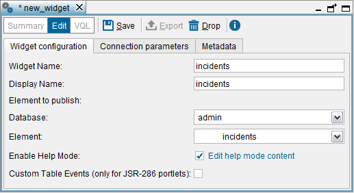
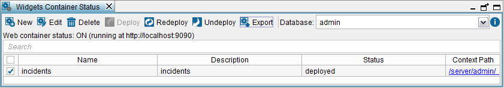

==========================
Publish a View as a Widget
==========================

.. note:: Publishing views as widgets is a deprecated feature and it may be removed in future
   major versions of the Denodo Platform.
   
   The section :ref:`Features Deprecated in Virtual DataPort 7.0` lists all the features that are deprecated.

To create a widget, click **Widget** on the **File** > **New** > **Data
service** menu, or right-click on the Server Explorer and click **Widget**
on the **New** > **Data service** menu.

   Creating a widget

The dialog to create new widgets has tree tabs:

#. **Widget configuration**: in this tab you have to provide the following:

   -  **Widget name**: name of the new widget.
   -  **Display name**: name that will be displayed to the users of the
      widget.
   -  **Database** and **Element to publish**: select the element/stored
      procedure you want to publish and its database.
   -  **Enable Help Mode**: if selected, the Help Mode of the widget will
      be enabled and users will be able to switch to it. This mode will
      display basic instructions of how to use this widget. You can
      customize these instructions by clicking on **Edit help mode
      content**.
   -  **Custom Table Events** (only for JSR-286 portlets): select this
      option to enable the Full Table JSR-286 complex event.
   
      .. note:: Increase the performance of the JSR-286 portlets by *not*
         selecting this option (see section :ref:`Export to JSR-168 or JSR-286
         Portlet` for more details).
   

#. **Connection parameters**: configure the connection parameters used by
   the portlets and the auxiliary Web Services to connect to Virtual
   DataPort (section :ref:`Auxiliary Web Services` explain what the auxiliary
   Web Services of the widgets are)

   -  **Chunk Size**. The results obtained by executing a sentence can be
      divided into blocks (chunks), so the Virtual DataPort Server does not
      have to wait until a sentence ends, to send the processed tuples to
      the portlet or the auxiliary Web service.
      
      This parameter establishes the maximum number of results that a block
      can contain.
      
      When the Server obtains enough results to complete a block, it sends
      this block to the client and continues processing the next results.

   -  **Chunk Timeout**. It establishes the maximum time (in milliseconds)
      that the Server waits before returning a new block to the portlet or
      the auxiliary Web service. When this time is surpassed, the Server
      sends the current block even if it does not contain the number of
      results specified in the *Chunk Size* parameter.
      
      .. note:: If *Chunk Size* and *Chunk Timeout* are 0, the Server
         returns all the results in a single block. If both values are
         different from 0, the Server returns a chunk whenever one of these
         conditions happen:

         -  The chunk is filled (*Chunk Size*)
         -  Or, after a certain time of not sending any chunk to the client
            (*Chunk Timeout*).
    

   -  **Query Timeout**. Maximum time (in milliseconds) the server will wait
      for the termination of a query. If its value is 0, it will wait
      indefinitely until the query finishes.

   -  **Enable Pool**. Enable the use of the connection pool. In production
      environments, the use of the connections pool is *strongly* recommended.

   -  **Initial Size**. Initial number of connections to be opened in the
      connection pool.

   -  **Max Active**. Maximum number of connections in the pool. A negative
      value means there is no limit.

#. **Metadata**: select the target folder of the Web service and provide a
   description for it.

After configuring everything, click on **Save** to create the widget.
The Tool will display the “Widgets container status” table (see `Widgets
Status Table`_) that lists the existing widgets.

   Widgets Status Table

This table provides the following information and actions for each
widget:

-  **Name** of the widget.
-  **Export**. Contains buttons to export the widget to different widget
   technologies.
-  **Status** indicates whether the auxiliary Web Service is deployed in
   the embedded Web container. If it is deployed, but changes have been
   made to the widget configuration, this is indicated by an “\*”.
-  **Context path**. If the auxiliary Web Service is deployed in the
   embedded Web container, contains the path to the service.
-  **Deployment**. Contains links to deploy / redeploy / undeploy the
   auxiliary Web Service of the widget.
-  **Properties**. Click on **Show** to display the properties of the
   widget.

You can also open the “Widgets container status” dialog by clicking
**Widgets container** on the menu **Tools**.

To obtain the information provided by this dialog from an external
application, invoke stored procedure ``WEBCONTAINER_ELEMENTS`` (see section :ref:`WEBCONTAINER_ELEMENTS` of the VQL Guide).

|

To open an existing widget, double-click on it, in the Server Explorer or
click on its name in the “Widgets container”. Then, you can:

-  Change the view/stored procedures to publish.
-  Change the settings of the widget.
-  View the VQL code that generates the widget by clicking **View VQL**.
   This dialog has the same options as the “View VQL” dialog of views
   (see section :ref:`View the VQL of an Element`).
   
   The VQL statements of this dialog correspond to the widget
   configuration stored in the Server and it does not reflect the
   current modifications.
