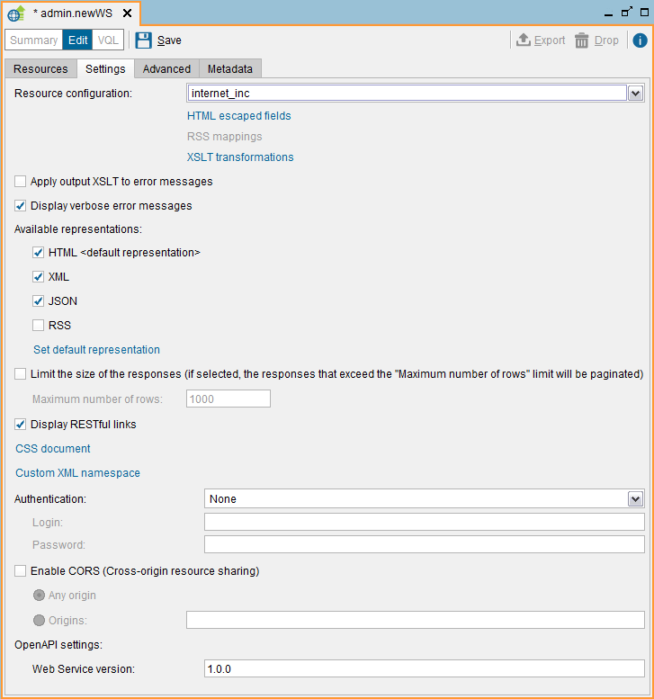
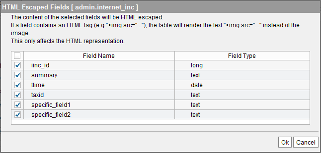

===================
Settings Tab (REST)
===================

In this tab, you can configure the following parameters of the REST Web
service:

   Creating a REST Web service: Settings tab

-  For each operation, you can:

   -  Select the fields you do not want to be **HTML escaped** (see section
      :ref:`HTML-Escaping the Data`).
   -  Assign **RSS Mappings** (see section :ref:`Mappings for the RSS
      Representation`).
   -  Define an **XSLT transformation** to transform the requests and
      responses to this operation, to adapt them to the requirements of
      existing REST-XML clients. See section :ref:`XSLT Transformations`.

-  By default, the XSLT transformations are applied to data but not to
   the error messages returned by the Web service. Select **Apply output
   XSLT to error messages** if you want the Service to apply them to
   error messages as well.
   This only affects the XML representation of the views.

-  If you want the Web service to return verbose error messages: by
   default, the Denodo Web services return verbose error messages when
   there is an error invoking one of the operations. These messages
   indicate where the problem was raised. E.g. if there was a timeout
   connecting to one of the data sources, an error executing a query, etc.
   If you do not want the clients of the Web service to get these verbose
   messages, clear the check box **Display verbose error messages**. In
   this case, the service will return a simple error message.

-  Select the representations provided by the Web service. See section
   :ref:`Selecting the Default / Available Representations`.

-  Limit the maximum number of rows returned by the service. If this
   limit is enabled, when a client queries a view, the number of rows in
   the response will never exceed this limit. This feature is useful to
   make sure that there is not any client who puts too much strain on the
   Virtual DataPort server or its data sources.
   
   To enable this limit, select the **Limit the size of the responses**
   check box and if needed, change the default limit in the **Maximum
   number of rows** box.

-  By default, REST Web services return several links within the data of a
   view:

   -  Each row of a view has a link that points to the row itself.
   -  Each row has a link for each association of the view that has been
      published.
   -  And, in the JSON and the XML representations, there is a link that
      points to the result itself.

   If you do not want the result to contain these links, clear the check
   box **Display RESTful links**.

-  The XML representation uses a default namespace, which can be changed.
   To do this, click on **Custom XML namespace**.

-  Provide a **CSS document** different from the default one. This is only
   useful for the HTML representation of the Web service. If you do not
   customize the CSS of this service, it will use the same one as the
   global RESTful Web service. As you can customize the CSS of the global
   RESTful Web service (explained in the section :ref:`Customizing the Look &
   Feel of the RESTful Web Service`), you can easily set up all your REST
   services to have the same customized layout.

-  Configure the **authentication** method of the Service. See section :doc:`Web
   Services Authentication <../web_services_authentication/web_services_authentication>`.

-  Enable Cross-origin resource sharing (CORS) in the Web service. See
   section :ref:`Cross-origin resource sharing (CORS)`.

HTML-Escaping the Data
=================================================================================

By default, the HTML representation of a REST Web service “HTML-escapes”
all the values of type ``text``. For example, if the value of a field is
``<a href="http://www.denodo.com">denodo</a>``, the user will see this
as text instead of a link to ``http://www.denodo.com``.

If you do not want the values of a field to be HTML-escaped, you have
two options:

#. At design time, when defining the REST Web service, select the fields
   you want the service to escape.
#. Or, at runtime, by adding the parameter ``$noescapehtml`` to the URL.
   The section :ref:`Input Parameters of the RESTful Web service` explains how to
   use this and other parameters of the REST Web services.

To configure the Web service at design time, select the view you want to
configure, in the **Resource configuration** list and click **HTML
escaped fields**. The Tool will open the “HTML Escaped Fields” dialog.

   REST Web services: HTML escaped fields

In this dialog, clear the check boxes of the fields you do not want the
service to escape.

Mappings for the RSS Representation
=================================================================================

The RSS 2.0 format (`Really Simple Syndication Format (RSS 2.0) <http://www.rssboard.org/rss-specification>`_)
specifies a series of
specific fields for each item. Therefore, on exporting a view in RSS
format, the correspondence between the fields of the view and the fields
in RSS format must be specified. The following options are displayed on
the RSS mappings screen:

-  If the service published includes operations of more than one view
   (or stored procedure), the RSS version of the service may only
   include the operations to query one of them. The selectable at the
   top left enables you to choose the view or stored procedure to be
   used.
-  Values for channel attributes. An RSS feed contains a channel element
   that specifies general information on the feed. In this group of
   options, it is possible to specify constant values for each of the
   channel subelements permitted by RSS format.
-  Mappings for the attributes of channel items. An RSS feed contains a
   list of item elements. Virtual DataPort will generate an item element for
   each row returned by the query executed on the view or stored
   procedure selected. This group of options enables you to select the
   attribute of the view that corresponds to each item subelement
   defined in the RSS format. If the mapping for a certain item
   subelement is left with the “none” value, that subelement will not be
   included in the output feed. The RSS format specifies that at least
   one value must be assigned either to the “title” subelement or to the
   “description” subelement.

Selecting the Default / Available Representations
=================================================================================

A REST Web service can provide four representations of the data of a
view:

#. HTML
#. XML
#. JSON
#. And / or RSS

You can configure the following:

-  Select the **Available representations** to choose the
   representations you want the Web service to provide. E.g., you may
   want the Web service to provide only the XML and JSON representations
   and not provide HTML or RSS.
-  Click **Set default representation** to choose the default
   representation of the data.

The Web service returns the default representation when the request does
neither includes the ``Accept`` HTTP header nor it has the ``$format``
parameter in the URL.

The browsers always send the header ``Accept`` requesting the HTML representation (they send something like ``Accept = text/html, application/xhtml+xml``). Therefore, if one of the available representations of the web service is HTML, when a user connects to the service using a browser, the service will return the HTML representation regardless of the "default representation" of the service. In this case, to obtain a different representation, add the parameter ``$format`` to the URL (e.g. ``$format=xml``).

When the ``Accept`` header contains
several media types, the service returns the default representation if
this representation is present in this header. However, if in the
``Accept`` header, the default representation has a quality factor lower
than 1, the service will return the representation with the highest
quality factor (see the example below)

For example, let us say that we publish a view as a REST Web service. In
this service, the available representations are JSON and XML and the
default one is XML. The following table lists what the output will be
depending on the value of the Accept HTTP header of the request.

.. table:: Representation returned by a REST Web service depending on the Accept HTTP header

   +--------------------------------------+--------------------------------------+
   | Accept HTTP Header of the Request    | Output Representation                |
   +======================================+======================================+
   | application/xml                      | XML                                  |
   +--------------------------------------+--------------------------------------+
   | application/json                     | JSON                                 |
   +--------------------------------------+--------------------------------------+
   | application/json, application/xml    | XML                                  |
   |                                      |                                      |
   |                                      | Although it is not the first media   |
   |                                      | type in the list, it is the default  |
   |                                      | one.                                 |
   +--------------------------------------+--------------------------------------+
   | application/xml;q=0.9,application/js | JSON                                 |
   | on                                   |                                      |
   |                                      | The default representation (XML) has |
   |                                      | a quality factor lower than the      |
   |                                      | other supported representation.      |
   +--------------------------------------+--------------------------------------+
   | application/json;q=0.2,application/x | JSON                                 |
   | ml;q=0.1                             |                                      |
   |                                      | Because the default representation   |
   |                                      | (XML) has a quality factor lower     |
   |                                      | than the other supported             |
   |                                      | representation.                      |
   +--------------------------------------+--------------------------------------+
   | text/xml, application/rss+xml        | The service returns the HTTP error   |
   |                                      | 406 Not Acceptable because none of   |
   |                                      | the media types in the Accept header |
   |                                      | are supported by the service.        |
   +--------------------------------------+--------------------------------------+

.. note:: The RSS representation has to be configured. Therefore, if you select
   RSS, click on **RSS mappings** to configure it.

.. _vdp-admin-publish-ws-settings-tab-cors:

Cross-origin Resource Sharing (CORS)
=================================================================================

Cross-origin resource sharing (`Cross-Origin Resource Sharing
(CORS) <https://www.w3.org/TR/cors/>`_) is a mechanism whereby a browser
and a web server interact to determine whether to allow a web page to perform
HTTP requests to a domain other than the domain from which the web page
is originated. The goal is for the browser to know if it is safe that a
page served from the domain *http://foo.com* can send requests to a
server in the domain *http://bar.com*.

You can configure REST Web services to support CORS. By doing so, the
service will respond with the appropriate HTTP headers so the browser
allows these requests. That way, you can create web pages that send
requests to this service.

To enable the support for CORS in a REST Web service, select **Enable
CORS**. Then, select one of these options:

-  **Any origin**. The service will allow CORS requests sent from any
   domain.
-  Or, **Origins** to enter the list of allowed URLs from which requests
   to this service are allowed. Separate each URL by a comma.
   For example, ``http://foo.com, https://foo.bar.com``.
   
   CORS requests from any other origin will be denied with the HTTP code 403 (Forbidden)
   
   .. important:: For each URL, enter its protocol as well. URLs that not contain the protocol are invalid. E.g. foo.com is invalid.

Note that when you enable the CORS support on a Web service, regular
HTTP requests are still allowed from any domain.

.. important:: REST Web services only provide support for CORS when you
   deploy them on the web container embedded in Denodo. That is, when you
   click “Deploy” in the “Web services container” dialog. If you export the
   Web service to a war file to deploy it on another Web container, you
   have to configure the CORS support using the mechanisms provided by your
   container. The reason is that the configuration of CORS is not standard
   across Web containers.
   
The Denodo REST services support CORS for the HTTP methods GET, POST, PUT and DELETE.

OpenAPI / Swagger
=================================================================================

The `OpenAPI Specification <https://www.openapis.org>`_, originally known as the 
"Swagger Specification", is a specification for describing REST web services.

Denodo REST web services publish an 
`OpenAPI 2 / Swagger specification <https://github.com/OAI/OpenAPI-Specification/blob/master/versions/2.0.md>`_
that describes the available operations and their input and output 
schemas. Once a REST web service has been deployed, the specification can be
accessed from its **Summary** panel. The table :ref:`Types of resources exposed by the RESTful Web service` provides more details on how to access this specification.

To specify the version of a REST web service, enter a value in the field
**Web service version** (*1.0.0* by default). This value will be
included in its OpenAPI specification.
