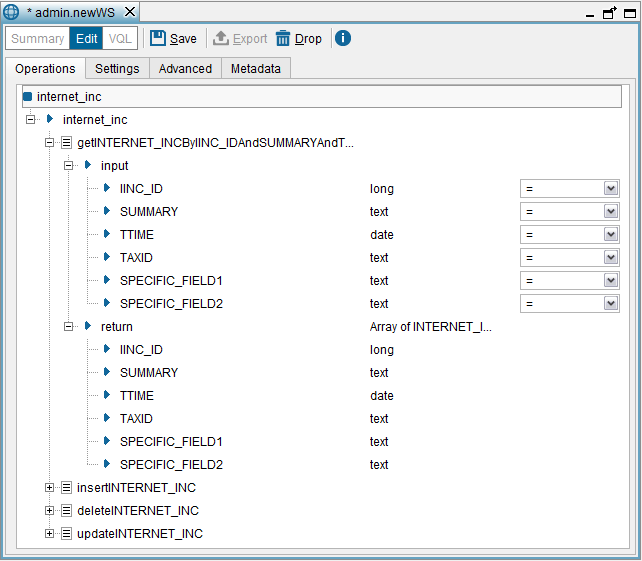

==============
Operations Tab
==============

This tab lists the operations published by the Service.

In this dialog, you can rename the Web service (only when you are
creating it), rename / delete input and output parameters, add
pagination support for operations (see section `Pagination Support`_),
etc.

   Creating a SOAP Web service: Operations tab

To add a new operation, drag a view or a stored procedure from the
Server Explorer to the dialog. The view/stored procedure can belong to a
different database. Then, the Tool analyzes its query capabilities and
generates the “candidate operations” of the Web service. These
operations have these characteristics:

-   The input parameters of the generated operations correspond to the
    fields of the view or the input parameters of the stored procedure.
    The return value of the ``SELECT`` operations is an array of elements.
    Each element of this array corresponds to a row of the view and will
    have one subelement for each field.

-   If the view is updateable (see section :ref:`Inserts, Updates and Deletes
    over Views` section of the VQL Guide), the Tool generates
    operations to insert, update, and delete rows from this view. More
    specifically, it generates the following operations:

    -   An insert operation with a parameter for each field of the view. The
        name of the operation will start with “insert” followed by the name
        of the view.
    -   A delete operation with a parameter for each field of the view. The
        name of the operation will start with “delete” followed by the name
        of the view.
    -   An update operation with *two* parameters for each field of the view:
        one of the parameters will take the name of the field and the other
        will take the name of the field prefixed by “New”.
        The parameters with the prefix “New” correspond to the new values
        (``SET`` clause of the ``UPDATE`` statement). Those without this
        prefix are used to choose the tuples to be updated (``WHERE`` clause
        of the ``UPDATE`` statement). The name of the operation will start
        with “update” followed by the name of the view.

You can modify the operations of the Web service as follows:

-   Rename an operation or one of its parameters: right-click on the
    operation or the parameter and click **Rename**.
-   Rename the type name of the compound parameters (register or array):
    right-click on the parameter and click **Rename type**.
    You may need to do this if the name of the type is very long and it
    affects the clients that will interact with this Web service.
-   Select the operator used to build the query sent to the Server, with
    the value provided for this input parameter: click on the operator
    beside the name of the input parameter and select the new one.
    This means that if you select the operator ``<=`` for a parameter
    ``P`` of an operation, when a client invokes this operation, the
    query sent to the Server will be like this:
    ``SELECT ... WHERE P <= <value>``\ To change the operator of
    several input parameters at once, select them, right-click on them
    and click **Change operator**. The new operator will be applied to
    the parameters that can accept the selected operator.
    To select two or more operations / parameters, hold Ctrl or
    Shift and click on each operation.

Delete an operation or one of its parameters: right-click on the
operation or the parameter and click **Drop**.

Depending on the query capabilities of the view (see section :ref:`Query
Capabilities`), some operations generated may have mandatory parameters
that cannot be deleted. To search for an element in the tree of
operations, press **Ctrl+F**.

Pagination Support
=================================================================================

When you are defining a Web service with an operation that returns many
data, you may need to paginate the results in order to avoid retrieving
them all at once. With this feature, a client can request the first
thousand results, then the next thousand, then… In addition, a client
may be interested in limiting the number of rows returned by the Web
service.

The pagination support is added operation by operation. That means that
if a Web service has several operations, not all of them may have
pagination support.

To add pagination to an operation, right-click on the operation and
click **Add pagination**. The Tool will add two new parameters to the
operation: ``COUNT`` and ``START_INDEX`` (these parameters can be
renamed):

-  ``COUNT`` limits the number of rows returned by the operation.
-  ``START_INDEX`` skips the rows of the result from row #\ ``0`` up to
   row #\ ``<START_INDEX>``.

These two parameters are optional and if their value is not present, the
operation returns all the results of the operation, at once.

If a client passes the ``START_INDEX`` and ``COUNT`` parameters, the
operation will return ``<COUNT>`` rows, starting from the row number
``<START_INDEX>`` (the first row is ``0``)

If a client just passes the ``COUNT`` parameter and not ``START_INDEX``,
the Web service will return the first ``<COUNT>`` rows of the result.

If a client just passes the ``START_INDEX`` parameter and not ``COUNT``,
the Web service will return all the rows of the result from row
``<START_INDEX>``.

If later, you need to remove the pagination support from an operation,
right-click on the input parameters ``COUNT`` and ``START_INDEX`` and
click on **Drop**.

Ordering the Results
=================================================================================

By default, the operations of the Web services return the data in the
order set by the published view, if any. However, if required, the order
can be determined by the clients of the Web service. To achieve this,
right-click on the operation and click **Add order by**. The Tool will
add a special type of input parameter called “ORDER\_BY” (this attribute
can be renamed).

The clients of the Web service that want to sort the results of the
operation have to provide a value to the “ORDER\_BY” parameter, with
this syntax:

``<field name> [ ASC | DESC ] [, <field name> [ ASC | DESC ] ]*``

For example, ``iinc_id ASC, summary DESC``.

Note that ``<field name>`` has to be name of the output field in the
operation and not the name of the view’s field.
