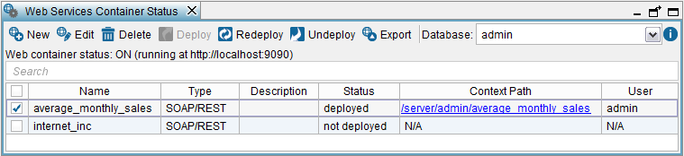

==================================
Web Service Container Status Table
==================================

The “Web service container status” dialog lists the existing Web
services of the database that you are connected to and allow you to
manage them. To open it, click **Web services container** on the menu
**Tools**.

   Web services Container Status dialog

This dialog provides the following information about each Web service:

-  **Name** of the Web service.
-  **Type** of the Web service. It can be “REST”, “SOAP” or “SOAP/REST”.
   The last type is for Web services imported from Virtual DataPort 4.7
   or earlier.
-  **Description**.
-  **Status**. It indicates whether the service is deployed in the
   embedded Web container. The icon
-  **Context path**. If the Web service is deployed in the embedded Web
   container, it contains a link to the root path to the service. Click
   this link to open it in your browser. **N/A** means that the service
   is not deployed.
-  **User**. As explained in the section :ref:`Web Service Container Status
   Table`, when a Denodo Web service receives a request, it connects to
   the Virtual DataPort server and executes a query equivalent to the
   request received. To open a connection, it uses the credentials of
   the user displayed in this column.
   
   When the authentication method of the service is “HTTP Basic with VDP”, “HTTP SPNEGO (Kerberos)” or 
   “WSS Basic with VDP” (only for SOAP Web services), the value is **Not required**. The reason is that a service with any of these types of authentication connects to Virtual DataPort using the credentials provided by the client of the service.
   
   .. important:: If a service uses the other authentication methods and you
      change the password of the user used by a Web service, you have to redeploy that Web service.
      
      If the service is not deployed, the value is **N/A**.

To obtain the information provided by this dialog from an external
application, invoke the stored procedure ``WEBCONTAINER_ELEMENTS`` (see section :ref:`WEBCONTAINER_ELEMENTS` of the VQL Guide).

In this dialog, you can perform the following actions over a Web
service:

-  **New**: to create a new SOAP or REST Web service.

-  **Edit**: to edit the selected Web service. This button is only enabled
   when you select only one service. When editing a Web service, you can do
   the following:

   -  Select the views/stored procedures to publish.
   -  Edit the existing operations of the Web service
   -  Change the settings of the Web service.
   -  Click **View VQL** to view the VQL code that generates the Web
      service. This dialog has the same options as the “View VQL” dialog of
      views (see section :ref:`View the VQL of an Element`).
     
      The VQL statements of this dialog correspond to the Web service
      configuration stored in the Server and it does not reflect the
      current modifications.

-  **Delete**: to delete the selected Web services. If any of the selected
   services is deployed in the embedded Web container, they are
   automatically undeployed and then deleted.

-  **Deploy**: to deploy the selected Web services in the embedded Web
   container.
   As explained in the section :ref:`Web Service Container Status Table`,
   when a Denodo Web service receives a request it connects to the
   Virtual DataPort server and executes a query equivalent to the request
   received.
   
   When clicking “Deploy”, the Tool opens a wizard where you have to
   select the credentials that you want the Web service to use:

   -  **Credentials of the current user**: the service will use the
      credentials of the current user to connect to Virtual DataPort.
   -  **Credentials of another user**: if you want the Web service to user
      other credentials, select this option, select a **User name** and
      enter the password of the selected user. Make sure that the password
      of the user is correct. Otherwise the requests sent to the service
      will fail because the service will not be able to connect to Virtual
      DataPort.

     .. note:: The Tool will not display the “Deploy Web service” wizard if
        the service uses the authentication methods “HTTP Basic with VDP”,
        “HTTP SPNEGO (Kerberos)” or “WSS Basic with VDP”.
        Instead, it will directly deploy the Web services. The reason is that 
        with these authentication methods, the service uses the credentials of the users that invoke the service.

   -  If Virtual DataPort is running in a Master/Slave configuration, this
      wizard will also show the **Virtual DataPort server URI** box. In
      this box you have to enter the URI of the Virtual DataPort server
      that you want this service to connect to. This is necessary because
      in a Master/Slave configuration there is only one embedded Web
      container running, but the services running in it can connect to any
      of the Virtual DataPort instances. In this URI, the host name is the
      same for all the instances because they all run in the same host. But
      the port number is different for each instance.
      
      The section :ref:`Configuring Several Instances of a Virtual DataPort Server` explains what a Master/Slave configuration is.

-  **Redeploy**: to redeploy the selected Web services in the embedded
   Web container. It is only enabled if all the selected services are
   already deployed in the embedded container.
   
   When you click this button, the Tool opens a wizard where you have to
   provide the same information as in the “Deploy Web service” wizard.
   This wizard provides one additional option: **Credentials of the user
   that deployed the Web service**. If selected, the Web service will use
   the same credentials as when it was deployed. For example, if the
   service was deployed with the user “scott” and you redeploy it
   selecting this option, the service will still use the credentials of
   the user “scott”. Note that if the credentials of the user “scott”
   changed since the last time you deployed the service, you have to
   select “Credentials of another user” and enter its user name and
   password.

-  **Undeploy**: to undeploy the selected services.

-  **Export**

   -  **WAR**: to generate a war file for each selected Web service. A war
      file contains the implementation of the Web service. With it, you can
      deploy the Web service to an external JEE Web container such as IBM
      WebSphere or Apache Tomcat. When you click this button, the Tool opens a
      wizard where you have to provide this information:

      -  **Virtual DataPort server URI**: URL to the Virtual DataPort server that
         this war will connect to execute queries. The default value is the URL
         of the server that you are connected to. But you can change it if you
         want the service to connect to a different server.

      -  Provide the credentials of the user of the Web service. You can select:

         -  **Credentials of the current user**.
         -  **Credentials of another user**: select a **User name** and enter her
            password. Make sure that the password of the user is correct.
            Otherwise the requests sent to the Web service will fail because the
            service cannot connect to Virtual DataPort.

      If the credentials of the exported services are “HTTP Basic with VDP”,
      “HTTP SPNEGO (Kerberos)” or “WSS Basic with VDP”, you only have to
      provide the “Virtual DataPort server URI”.
      
      After exporting WAR files, the Tool will display the URL to the
      generated files.

   -  **WSDL**: to generate a 
      WSDL (`Web Services Description Language - WSDL - version 1.1 <https://www.w3.org/TR/2001/NOTE-wsdl-20010315>`_)
      for each
      selected Web service (only enabled when all the selected services are
      SOAP).

      A ``wsdl`` file defines the interface of a SOAP Web Service and is
      required by the clients that want to access a SOAP Web service.
      
      The supported version of WSDL is 1.1.
      
      After exporting WSDL files, the Tool will display the URL to the
      generated files.

