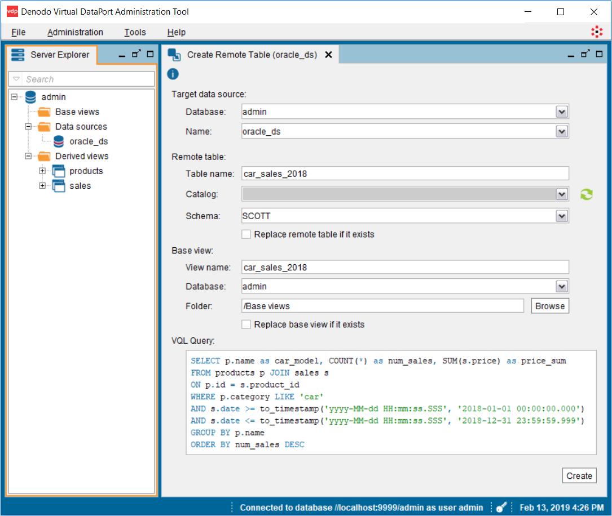
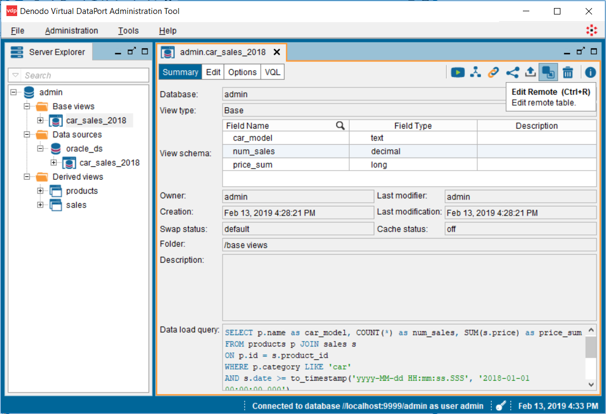
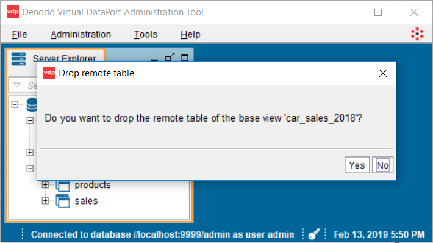
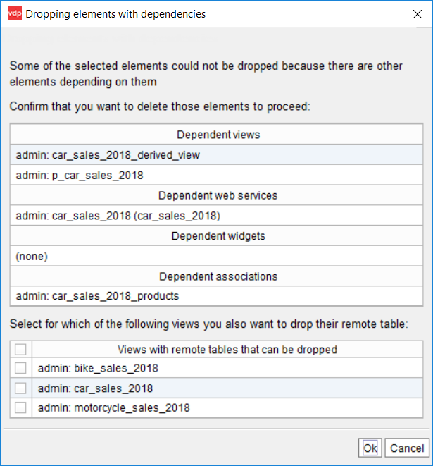

======================
Managing Remote Tables
======================

This section describes how to create, edit, and drop remote tables using the administration tool.

Creating Remote Tables
======================

There are three ways of creating a remote table:

1. Using the wizard of the administration tool.
#. Using the :ref:`CREATE_REMOTE_TABLE` stored procedure.
#. Using the :ref:`CREATE REMOTE TABLE<CREATE REMOTE TABLE Command>` command. This creates the table in the underlying database and inserts the results of the query in this table. However, it does not create the associated base view in Virtual DataPort.

This section describes how to create a remote table from the administration tool. To do this, follow these steps:

1. Right-click the JDBC data source where you want to create the remote table and then click **Create Remote Table**.

   .. note:: This feature is only supported for JDBC data sources. To use this feature with HDFS-based databases (Hive, Impala, Presto, Spark), first you need to enable :ref:`bulk data load <Bulk data load>`.

2. Enter the following information:

   
   Create remote table
  
..
   
   -  **Target data source**: select the data source where you want to create the remote table.
   -  **Remote table**: enter the name the name, catalog and schema of the new remote table.
   -  **Base view**: enter the information of the base view that will be created.
   -  **VQL Query**: enter the query that will be executed whose result will be inserted in the new remote table.
   
      Alternatively, you can drag a view from the Server Explorer to **VQL Query** to create the remote table using the definition of this view.

3. Click **Create**.

To create the remote table, the Execution Engine does the following:

1. It creates a table in the underlying database of a JDBC data source.
#. It executes the VQL query.
#. It inserts the result of this query into the table of the database created in step #1.
#. It creates a base view over the table created in step #1.

.. rubric:: Privileges Required

To do this, you need the following privileges:

-  "Connect" over the database of the JDBC data source.
-  "Execute" over the JDBC data source.
-  "Connect" and "Create view" over the Virtual DataPort database in which the base view will be created.
-  "Create folder" over the database where the base view will be created, if the procedure has to create the base view on a folder and the folder does not exist.
-  "Execute" over the views referenced in the query.

The user account set in the JDBC data source has to be able to create tables in the underlying database.

.. rubric:: Requirements

To use this feature, make sure Data Movement is enabled. To check this, open the dialog 
:ref:`Server Configuration - Queries Optimization <Queries Optimization>`. Otherwise, the creation
of remote tables will fail.

Editing Remote Tables
=====================

To edit a remote table, open the base view associated with the remote table and then, click **Edit Remote**.

   
   Edit remote table

After doing the necessary changes, click **Create**. The Execution Engine will do the following:

1. Drop the current table from the underlying database. All the data in this table will be lost.
#. Create a table in the underlying database of the JDBC data source.
#. Execute the query in Virtual DataPort.
#. Insert the result of this query into the table of the database created in step #2.
#. Replaces the existing base view with a new one, with the schema of the table created in step #2. If the base view
   had dependent elements, the changes in the schema *will not be propagated*.

If you want to modify a remote table programmatically, use the stored procedure :ref:`CREATE_REMOTE_TABLE`.

Dropping Remote Tables
======================

When you drop a remote table from the administration tool, you delete the base view associated to it and optionally, you can also delete the table from the underlying database. This is different from removing a regular base view because with regular base views, the underlying database is not modified.

When you delete a base view associated with a remote table, the tool will show a dialog like this one:

Click **Yes** to delete the table in the underlying database, in addition to the base view.

If you removing several remote tables at once, the tool will show a dialog like this one:

If you want to remove remote tables programmatically, use the stored procedure :ref:`DROP_REMOTE_TABLE`.
