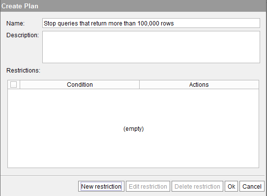

===============
Defining a Plan
===============

After enabling the Resource Manager, you have to create one or more
plans and later, one or more rules linked to one of these plans.

To define a plan, do the following:

#. Click the **Plans** tab.
#. Click **New** to create a plan. In the “Create plan” dialog, enter
   the name of the plan and optionally, a description.

   Resource Manager: creating a new plan

3. Click **New restriction**. In this dialog, select two things:

   a. **Execute when**: select when the plan will be activated. The options
      are:

      i.  Always.
      ii. When the CPU usage goes over a certain percentage. This restriction
          is evaluated when the query starts and every 20 seconds.

   b. Select the actions the Resource Manager will perform when the condition
      above is met. These actions are applied to ``SELECT`` or ``CALL``
      statements, not to DDL (``CREATE VIEW``, ``CREATE REST WEBSERVICE``, etc.) or DML ones (``INSERT``, ``UPDATE``, etc.)

      i. Stop query always. Stops the query immediately.

      #. Switch query to plan: the query will be moved to a different plan.

      #. Stop query when the maximum execution time has been reached.

      #. Stop query when the maximum number of returned rows has been reached.

      #. Set priority of the threads that execute the query: changes the priority
         of the threads spawned by the Virtual DataPort server to run the query.
         1 is the lowest priority and 10, the highest.

         Increasing the priority of the threads makes the query run faster.

         .. important:: If the Virtual DataPort server runs on Linux, this action
            will only be applied if the following two conditions are met, otherwise
            it will be ignored:
         
            -  Virtual DataPort is started with the ``root`` user
            -  And the following has been added to the “JVM options” of the Virtual
               DataPort server: ``-XX:ThreadPriorityPolicy=1``.
   
            The reason for having to meet these conditions is that on Linux, only
            processes launched by the ``root`` user can change the priority of its
            threads dynamically.
            
            This reminder does not affect Virtual DataPort servers that run on
            Windows because on Windows, processes can change the priority of its
            threads.

      #. Set the maximum number of concurrent queries. Sets the maximum number of
         concurrent queries run by the group of users that meet the condition of
         a rule (rules are explained in the next section).

         For example, let us say that we create a rule with the condition
         “access\_interface=JDBC” and assign to it a plan that limits the maximum
         number of concurrent queries to 30. If 35 JDBC clients execute a query
         at the same time and they do not meet the condition of another rule that
         is higher on the list of rules, the Server will only execute 30 queries
         concurrently. The other ones will be queued.
         
         The value of this action does not override the maximum number of
         concurrent queries set in the “Server Configuration” dialog.

      #. Set the maximum number of queued queries. Sets the maximum number of
         queued queries run by the group of users that meet the condition of a
         rule.

         The value of this action does not override the maximum number of queued
         queries set in the “Server Configuration” dialog.

      #. Enable/disable the automatic simplification of this query. The process
         of automatic simplification of queries is explained on the section
         :ref:`Automatic Simplification of Queries`.

      #. Set the maximum number of queries per time unit. Sets the maximum number
         of queries per time unit (per minute, per hour, per day or per month) run by the group
         of users that meet the condition of a rule. This action is only available
         when the option *Execute when* is *Always*.

   #. Click **Ok** to save the restriction and again, to save the plan.

You can create a plan with several restrictions. For example,

-  A restriction that is triggered when the CPU usage is above 50%.
-  A restriction that is triggered when the CPU usage is above 80%.

