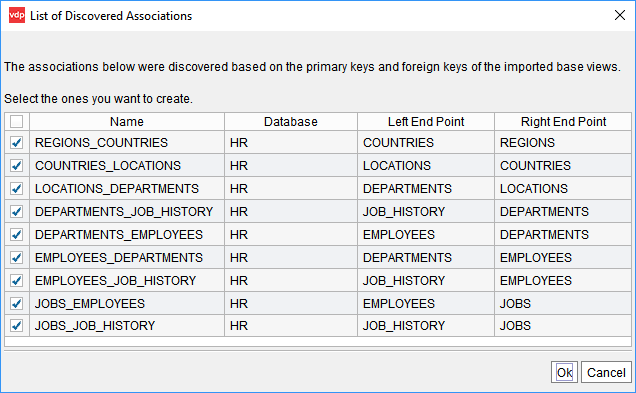
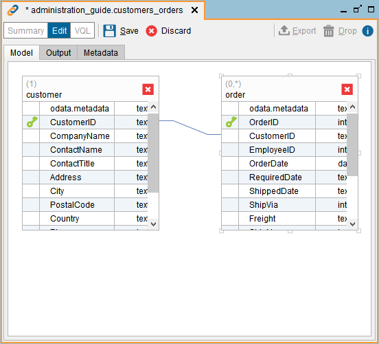
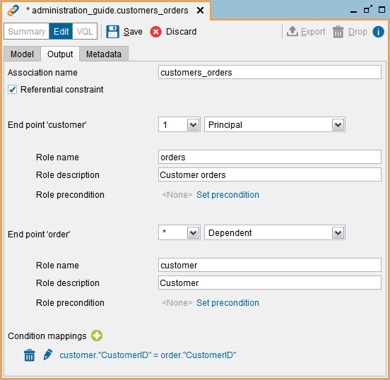

=======================
Creating an Association
=======================

There are two ways of creating an association:

1. For JDBC base views, the Tool can :ref:`Creating Associations for JDBC Base Views Automatically` create them automatically for you.

2. :ref:`Manually <Creating an Association Manually>`.

Creating Associations for JDBC Base Views Automatically
=======================================================

The administration tool can create automatically the associations between *JDBC base views* of the *same data source*. These associations will mirror the foreign key constraints of the tables/views in the source database.

To do this, follow these steps:

1. Select all the JDBC base views for which you want to create its associations, right-click one of the views and click **Discover associations**. To select several views, press Ctrl and click each view. You can also click the first view, press Shift and click the last view you want to select. 
#. The Tool will display a dialog like the one below, with the associations that will be created. In this dialog you can:

   -  Change the name of the new association.
   -  If you do not want to create one of the associations, clear the check box next to its name.

#. Click **Ok**. The Tool will create the associations.

   Discover associations dialog

You can also discover the associations of a single JDBC base view by opening the view and clicking **Associations**. The tool will display a panel with the associations of the view. In this panel, click **Discover**.

|

The list of new associations of this dialog is based on the foreign key constraints the tables/views had in the database, at the time the base views were created. In the VQL of a base view, each parameter ``REFERENCES`` of the statement ``CREATE WRAPPER JDBC`` of the base view represents one of these constraints. If the foreign keys of the tables/views in the database changed since you created the base view, do a *Source refresh* of the base view to update this information.

To create an association involving a derived view or a non-JDBC base view, follow the steps of the section :ref:`below <Creating an Association Manually>`. 

Creating an Association Manually
================================

To create a new association, click **Association** on the **File** >
**New** menu or right-click the Server Explorer and click **Association**
on the **New** menu.

The Tool will open the “View association” dialog and it will add the view that is currently
selected in the Server Explorer. To add the other view of the association,
click the **Model** tab and drag the view from the Server Explorer to this
dialog.

The “View association” dialog has three tabs:

#. **Model** (see `Creating a new association (“Model” tab)`_): tab
   where you have to drag the two views that will form the association
   and establish the mappings between the fields of the view. These
   views can belong to different databases.

   To link the field of a view with a field of another view, drag one field
   to the other. You will see a line between these fields. In views with many fields,
   you can right-click on the view and click **Find** to search the field you look for.

   To associate two fields, they must have the same type or compatible.
   For example, you can associate a ``float`` field with a
   ``double``, an ``int`` with a ``long``, etc.
   
   If you want to delete a view from the union, click on |image0| (in the
   top-right side of the view).

   The label on the top-left of each view – by default “(*)” – indicates the cardinality on that side of the association.
   
#. **Output** (see `Creating a new association (“Output” tab)`_): in this
   tab you can do the following:

   a. Change the name of the association.
   b. Select/clear the check box Referential constraint. If selected, it indicates
      that this association represents a foreign key constraint. The section :ref:`Referential Integrity in Associations` explains in more detail the implications of selecting this check box.
  
     .. note:: Only the associations marked as referential constraint are reported by the JDBC and the ODBC drivers as foreign keys.

     .. note:: Virtual DataPort cannot enforce referential integrity of the data. The sources have to guarantee it. 
  
   c. An association links two views and each view is one endpoint of the association. For each endpoint, do this:
   
      i.    In the list next to the name of the view, select the multiplicity on that side of the association. The section :ref:`Multiplicity of Associations` below explains what the multiplicity of an association is.
  
      ii.   If “Referential constraint” is selected, in the next box, select **Dependent** if this side of the association represents a foreign key constraint. Otherwise, select **Principal**.
  
      iii.  Enter the role name of the end point and optionally, a description.
  
      iv.   Optionally, set a **Role precondition**. You can only do this on an end point when the other end point has a multiplicity of **0..1** or **\***. See more about this in the section :ref:`Role Preconditions`.
            
   d. In the “Model” tab you can only define mappings like “field X = field
      Y”. In this tab, you can define mappings that are more complex. To do
      this, click on |image1| to add a new mapping. The Tool will display a dialog where
      you specify the condition of the mapping. Each side of the condition
      must refer to the fields of only one of the views.
   
      To edit an existing mapping, click on it.

#. **Metadata**: tab that allows you to define the folder where the new
   association will be stored and provide a description for the
   association.

.. important:: By default, the Tool does not list the associations in
   the Server Explorer. To list them, click the arrow on the Search bar
   (top-left of the Tool) and select **Associations**.

   Creating a new association (“Model” tab)

   Creating a new association (“Output” tab)

