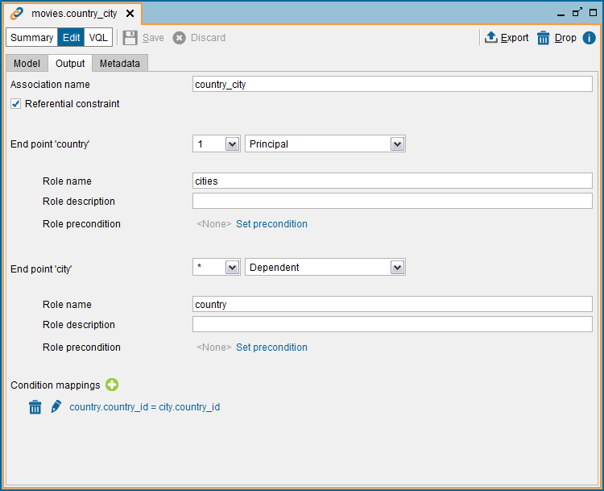

=======================
Navigating Associations
=======================

Virtual DataPort allows you to define relationships 
(:doc:`associations <../../restful_architecture/associations/associations>`) 
between two views. The figure below shows an association 
in which the elements of the ``country`` view can be related with the elements of 
the ``city`` view. Every ``country`` is related with zero or more ``cities``.

   Association between country and city

The Service Metadata Document of the OData service represents this relationship as a *navigation property*.

.. code-block:: xml
   :emphasize-lines: 10-15

   <EntityType Name="country">
       <Key>
           <PropertyRef Name="country_id"/>
       </Key>
       <Property Name="country_id" Type="Edm.Int16" 
                 Nullable="false"/>
       <Property Name="country" Type="Edm.String" MaxLength="50"/>
       <Property Name="last_update" Type="Edm.DateTimeOffset" 
                 Precision="19"/>
       <NavigationProperty Name="cities"  
                           Type="Collection(com.denodo.odata4.city)"         
                           Partner="country">
           <ReferentialConstraint Property="country_id"                        
                                  ReferencedProperty="country_id"/>
       </NavigationProperty>
   </EntityType>

Querying Related Entries
========================

The OData Service allows traversing the associations defined in the views in order 
to get all the entities related with a particular entity. This is done by means
of **navigation properties**::
  
  /denodo-odata.svc/<database name>/collectionName(key)/navigationPropertyName

For example, being ``cities`` a navigation property in the entity type 
``country`` that navigates towards the ``city`` entity type::

  /denodo-odata.svc/movies/country(2)/cities

Response:

.. code-block:: json
   :emphasize-lines: 6,7,12,13,18,19

    {
      "@odata.context": "/denodo-odata.svc/movies/$metadata#city",
      "value": [
        {
          "city_id": 59,
          "city": "Batna",
          "country_id": 2,
          "last_update": "2006-02-15T11:45:25Z"
        },
        {
          "city_id": 63,
          "city": "Bchar",
          "country_id": 2,
          "last_update": "2006-02-15T11:45:25Z"
        },
        {
          "city_id": 483,
          "city": "Skikda",
          "country_id": 2,
          "last_update": "2006-02-15T11:45:25Z"
        }
      ]
    }
	
Referencing Related Entities
============================

You can get the references to the collection of entities (instead of the actual
entities) related with one particular entity. 

To obtain this, add ``$ref`` to the URL (the old syntax 
``/$links/`` has been dropped in OData 4):
  
.. code-block:: none

  /denodo-odata.svc/<database name>/collectionName(key)/navProp/$ref

The URL specified below will show the references of every ``city`` associated 
with the entry ``country(2)`` through the navigation property ``cities``:

.. code-block:: none

  /denodo-odata.svc/movies/country(2)/cities/$ref

Response:

.. code-block:: json

    {
      "@odata.context": "/denodo-odata.svc/movies/$metadata#cities",
      "value": [
        {
          "@odata.id": "city(59)"
        },
        {
          "@odata.id": "city(63)"
        },
        {
          "@odata.id": "city(483)"
        }
      ]
    }
