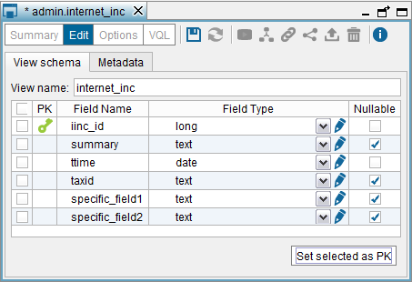
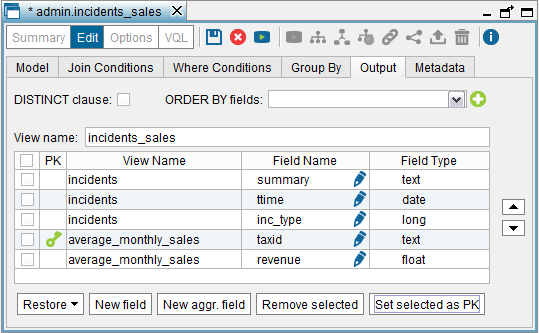

=====================
Primary Keys of Views
=====================

The primary key of a view is a column or a set of columns whose value is
unique in this view. In Virtual DataPort, you can define the primary key
of views. At runtime, clients can obtain the primary key definition of a
view by invoking the appropriate methods of the JDBC and ODBC interfaces
of the Server. Some business intelligence tools use this information to
generate more efficient queries.

Primary keys are part of the RESTful architecture of the Denodo
Platform. They allow browsing across the associations of views (see
section :doc:`../associations/associations`) by using the Denodo RESTful Web service (see
section :ref:`RESTful Web service`) or executing navigational queries
(``SELECT_NAVIGATIONAL``). See more about this in the section :ref:`Navigational Queries` of the VQL Guide.

Virtual DataPort does not enforce the primary key definitions so there
is no guarantee that a column marked as primary key indeed has unique
values. The responsibility of uniqueness relies on the data source.

To define the primary key of a base view, in the “Create view” or in the
“Edit view” dialog, select the check box beside the type of the fields
that form the primary key and click **Set selected as PK**. You will see
that these fields are marked with the icon |image0|.

To remove the current definition of the primary key, clear all the check
boxes and click **Set selected as PK**.

When creating a JDBC base view, the Server automatically sets the
definition of the primary key of the view according to the definition of
the selected table in the database.

When creating other types of base views, you have to define the primary
key manually.

   Setting the primary key of a JDBC base view

To define the primary key of a derived view, click the **Output** tab,
select the check box beside the type of the fields that form the primary
key and click on **Set selected as PK**. As in base views, these fields
are marked with the icon |image0|.

   Setting the primary key of a derived view

The primary key definition of views is not propagated. That is, you have
to define the primary key in the views where you need that information.

