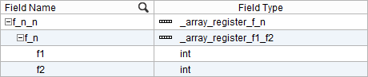
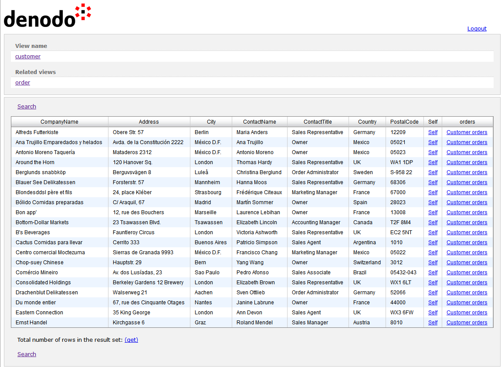
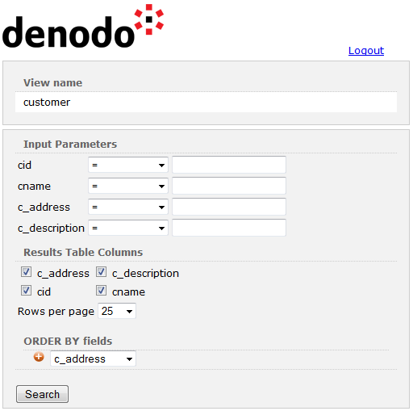

=================================================================================
Representations
=================================================================================

The RESTful Web service can represent the data of the views in three formats:

-  :ref:`XML representation <XML Representation>`.
-  :ref:`JSON representation <JSON Representation>`.
-  :ref:`HTML representation <HTML Representation>`.

By default, the RESTful Web service returns the data represented in
HTML, but clients can choose another representation (XML or JSON) by
either sending the appropriate ``Accept`` header in the HTTP request or
by including the ``$format`` parameter in the URL to invoke the Web
service (see the possible values of the ``$format`` parameter in the table
:ref:`Parameters supported by the Denodo RESTful Web service and published
REST Web services` of the section :ref:`Input Parameters of the RESTful Web
service`).

The RESTful Web service returns the default representation (HTML) when
the request neither includes the ``Accept`` HTTP header, nor it has the
``$format`` parameter in the URL. In addition, when the ``Accept``
header contains several media types, the service returns HTML if the
media types ``text/html`` or ``application/xhtml+xml`` are present in
this header. However, if in the ``Accept`` header, ``text/html`` or
``application/xhtml+xml`` have a quality factor lower than 1, it will
return the representation with the highest quality factor (see the
example below)

The following table lists what will be the output of the RESTful Web
service depending on the value of the Accept HTTP header of the request.

.. table:: Representation returned by a RESTful Web service depending on the Accept HTTP header
   :name: Representation returned by a RESTful Web service depending on the Accept HTTP header

   +--------------------------------------+--------------------------------------+
   | Accept HTTP Header of the Request    | Output Representation                |
   +======================================+======================================+
   | text/html                            | HTML                                 |
   +--------------------------------------+--------------------------------------+
   | application/xhtml+xml                | HTML                                 |
   +--------------------------------------+--------------------------------------+
   | application/xml                      | XML                                  |
   +--------------------------------------+--------------------------------------+
   | application/json                     | JSON                                 |
   +--------------------------------------+--------------------------------------+
   | application/json, application/xml,   | HTML                                 |
   | text/html                            |                                      |
   |                                      | Although it is not the first media   |
   |                                      | type in the list, it is the default  |
   |                                      | one.                                 |
   +--------------------------------------+--------------------------------------+
   | application/xhtml+xml;q=0.9,applicat | JSON                                 |
   | ion/json                             |                                      |
   |                                      | Because the default representation   |
   |                                      | (HTML) has a quality factor lower    |
   |                                      | than the other supported             |
   |                                      | representation.                      |
   +--------------------------------------+--------------------------------------+
   | application/json;q=0.2,application/x | JSON                                 |
   | ml;q=0.1                             |                                      |
   |                                      | Because the default representation   |
   |                                      | (XML) has a quality factor lower     |
   |                                      | than the other supported             |
   |                                      | representation.                      |
   +--------------------------------------+--------------------------------------+
   | application/rss+xml                  | The service returns the HTTP error   |
   |                                      | 406 Not Acceptable because the media |
   |                                      | type is only supported in            |
   |                                      | appropriately configured REST Web    |
   |                                      | services.                            |
   +--------------------------------------+--------------------------------------+

The value of the parameter ``$format`` overrides the value of the
``Accept`` HTTP header. For example, if a request contains the parameter
``$format=json`` and the value of the ``Accept`` HTTP header is
``text/html``, the Service will return the JSON representation of the
data.

XML Representation
=================================================================================

When a client selects the XML representation, the Service returns an XML
document.

To select this representation, clients have to add the ``Accept`` header
``application/xml`` to the HTTP request or add the ``$format=XML``
parameter to the URL (e.g.
``http://localhost:9090/denodo-restfulws/admin/views/customer?$format=XML``).

The following are some general remarks about the XML representations:

-  We reuse the link element from the ATOM specification 
   (`Atom Syndication Format <https://tools.ietf.org/html/rfc4287>`_) to
   represent links.
-  The value self for the ``rel`` attribute of a link has the standard
   meanings defined by IANA
   (http://www.iana.org/assignments/link-relations/link-relations.xml).
   That is, the link provides an identifier for the parent element.
-  The values ``prev`` and ``next`` have the standard meanings defined
   by IANA. That is, they are used for accessing the previous and next
   pagination intervals.
-  When there is not a standard identifier for the relation represented
   by a certain link, we use Denodo-defined URIs to specify the
   semantics of the relation.
   
   For instance, the value
   ``http://www.denodo.com/restful/rels/viewSchema`` identifies a link
   that allows accessing the schema of a certain view.

XML Representation of a Database
--------------------------------

The figure :ref:`below <Sample XML representation of a database>` shows an example of the XML
representation of the database ``support``.

The URL to retrieve this document is something like this:

http://localhost:9090/denodo-restfulws/support?$format=XML

For each view of the database, there is a ``view-metadata`` element,
which contains the following information:

-  A link to obtain the ``view-metadata`` element itself.
-  A link to access the schema of the view, formatted in XML Schema.
-  A link to obtain the content of the view.
-  A link to obtain the associations of the view.

.. code-block:: xml
   :caption:  XML representation of a database
   :name: Sample XML representation of a database
   
   <?xml version="1.0" encoding="UTF-8"?>
   <db name="support" xmlns="http://www.denodo.com/restful" xmlns:atom="http://www.w3.org/2005/Atom">
       <description>Customers support database</description>
       <view-metadata name="customer">
           <description>Acme customers</description>
           <atom:link rel="self" 
               href="http://localhost:9090/denodo-restfulws/support/views/customer/$metadata" />
           <atom:link rel="http://www.denodo.com/restful/rels/viewSchema" 
               title="View Schema"             
               href="views/customer/$schema" />
           <atom:link
               rel="http://www.denodo.com/restful/rels/viewElements" 
               title="View Elements" href="views/customer"/>
           <atom:link 
               rel="http://www.denodo.com/restful/rels/viewAssociations" 
               title="View Associations"  
               href="views/customer/$associations "/>
       </view-metadata>
       <view-metadata name="order">
           <description>Acme's orders database</description>
           <atom:link rel="self" 
               href="http://localhost:9090/denodo-restfulws/support/views/order/$metadata" />
           <atom:link 
               rel="http://www.denodo.com/restful/rels/viewSchema"  
               title="View Schema" 
               href="views/order/$schema" />
           <atom:link  
               rel="http://www.denodo.com/restful/rels/viewElements" 
               title="View Elements" 
               href="views/order" />
           <atom:link 
               rel="http://www.denodo.com/restful/rels/viewAssociations" 
               title="View Associations" 
               href="views/order/$associations "/>
       </view-metadata>
       <view-metadata name="orderline">
   …
       <atom:link rel="self" 
               href="http://localhost:9090/denodo-restfulws/support"/>
   </db>

XML Representation of a View
-----------------------------------------------------------------------------------------------------

The figure :ref:`below <Sample XML representation of a view>` shows an example of the XML
representation of the view ``customer`` of the database ``support``.

The URL to retrieve this document is something like this:

http://localhost:9090/denodo-restfulws/support/views/customer?$format=XML

This representation includes the name and description of the view and a
``customer`` element for each row of the view.

Each element has a link for each association of the view. This link
traverses the association for that element (in the `XML representation
of a view`_, it returns the orders of a given customer).

By default, all the attributes of the view are returned. The section
:ref:`Input Parameters of the RESTful Web service` explains how to customize the
output.

This representation supports pagination through the ``prev`` and
``next`` links. They will only appear if the URL contains the parameters
``$start_index`` and/or ``$count``.

 
.. code-block:: xml
   :caption: Sample XML representation of a view
   :name: Sample XML representation of a view
     
   <?xml version="1.0" encoding="UTF-8"?>
       <denodo:view name="customer" 
               xmlns="http://www.denodo.com/support/views/customer" 
               xmlns:denodo="http://www.denodo.com/restful" 
               xmlns:atom="http://www.w3.org/2005/Atom" 
               xmlns:xsi="http://www.w3.org/2001/XMLSchema-instance">
         <description>Acme customers</description>
         <customer>
             <cid>1</cid>
             <cname>RoadRunner</cname>
             <c_address>Monument Valley</c_address>
             <c_description>He is fast</c_description>
             <atom:link rel="self" 
                   href="http://localhost:9090/denodo-restfulws/support/views/customer/1?$format=XML"/>
             <atom:link 
                   rel="http://localhost:9090/denodo-restfulws/support/views/customer/supportcases" 
                   title="Support cases of this customer" 
                   href="../supportcase?$filter=scid&3D1&$format=XML" />
              <atom:link 
                    rel="http://localhost:9090/denodo-restfulws/support/views/customer/orders" 
                    title="Orders of this customer"  
                    href="../order?$filter=oid&3D1&format=XML" /> 
          </customer>

          <customer>…</customer>
   …
          <atom:link rel="self" 
                href="http://localhost:9090/denodo-restfulws/support/views/customer?$format=XML"/>
          <atom:link rel="prev" title="Previous"  
                href="?$count=10&$start_index=0">
          <atom:link rel="next" title="Next"
                href="?$count=10&$start_index=20">
   </denodo:view>

.. warning:: The RESTful Web Service will return the HTTP code 406 (“Not
   acceptable”), if the name of the view or any of its fields contains
   characters that are not valid in the name of an XML element (e.g. “+”,
   “\*”, space, etc.). This does not affect the HTML and the JSON
   representations.
   
   When publishing a view as a REST Web service, Virtual DataPort will
   automatically remove the invalid characters from the names of the
   fields.

|

The Service does not return the values of the blob fields when you
request a representation of the view. If the view has primary key, the
result has a link to the blob value. For example:

 
.. code-block:: xml
   :caption: XML representation of a view: link to a blob value
   :name: XML representation of a view: link to a blob value
   
   <image xsi:nil="false">
     <atom:link 
       rel="self" 
       type="multipart/mixed" 
       href="http://localhost:9090/denodo-restfulws/admin/views/customer/1?$format=xml&amp;$select=image"/>
   </image>

If the blob value is ``NULL``, the field is represented as an empty
element with the ``nil`` attribute set to ``true``. For example,
``<image xsi:nil="true"/>``

If the view does not have primary key, the blob fields are represented
as empty elements with the attribute ``xsi:nil`` set to ``true`` or
``false`` depending on if the value is ``NULL`` or not, respectively.

XML Representation of a “View Element” Resource
-----------------------------------------------------------------------------------------------------

The figure :ref:`below <XML representation of an element>` shows an example of the XML representation of
a row of the view ``customer``, identified by its primary key.

The URL to retrieve this document is: http://localhost:9090/denodo-restfulws/support/views/customer/1?$format=XML

In this URL, ``1`` is the value of the primary key of the ``customer``
view’s row.

If the view has one or more fields of type ``blob``, the response will
be a multipart message (i.e. with the HTTP header
``Content-type: multipart/mixed``):

-  The first part of the message will be the XML document with the data.
-  The following parts contain the value of each blob field encoded in
   ``base64``.

Each part of the message has its own ``Content-type`` header. If you
have set the content type of a blob field (see section :ref:`Working with
Blob Fields of Base Views`), the Service will set the value of the HTTP
header of its part, to the content type constant or the result of
evaluating its expression. Otherwise, the ``Content-type`` will be
``application/octet-stream``.

.. note:: The service only returns the links to traverse associations
   and retrieve blob values when the view has primary key.

.. code-block:: xml
   :caption: XML representation of an element
   :name: XML representation of an element

   <?xml version="1.0" encoding="UTF-8"?>
   <customer xmlns="http://www.denodo.com/restful/support/views/customer" 
             xmlns:atom="http://www.w3.org/2005/Atom" 
             xmlns:xsi="http://www.w3.org/2001/XMLSchema-instance">
       <cid>1</cid>
       <cname>RoadRunner</cname>
       <c_address>Monument Valley</c_address>
       <c_description>He is fast</c_description>
       <atom:link rel="self" 
             href="http://localhost:9090/denodo-restfulws/support/views/customer/1"/>
       <atom:link rel="http://localhost:9090/denodo-restfulws/support/views/customer/supportcases" 
             title="Support cases of this customer"  
             href="../supportcase?$filter=sid%3D1"/>
       <atom:link rel="http://localhost:9090/denodo-restfulws/support/views/customer/orders" 
             title="Orders of this customer" 
             href="../order?$filter=oid%3D1"/>
   </customer>

XML Representation of Array-Type Values
---------------------------------------

Denodo REST web services simplify the XML representation of array-type fields that only have one sub-field by returning only the subfield, without the enclosing array.

.. note:: The information on this subsection is related to the XML representation, not the HTML nor the JSON representations.

For instance, consider a web service that 
publishes a view with this schema:

   Schema with nested arrays

The service will represent the data with this XML document:

.. code-block:: xml
   :caption: Simplified XML representation of an element with nested array values

   <test_view>
      <f_n>
         <f1>10</f1>
         <f2>20</f2>
      </f_n>
      <f_n>
         <f1>10</f1>
         <f2>20</f2>
      </f_n>
      <f_n>
         <f1>10</f1>
         <f2>20</f2>
      </f_n>
      <f_n>
         <f1>10</f1>
         <f2>20</f2>
      </f_n>
   </test_view>

Note that the array "f_n_n" is not in the result, only the register "f_n".

|

If you prefer to not simplify the output in these scenarios, follow these steps:

1. Execute the following command:

   .. code-block:: vql
  
      SET 'com.denodo.wsgenerator.restws.xmlArraySimpleOutput' = 'false';

#. Redeploy all web services. The changes to this property are applied to a web service when you redeploy the web service.

After performing these steps, the service of the example will return this:

.. code-block:: xml
   :caption: XML representation of an element with nested array values

   <test_view>
      <f_n_n>
         <f_n>
            <f1>10</f1>
            <f2>20</f2>
         </f_n>
         <f_n>
            <f1>10</f1>
            <f2>20</f2>
         </f_n>
      </f_n_n>
      <f_n_n>
         <f_n>
            <f1>10</f1>
            <f2>20</f2>
         </f_n>
         <f_n>
            <f1>10</f1>
            <f2>20</f2>
         </f_n>
      </f_n_n>
   </test_view>

XML Representation of an Association
-----------------------------------------------------------------------------------------------------

The metadata of an association provides information about an association
and its two endpoints.

The figure :ref:`below <Sample XML representation of an association>` shows an example of the XML
representation of the association ``customer_order``.

The URL to retrieve this document is:

http://localhost:9090/denodo-restfulws/support/
associations/customer\_order/$metadata?$format=XML

.. code-block:: xml
   :caption: Sample XML representation of an association
   :name: Sample XML representation of an association

   <association-metadata referential-constraint="false" name="customer_order">
       <description>Association of customers and orders</description>
       <endpoint 
           principal="false" 
           multiplicity="1" 
           role-description="Orders of this customer" 
           role-name="orders" 
           view-name="CUSTOMER"/>
       <endpoint 
           principal="false" 
           multiplicity="0,*" 
           role-description="Customer of this order" 
           role-name="customer" 
           view-name="ORDER"/>
       <ns2:link 
           href="associations/customer_order/$metadata"    
           rel="self"/>
   </association-metadata>

JSON Representation
=================================================================================

When a client selects the JSON representation, the Service returns a
JSON document (`JavaScript Object Notation <http://www.json.org/>`_)
describing the requested element: a database, a view or a row of a view.

To select this representation, clients have to add the ``Accept`` header
``application/json`` to the HTTP request or add the ``$format=JSON``
parameter to the URL.

The JSON representation is equivalent to the XML representations.

.. code-block:: json
   :caption: Sample JSON representation of a view
   :name: Sample JSON representation of a view

   {
     "name": "customer",
     "description": "Acme Customers",
     "elements" : [
       { 
         "cid": 1234,
         "cname": "Roadrunner",
         "address": "Monument Valley",
         "description": "He is fast",
         "links" : [
           { 
             "rel": "self", 
             "href": "http://localhost:9090/denodo-restfulws/ support/views/customer/1234"
           },
           {
             "rel":"http://localhost:9090/denodo-restfulws/support/views/customer/supportcases",
             "title":"Support cases of this customer",
             "href":"../supportcase?$filter=customer_id%3D1234"},
           {
             "rel": "http://localhost:9090/denodo-restfulws/support/views/customer/orders", 
             "title": "Orders of this customer",
             "href": "../order=$filter=customer_id%3D1234"
            }
         ]
       },
       { 
         "cid": 5678,
         "cname": "Wile E. Coyote",
         "address": "Flagstaff, Arizona",
         "description": "He is fast",
         "links" : [
           { 
             "rel": "self", 
             "href": "http://localhost:9090/denodo-restfulws/ support/views/customer/5678"
           },
           {
             "rel":"http://localhost:9090/denodo-restfulws/support/views/customer/supportcases",
             "title":"Support cases of this customer",
             "href":"../supportcase?$filter=customer_id%5678"},
           {
             "rel": "http://localhost:9090/denodo-restfulws/support/views/customer/orders", 
             "title": "Orders of this customer",
             "href": "../order=$filter=customer_id%5678"
            }
         ]
       }
     ],
     "links": [
       { 
         "rel": "self", 
         "href": "http://localhost:9090/denodo-restfulws/support/views/customers"
       },
       { 
         "rel": "prev", 
         "title": "Previous",
         "href": "?$count=2&$start_index=0"
       },
       { 
         "rel": "next", 
         "title": "Next",
         "href": "?$count=2&$start_index=3"
       }
     ]

The Service does not return the values of the blob fields when you
request a representation of the view (i.e., when the URL does not have
the primary key of a view’s row). If the view has primary key, the
result contains a link to the blob value. For example:

.. code-block:: none
   :caption: JSON representation of a view: link to a blob value
   :name: JSON representation of a view: link to a blob value

   "image": {
       "rel": "self",
       "type": "multipart/mixed",
       "href": "http://localhost:9090/denodo-restfulws/admin/views/customer/1?$select=image"
   }

If the blob value is ``NULL``, the field is represented as a null value.
For example, ``"image": null``.

If the view does not have primary key, the blob fields are represented
as an empty string (i.e. ``"image": ""``) or with null (i.e.
``"image": null``) depending on if the value of the blob is ``NULL`` or
not, respectively.

|

If the URL represents a “View element” (i.e. a row identified by its
primary key) and the view has a field of type ``blob``, the response is
a multipart message (i.e. with the HTTP header
``Content-type: multipart/mixed``):

-  The first part of the message will be the JSON document with the
   data.
-  The following parts contain the value of each blob field encoded in
   ``base64``.

Each part of the message has its own ``Content-type`` header. If you
have set the content type of a blob field (see section :ref:`Working with
Blob Fields of Base
Views`),
the Service will set the value of the HTTP header of its part, to the
content type constant or the result of evaluating its expression.
Otherwise, the ``Content-type`` will be ``application/octet-stream``.

.. note:: The service only returns the links to traverse associations
   and retrieve blob values when the view has primary key.

HTML Representation
=================================================================================

The HTML representation is the default representation and is intended
for human use.

The Service returns this representation if:

-  The user adds the ``Accept`` header to the HTTP request with the
   values ``application/xhtml+xml`` or ``text/html``.
-  The user does not add the ``Accept`` header to the HTTP request.
-  Or, the user does not add the ``$format`` parameter to the URL.

   HTML representation of a view

There are a few differences between the HTML representation and the XML
and JSON ones:

-  There is a query form for each view (see `HTML query form`_) to
   filter the view elements, select the fields that will appear in the
   response and to order the results.
   
   To access this form, click **Search** in the representation of the
   view.
   
   The features provided by this form can also be obtained in the XML
   and JSON representations by adding certain parameters to the
   invocation URL (see section :ref:`Input Parameters of the RESTful Web
   service`).
-  For each association of a view, there is a link to make easier
   browsing through the associations of views. The views associated with
   this view are listed in the “Related views” box.
-  Click **get**, next to “Total number of rows…” to obtain the total number
   of rows of the result set. That is, the total number of rows of the result set.
   This number may be higher than the number of rows you are seeing because the HTML
   representation displays the data paginated.

   For example, if you are seeing the data of the view customer, by default the HTML
   representation will only show 25 rows, but if you click this link, the number will
   be all the rows of the view customer.  That is because the service obtains this number
   by executing the query

   .. code-block:: vql

      SELECT_NAVIGATIONAL COUNT(*) 
      FROM view 
      WHERE … 
   
   When obtaining the number of rows, the service takes into account the conditions you set in the URL.

-  When a view has a field of type ``blob`` *and* the view has primary
   key, the Service represents its values with a link whose label is the
   name of the field. If you click on this link, the Service will return
   the value of the field with the appropriate ``Content-Type`` HTTP
   header.
   
   If you have set the content type of the field (see section :ref:`Working
   with Blob Fields of Base
   Views`),
   the Service will set the value of the ``Content-Type`` HTTP header of
   its part, to the content type constant or the result of evaluating
   its expression. If you did not set the content type, the Service will
   try to guess it.
   
   If the view does not have primary key, the blob fields are hidden and
   you cannot request their values.

-  To begin using the service with different credentials, click the
   **Logout** link.

   Although this service does not keep a session, the browsers usually
   send automatically, along with every request, the first valid
   credentials you entered. When you click “Logout”, the service
   indicates the browser that the user has to enter new credentials.

   The other representations (JSON and XML) do not have this option
   because a client that wants to connect with different credentials, it
   just has to change the authentication headers of the requests it
   sends to the service.

.. note:: The service only returns the links to traverse associations
   and retrieve blob values when the view has primary key.

   HTML query form
