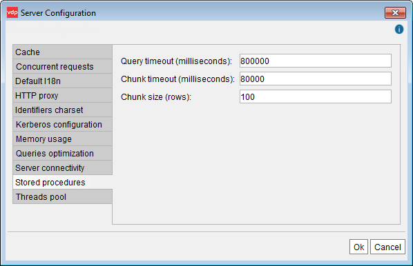

====================================================
Configuring Runtime Parameters for Stored Procedures
====================================================

Virtual DataPort allows executing stored procedures written in Java (see
section :ref:`Editing the Execution Plan` and the :doc:`/vdp/vql/stored_procedures/stored_procedures`
section of the VQL Guide). Stored procedures can execute
sentences on the Virtual DataPort server and process their results. The
execution of those sentences is affected by several configuration
parameters.

To change the runtime parameters for stored procedures, click **Server
configuration** on the menu **Administration** and then, click **Stored
procedures** (see `Configuration of Stored Procedures runtime parameters`_).

   Configuration of Stored Procedures runtime parameters

It is possible to configure the following parameters:

-  **Query timeout (milliseconds)**: Maximum time the stored procedure
   will wait for the termination of a sentence. If the value 0 is
   specified, the procedure will wait indefinitely until the sentence
   ends.
-  **Chunk timeout (milliseconds)**: This parameter establishes the
   maximum time the server will wait before returning a new block. If
   this time is surpassed, Virtual DataPort will return the current
   block even if it still does not contain the number of results
   specified by the “Chunk size” parameter. If the “Chunk timeout”
   parameter is not specified (or receives the value 0), then all the
   results of the query will be returned in a single block when the
   sentence execution ends.
-  **Chunk size (rows)**: The results obtained by executing a sentence
   can be divided into blocks, so it is not needed to wait until a
   sentence ends to process the already obtained tuples.
   This parameter establishes the maximum number of results that a block
   can contain. If Virtual DataPort has obtained enough results to
   complete a block, they will be immediately returned to the stored
   procedure. The next results will be returned in new blocks. If this
   parameter is not specified (or receives the value 0), all the results
   of the query will be returned in a single block.

