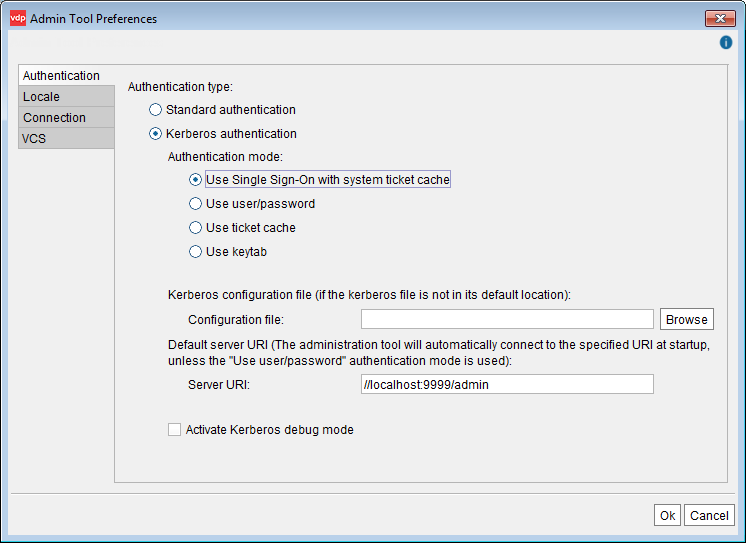

==================================================================
Configuring the Administration Tool to Use Kerberos Authentication
==================================================================

Besides configuring the Kerberos authentication in the Virtual DataPort
server, you have to do it in all its clients that want to login using
Kerberos.

This section explains how to configure the Administration Tool to use
Kerberos authentication.

To enable Kerberos for JDBC clients, read the section :doc:`Connecting to
Virtual DataPort Using Kerberos Authentication <../../../developer/access_through_jdbc/connecting_to_virtual_dataport_using_kerberos_authentication/connecting_to_virtual_dataport_using_kerberos_authentication>` of the Developer Guide.

To enable Kerberos for ODBC clients, enable Kerberos authentication on the databases that you are
going to access from ODBC clients. The section :doc:`Creating Databases </vdp/administration/databases_users_and_access_rights_in_virtual_dataport/administration_of_databases_users_roles_and_their_access_rights/creating_databases>`
explains how to do this.

The section :doc:`/vdp/administration/publication_of_web_services/web_services_authentication/web_services_authentication` provides information about
the Kerberos authentication in Web services published by Virtual
DataPort.

|

To configure the Administration Tool, click the menu **Tools** > **Admin
Tool preferences**.

   Setting up Kerberos authentication in the Administration Tool

In this wizard, provide the following details:

#. Select **Kerberos authentication**. If in the future, you want this
   Administration Tool to use the authentication configured in the
   database, select **Standard authentication**.

   If you select “Standard authentication”, you will rely on the other
   authentication methods provided by Virtual DataPort. I.e. you have to
   provide the credentials of a user created in Virtual DataPort or if you
   are connecting to a database with LDAP authentication, the credentials
   of a user in the LDAP directory selected for this database.

#. Leave the **Kerberos configuration file** box empty unless the host
   where this Tool runs does not belong to a Kerberos
   realm (e.g. a Windows Active Directory domain) or it is a different domain than the one used by the Server. If you need to, click **Browse** to select the path to the file ``krb5.conf`` or ``krb5.ini``.

#. Select the authentication mode:

   a. **Use Single Sign-On with system ticket cache**:
      with this option, when you launch this Administration Tool, you will not
      need to enter your credentials. Instead, the Administration Tool will
      retrieve the Kerberos ticket from the tickets cache of the operating
      system. Then, it will automatically connect to the default database,
      which is configured in the “Server URI” box.

      .. important:: If the Administration Tool runs on Windows, you can only use this authentication mode if you modify the Windows registry as
         explained in the section :ref:`Modifying the Windows Registry to Use the Native Ticket Cache`
         of the Installation Guide. 
         
         If you cannot do this, use the “Use user/password” or the “Use ticket cache” options.
         
         On Linux, you can use this option without doing any changes on the system.

   b. **Use user/password** (recommended option if you cannot use the first one): the users will have to provide their credentials to log in. The tool will connect to the Active Directory to request a Kerberos ticket on their behalf and use it to authenticate.

   c. **Use ticket cache**: select this to use your own ticket cache instead
      of the one from the operating system.
      
      We recommend using the option *Use user/password* over this one because with this one, there is a limit of how long the administration tool can renew the Kerberos ticket of the ticket cache. Usually, after a week, these tickets can no longer be renewed and you will have to obtain it again. 

      To use this option, before starting the Tool, you need to manually request a
      Kerberos ticket-granting ticket (TGT). To do this, execute the following: 

      .. code-block:: batch

         <DENODO_HOME>\jre\bin\kinit.exe -f -c "<DENODO_HOME>\conf\vdp-admin\ticket_cache"

      You will also have to run this when the ticket has expired.

      The option -f requests the Active Directory to return a
      “forwardable” ticket. “Forwardable” tickets can be used by the other
      applications (in this case, the Virtual DataPort server) to request
      service tickets on behalf of the user. These service tickets will be
      used to perform Kerberos requests to other services (e.g. databases) on
      behalf of the Virtual DataPort client (i.e. the Administration Tool,
      JDBC clients and ODBC clients).
      
      If the ticket used by the client is not forwardable, the requests that
      involve data sources with the option “pass-through session credentials”
      enabled, will fail.
      
      i.   After creating the ticket cache file, enter the path to this file
           in the **Ticket cache file** box.
      ii.  If the tickets cache contains “ticket-granting tickets” for several
           users or domains, enter the user name that you want to use for the
           authentication in the **Principal** box.
      iii. Select **Renew TGT** so when the ticket expires but still is within
           the renewal period, a new ticket will be obtained. The renewal
           period is configured in the Active Directory.

      If you were using this authentication method and switch to another one, remove the ticket cache file.

   d. **Use keytab**: we discourage using it because this method is usually used by servers, not for regular users. You only need to enter the **Principal** if the keytab contains entries for several users.

4. The first time you set up Kerberos, we recommend selecting the check box **Activate Kerberos debug mode**
   in case you run into any issues. Once Kerberos has been set up, disable this.

   .. rubric:: If the administration tool has the update 20190903 or newer:
   
   To obtain the Kerberos debug messages with the update 20190903 or newer, in the installation of your administration tool - not in the Denodo server - open the file :file:`{<DENODO_HOME>}/conf/vdp-admin/log4j2.xml` and add the following *below* the line ``<Loggers>``:

   .. code-block:: xml

      <Logger name="com.denodo.util.logging.JavaConsoleLogging" level="debug" />

   Restart the administration tool to apply the changes to this file.
      
   You will find the Kerberos debug messages in the *local file* :file:`{<DENODO_HOME>}/logs/vdp-admin/vdp-admin.log`.

   .. rubric:: If the administration tool has the update 20190312 or older:
   
   To obtain the Kerberos debug messages with the update 20190312 or older, launch the administration tool from the command line and redirect the output to a file. To do this, execute these commands:
   
   On Windows:
   
   .. code-block:: batch
   
      cd <DENODO_HOME>\bin
      vdpadmin.bat > vdpadmin_kerberos_logging.log 2>&1
      
   On Linux:
   
   .. code-block:: bash
   
      cd <DENODO_HOME>/bin
      ./vdpadmin.sh > vdpadmin_kerberos_logging.log 2>&1

   You will find the Kerberos debug messages in the *local file* :file:`{<DENODO_HOME>}/bin/vdpadmin_kerberos_logging.log`.
   
   When you disable the Kerberos debug mode, you no longer need to start the administration tool from the command line.

#. If you selected the Authentication modes *Use Single Sign-On with system
   ticket cache*, *Use ticket cache* or *Use keytab*, the next time you
   launch the Administration Tool of this host, it will automatically log
   in to the Server indicated in **Server URI**.
