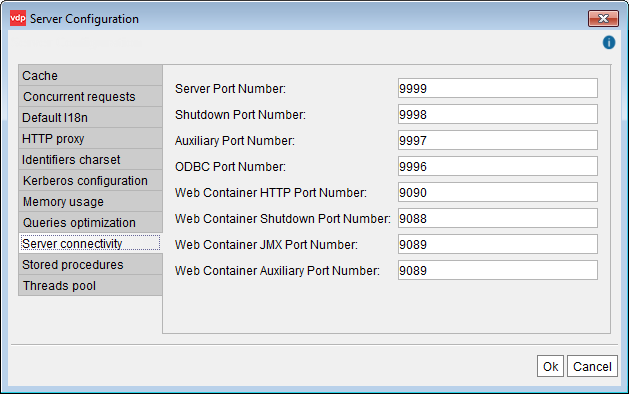

===================
Server Connectivity
===================

To change the connectivity settings of the Virtual DataPort server,
click **Server configuration** on the menu **Administration** and then,
click the tab **Server connectivity** (see `Server connectivity`_).

In this dialog, you can configure the following:

-  Ports used by the Virtual DataPort server: execution, shutdown and
   auxiliary ports.

   -  The **Server port number** and the **Auxiliary port number** are the
      ports used to communicate between the Virtual DataPort server and its
      Administration Tool, the Denodo Web container, third-party JDBC
      clients, etc.
   -  The **ODBC port number** is the port where the server listens to ODBC
      connections.

-  Port numbers of the Web container embedded in the Denodo Platform.

.. important:: When the Virtual DataPort Server and the
   Administration Tool or other clients are installed in different
   machines, you may need to change the interface that the Server listens
   to connections. To change this, open the Denodo Control Center, open the
   **Configuration** dialog and change the **RMI Host** of the **JVM
   Options**. See more details in the section :ref:`Denodo Platform Configuration` 
   of the Installation Guide.

   The reason for this is that in some environments, when listening to
   ``localhost``, the server does not allow connections from remote hosts.

.. note:: When the connection between clients and the Virtual DataPort
   server is established through a firewall, this must be configured to
   allow the connections to the execution and auxiliary ports.

   Server connectivity

The ports changes will take effect the next time the Virtual DataPort
server is launched.
