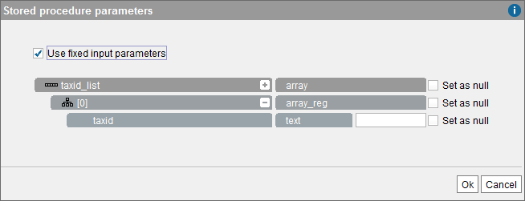

==========================================
Use of Stored Procedures in Creating Views
==========================================

Virtual DataPort stored procedures can be used to create new derived
views.

More specifically, an invocation of a stored procedure may appear in the
``FROM`` clause of any query or view definition. The stored procedure
will be considered a view which schema includes all input and/or output
parameters (that is, of type ``IN``, ``OUT``, ``IN_OUT``) of the stored
procedure, and with a single search method (see section :ref:`Query
Capabilities`). The search method of a view generated from a stored
procedure will have one obligatoriness (``OBL``) constraint for every
input parameter (``IN`` or ``IN_OUT``).

To create a view that combines data obtained by a stored procedure, open
the dialog to create the view, click the tab “Model” and drag the
procedure from the Server Explorer to the dialog of the new view (join,
union, minus, intersect, etc.). Then, if the procedure includes input
parameters, they can be added to the new view by clearing the **Use
Input Parameters** check box (see `Parameters of a procedure added to a
new view`_). Otherwise, the user has to fill in the input values.

   Parameters of a procedure added to a new view

