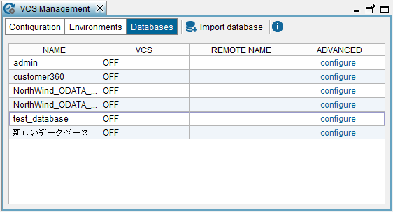
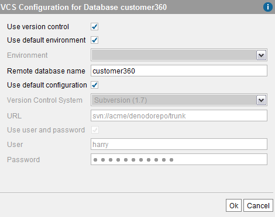

======================
Database Configuration
======================

After enabling the VCS integration in the Server, you have to enable it
for a specific database. To do this, click **VCS management** on the
menu **Administration** and then, click **Databases**.

   Database-specific VCS management

In this wizard, configure the VCS settings of the databases. The column
“VCS” indicates if the VCS integration is activated for each database.

Click **configure** to enable/disable version control in a database.

   Enabling version control for a database

In this dialog, you have to provide following:

-  **Use version control**. Select to enable VCS integration for this
   database.
-  **Use default environment**. If selected, the database will use the
   environment selected for the global VCS configuration.
-  **Environment**. A database can use an environment different to the
   one specified in the global VCS configuration.
-  **Remote database name**. By default, this parameter matches the
   local database’s name. Changing this parameter’s value allows several
   local databases to be synchronized against the same
   version-controlled database. This is useful if there are several
   developers working on the same version-controlled database in the
   same server (see section :ref:`Centralized Workflow with Private Databases`).
-  **Use default configuration**. True by default. Note that regardless
   the value of this option, the environment and the remote database
   name of a database can always be configured. If a database is
   configured not to use the default VCS configuration, all of the
   parameters explained in the section :ref:`Virtual DataPort Server
   Configuration` can be overwritten.

