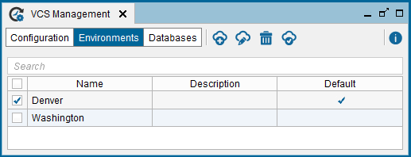

======================
Environment Management
======================

In Denodo, the term “Environment Management” refers to the management of
the metadata of the Denodo servers used at different locations.

Defining several environments is useful when:

-  The development team is geographically distributed. For example, there is a team of Denodo developers in London and another in Denver.
-  And on each location, there is a replica of the data sources they use. For example, there is one Oracle database in London and another Oracle database in Denver and their views, tables... are the same (although it's data may be different).
-  And the teams of each location want to point to the data sources of their own location.

If your organization *does not meet all* these conditions, we recommend creating only one environment called "development" and always use this one.

If your organization meets all these conditions, we recommend creating one environment for each location. For example, "development_london" and "development_madrid".

Do not create an environment for testing or production because we do not recommend using VCS to promote elements between environments.

What are VCS Environments
=========================

Certain properties of the metadata elements are considered
“environment-dependent”. For example, a data source may point to
a different database depending on the location of the Server. In this scenario, the access details (URI, access credentials…) for that
data source may be different depending on the environment.

Denodo manages this situation by introducing the concept of
“environment”. For each environment, Denodo can generate a file
specifying the metadata’s environment-dependent properties (e.g. the
URIs and connection details of data sources). When loading metadata from
a different environment, the metadata can be loaded using the 
properties of the target environment instead of the original properties.

An environment (in our VCS integration context) consists of a name and
an optional description. There are properties files in the VCS
repositories for each environment-dependent element:

-  One properties file for each environment that was active each time
   the element was checked in.
-  A default properties file, which will be used if there is no
   properties file for the selected environment when checking an
   element out. Each time an element is checked in, its default
   properties file is replaced in the VCS repository.

The section :ref:`Export to a File with
Properties` contains a full list of the elements that are considered
environment-dependent, along with their environment-dependent properties.

Managing VCS Environments
=================================================================================

To open the wizard to manage the VCS environments, click **VCS
management** on the menu **Administration** and then, click
**Environments**.

   Environments management screen

In this dialog, administrator users can manage the environments.

When you add/modify an environment, Virtual DataPort sends a commit to
VCS server with a properties file that contains the name of the
environment and its description. When you delete an environment, Virtual
DataPort deletes it from the VCS server.

By selecting an environment and clicking **Set as default**, the user
can choose what environment will be active when using the global VCS
configuration (this will be the case of the databases configured to use
VCS with the default environment, as seen on :ref:`Environment Management`).
After creating the first environment in a repository, it will be
automatically set as the default environment.

Note that after changing the server’s environment (either here or in the
specific configuration of a database, as seen in :ref:`Environment
Management`), the change will not be effective until the next time the
user executes a check in or check out operation, or a pull or a push.
This does not affect the databases with specific environment
configuration.

|

After creating the environments, you have to do one of these:

#. Enable version control in an existing database: see the section
   :doc:`Database Configuration </vdp/administration/version_control_systems_integration/vcs_configuration/database_configuration>`.
#. Or, import a database that was already uploaded to the VCS server by
   another user: see section :ref:`Importing an Existing Database from a VCS Server`.

