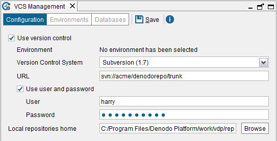

=====================================
Virtual DataPort Server Configuration
=====================================

To begin using the VCS integration, configure the VCS settings of the
Virtual DataPort server. To do this, click **VCS management** on the
menu **Administration** and then, click **Configuration**.

   VCS configuration screen

Configure the following parameters:

-  **Use version control**. Select it to enable the Version Control System
   support.

   After this, you have to enable it in the databases where you want to use
   the VCS integration (see section :ref:`Environment Management`). By default,
   it is disabled for all the databases.

-  **Environment**. Shows the selected environment. The first time you
   configure the VCS integration, there is no selected environment.

-  **Version control system**. Default version control system.

-  **URL**. The path to the root of the version control repository.

   -  Example for GIT: ``https://git.acme.com/product/project1.git``

   -  Example for Subversion: ``svn://acme/denodorepo/trunk``

   -  For Microsoft TFS:
      ``http://<server>:<port>/tfs/<collection>/<project>[[/<folder>]*/<branch>]``
      
      For example,
      ``http://acme:8080/tfs/collection1/project1/folderA/branch1``
      
      There are two different parts in this TFS URL:

      -  ``http://acme:8080/tfs/collection1`` is the URL of the TFS server.
      -  ``project1/folderA/branch1`` is used to obtain an appropriate
         “working folder” (a “working folder” is a TFS concept akin to the
         Subversion “working copy” concept)

      Although it is not mandatory, we recommend adding a ``<branch>`` to the
      URL, as it will be easier to add development branches in the future if
      we begin to work with branches from the start.

-  **Use user and password**. If cleared, the Server will use the
   authentication methods configured in the host operating system.
   
   When working with Microsoft TFS, if you clear this check box, Virtual
   DataPort will use the Windows authentication to connect to the TFS
   server. Therefore, the Windows user that launched Virtual DataPort
   must have granted the necessary privileges.

-  **User**. The user to access the specified repository.
   
   When working with TFS, the user name must be entered with the format
   ``<domain>\<user>``.

-  **Password**. The configured user’s password.

-  **Local repositories home**. Directory where the Server will create
   the local repositories for the databases with VCS enabled.
   
   .. warning:: Change this if you are going to work with Microsoft TFS.
      Microsoft TFS limits the maximum length on file paths so we
      strongly recommend changing this path to the shortest path possible.
      
      E.g. ``/tfs_rpo/`` or ``C:/tfs_repo``.
      You do not need to change this when working with GIT or Subversion.

.. warning:: After disabling and enabling the VCS integration or
   changing the “URL” of the VCS server, all the VCS metadata will be lost.
   That is, you will have to check in again all the elements of the
   databases you want to version.

   When using the support for GIT, the pull operations are performed with a
   fetch followed by a rebase.
