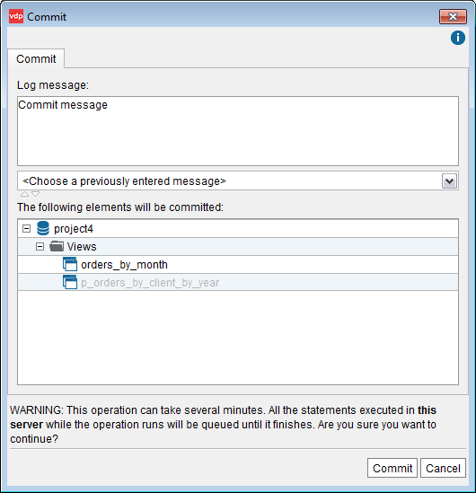
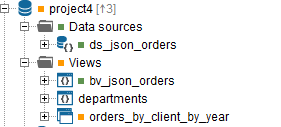
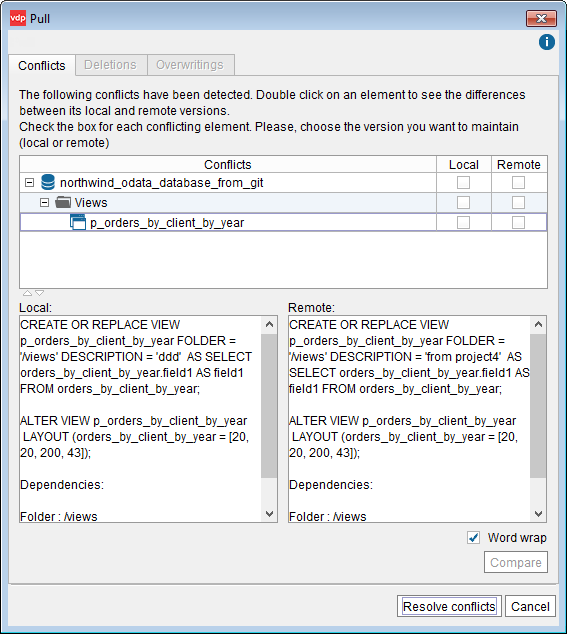
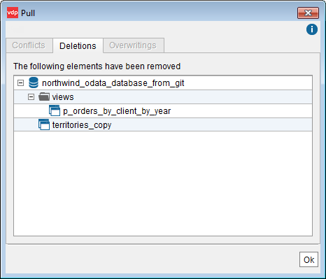
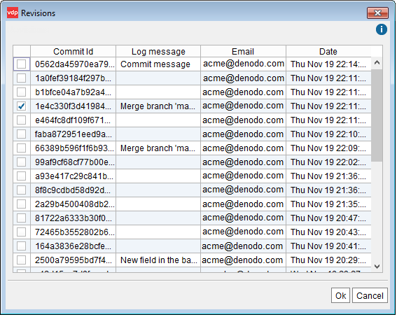

======================
VCS Operations for GIT
======================

The following subsections explain the GIT operations that Virtual
DataPort supports and how to use them:

-  Commit: see section :ref:`Commit`.
-  Push: see section :ref:`Push`.
-  Pull: see section :ref:`Pull`.
-  Revert: see section :ref:`Revert`.

The operations Pull, Push and Revert are available when you right-click
on a database but not when you right-click another element. The reason
is that these operations can only be performed over the entire
repository and not just an element.

Commit
=================================================================================

When you do a “commit”, Virtual DataPort generates the VQL of the
modified elements and commits it to the local repository.

You can commit a single element (its modified dependencies will be
committed as well), a folder or an entire database. To do this,
right-click on an element, a folder or a database and click **Commit**.
The Tool will display a dialog like the following:

   GIT: commit dialog

The deleted elements are displayed with a light-gray font.

Enter a “commit message” in the text box at the top of the dialog and
click **Commit**.

The fields *author* and *committer* of the commit will be the username of the user that has logged in the Administration Tool.

If, to obtain the value of these fields, you want to rely on the GIT configuration of the host where the Virtual DataPort server runs, execute this command from the VQL Shell:

   .. code-block:: vql
      
      SET 'com.denodo.vdb.vdbinterface.server.vcs.VCSConfigurationManager.useLoginAsAuthor' = 'false';
   
You *do not* need to restart to apply this change. 

When this property is set to false, the VCS module tries to obtain the user name from the system, in this order:
1. From the configuration file of the repository.
#. From the global gitconfig file.
#. The user name that runs the Virtual DataPort server.

Push
=================================================================================

Push is the operation to transfer commits from your local repository to
the remote repository.

Next to the name of the database, the Tool displays the number of
commits that have not been pushed. In the figure `GIT: number of pending
commits`_, the number of pending commits is 3. If there is no number, it
means that all the commits have been pushed.

   GIT: number of pending commits

To do a push, right-click on the database and click **VCS** > **Push**.
This will push all the commits performed on the selected database.

If the remote repository has commits that you have not pulled yet, the
Tool will display the error: “Error pushing database:
REJECTED\_NONFASTFORWARD”. In this case, you have to do a pull first and
then, a push.

Pull
=================================================================================

Pull is the operation to merge the changes on the remote repository into
your local repository. The pull operations are performed with a fetch
followed by a rebase.

To do a pull, right-click on the database and click **VCS** > **Pull**.

When doing a pull, there may be conflicts. This happens when there are
commits to be merged into your local repository and one of these commits
modifies an element that you also have modified.

When this happens, the Tool will display a dialog like the following:

For each element with a conflict, select the check box of the **Local**
column or the check box of the **Remote** column:

-  Select “Local” to keep your changes and ignore the changes of the
   remote repository.
-  Select “Remote” to overwrite your changes with the changes of the
   remote repository.

If a pull is going to delete elements from your local database, the Tool
will display a dialog like the following:

   GIT: list of removed elements after a pull operation

Revert
=================================================================================

The “revert” operation resets the local repository to a specific commit.
To do so, it reverts each commit, starting from the last one, until it
reaches the selected commit.

Only administrators and administrators of a database can revert to a 
previous version. This behavior prevents the problems that could arise if a 
standard user reverted to a version that would involve executing VQL statements 
that the user was not allowed to execute.

This only reverts elements that belong to the database (data sources, views, web services...) but it *does not* revert global elements (i18n or jar extensions).

To do a revert, right-click on the database and click **VCS** >
**Revert**. The Tool will display a dialog like the following:

   GIT: Reverting your database to a commit

After doing a revert, you have to do a push, to transfer to the remote
repository the commits that revert the changes.

|

To revert global elements, follow these steps:

1. Open the wizard to check in and out global elements: right-click on a database > **VCS** > **Global elements**. This wizard is only available to administrators. 

2. If the database is synchronized (i.e. there are not modified elements in it), the dialog will show the **Revert** button. If there are modified elements, you need to check them in and start again.

3. Select the element you want to revert and click **Revert**.

4. The tool will list all the commits in which the selected element was committed. Select the commit to which you want to revert and click **Ok**.
