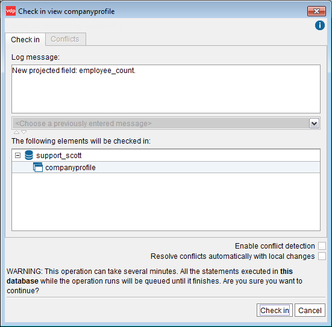
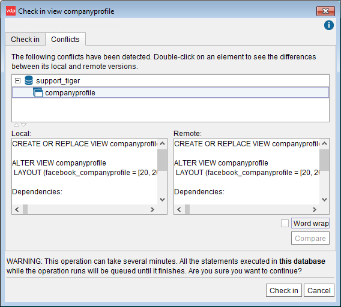
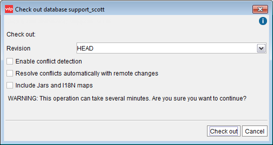
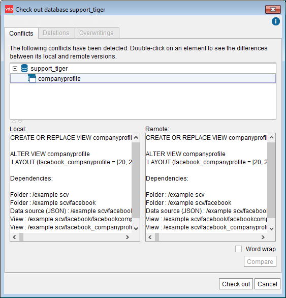

===============================================
VCS Operations for Microsoft TFS and Subversion
===============================================

The following subsections explains how the check in (commit) and check
out (update) operations work when using the VCS integration with
Microsoft TFS or Subversion.

Check In / Commit Operations
=================================================================================

The action of sending a resource to a version control repository is
commonly called check in or commit. A resource that is not under version
control needs to be added before being committed. In Virtual DataPort,
these commands are integrated into a single operation: *check in*.

You can check in a single element (and all their dependencies), a folder
or an entire database. When you do this, the Tool will display a dialog
that lists the elements that will be checked in. Enter a “check in
message” in the text box at the top of the dialog and click **VCS** >
**Check in**.

The *author* of the commit will be the username you entered in the dialog *VCS Management*.

When you work with VCS system, there is a conflict in an element when
you try to check in an element that has been modified and checked in by
another user, *after* the last time you checked-out this element. All
the VCS systems detect conflicts to prevent users from unknowingly
overwriting changes made by other users. Virtual DataPort also has a
“conflicts detection system” to help you when there are conflicts
between two resources.

The “check in” dialog has different options depending on if “conflicts
detection” is enabled or disabled on the Administration Tool. To know if
“conflict detection” is enabled, click **Admin Tool preferences** on the
menu **Tools** and then, click the **VCS** tab. If the check box “Enable
conflict detection” is selected, it means that “conflict detection” is
enabled. Note that this preference is set in the Administration Tool.
Therefore, is not a global setting.

If the conflict detection is disabled on the Administration Tool
(default and recommended option), the “Check in” dialog has two check
boxes (see `Check in dialog with “conflict detection” disabled`_):

   Check in dialog with “conflict detection” disabled

#. **Enable conflict detection** check box:

   a. If you select **Enable conflict detection** in the “Check in” dialog,
      the Server will look for conflicts between the local and the remote
      versions of the selected resources, before performing the commit.

      If there are no conflicts, the check in will be performed as expected.
      
      If there are conflicts, the Tool will switch to the “Conflicts” tab (see
      `Check in dialog: Conflicts tab`_), which will list the elements that
      have conflicts. Select an element to see the differences between the VQL
      of the local and the remote version. If you configured an external diff
      viewer tool, you can click **Compare** to see the differences in this
      external tool.
      
      To set the path to an external diff tool, open the **Admin Tool
      preferences** on the menu **Tools** and click the **VCS** tab (see more
      about this in the section :ref:`VCS Settings of the Administration Tool`).
      
      If there are conflicts, you have two options:
      
      i.  Overwrite the version stored in the VCS server with your local
          version. To do this, click **Check in**.
      ii. Overwrite your local version with the version in the VCS server. To
          do this, click **Cancel**. Then, on the Server Explorer, right-click
          the element and click **Check out** to obtain the version stored in
          the VCS server.

   b. If you clear the check box **Enable conflict detection**, the conflicts
      will be detected by the VCS server. When you click the **Check in**
      button on the “Check in” dialog, Virtual DataPort will try to commit of
      the changes. If there is a conflict, the operation will fail because the
      VCS server will return an error. The error returned by the VCS server is
      different in each VCS server. In Subversion, is “File xxx is out of
      date”.

   Check in dialog: Conflicts tab

2. **Resolve conflicts automatically with local changes**: if selected
   and there is a conflict in an element, the remote version will be
   overwritten by the local one.
   Be careful when selecting this option because it may lead to lose
   changes committed by other users unknowingly.

If conflict detection is enabled, the “check in” dialog does not display
these two check boxes (“Enable conflict detection” and “Resolve
conflicts automatically…”). The reason is that in this case, when you
right-click an element and then, “Check-in”, the Tool will look for
conflicts automatically. If there are any, the “Conflicts” tab will be
immediately displayed. If there are not, the tab will be disabled.

.. important:: In the Administration Tool, the “conflict detection
   system” is disabled by default because performing this process is slow;
   especially when the database has a lot of changes. So, it is better to
   rely on the VCS server to do this because it performs this process much
   faster. If, at any point, the check in operation fails because there is
   a conflict, you can open the “check in” wizard again and select the
   “Enable conflict detection” check box.

Check Out / Update Operations
=================================================================================

In Virtual DataPort, the *check out* and *update* commands are
integrated into a single operation: *check out*. You can check out a
single element and all their dependencies, a folder or the whole
database.

To check out an element, right-click it in the Server Explorer, and click
**VCS** > **Check out**. In the “Check out” dialog, in the **Revision**
list, you can select which revision you want to obtain or enter one,
manually. Usually you just want to use the default option: “HEAD”. If
you are checking out a database or a folder, you can check out the whole
database or folder, or just select one of its elements, by clicking
**Element** and selecting it in the list.

The “check out” dialog has different options depending on if “conflicts
detection” is enabled or disabled on the Administration Tool. To know if
“conflict detection” is enabled, open the **Admin Tool preferences**, on
the menu **Tools** and then, click tab **VCS**. If the check box “Enable
conflict detection” is selected, it means that “conflict detection” is
enabled. Note that this preference is set in the Administration Tool.
Therefore, is not a global setting.

If the conflict detection is disabled on the Administration Tool
(default and recommended option), the “Check out” dialog has three check
boxes (see `Check out dialog of a database with “conflict detection”
disabled`_):

   Check out dialog of a database with “conflict detection” disabled

#. **Enable conflict detection**:

   a. If you select **Enable conflict detection** in the “Check out” dialog,
      the Server will look for conflicts between the local and the remote
      versions of the selected resources.

      If there are no conflicts, the check out will be performed as expected.
      
      If there are conflicts, the Tool will switch to the “Conflicts” tab (see
      `Check out dialog: Conflicts tab`_), which will list the elements that
      have conflicts. Select an element to see the differences between the VQL
      of the local and the remote version.
      
      If you configured an external diff viewer tool, you can click
      **Compare** to see the differences in this external tool.
      
      To set the path to an external diff tool, open the **Admin Tool
      preferences** on the menu **Tools** and click the **VCS** tab (see more
      about this in the section :ref:`VCS Settings of the Administration Tool`).
      
      If there are conflicts, you have two options:
      
      i.  Overwrite your local version with the version stored in the VCS
          server. To do this, click **Check out**.
      ii. Overwrite the version of the VCS server with your local version. To
          do this, click **Cancel**. Then, on the Server Explorer, right-click
          the element and click **VCS** > **Check in** to store your version
          in the VCS server.

   b. If you clear the check boxes **Enable conflict detection** and **Resolve
      conflicts automatically…** and there is a conflict between an element
      that is modified locally and an element of the VCS server, the check out
      will fail.

2. **Resolve conflicts automatically with remote changes** (only available
   when “Enable conflict detection” is cleared):

   a. If selected and there is a conflict between an element that is
      modified locally and an element of the VCS server, your local version
      will be overwritten with the version from the VCS.
      
      Be careful when selecting this option because it may lead to lose
      your changes unknowingly.
   b. If cleared and there is a conflict between an element that is
      modified locally and an element of the VCS server, the check out will
      fail.

3. **Include Jars and I18N maps**: if selected, the Server will check out
   the jars and i18n maps that are dependencies of the checked-out
   elements. If during the check out process, the Server retrieves from the
   VCS a jar or an I18N map with the same name as a local unversioned jar
   or I18N map, it will be listed in the **Overwritings** tab of the
   following step of the wizard.

   Check out dialog: Conflicts tab

If conflict detection is enabled, the “check out” dialog does not
display the check boxes “Enable conflict detection” and “Resolve
conflicts automatically…”. The reason is that in this case, Virtual
DataPort will look for conflicts automatically.

.. important:: In the Administration Tool, the “conflict detection
   system” is disabled by default because performing this process is slow;
   especially when the database has a lot of changes. So, it is better to
   rely on the VCS server to do this because it can do it much faster. If,
   at any point, a check out operation fails because there is a conflict,
   you can open the “check out” wizard again and select the “Enable
   conflict detection” check box.

If as a result of a check out, one or more elements are deleted, they
are listed in the check out dialog, in the **Deletions** tab.

