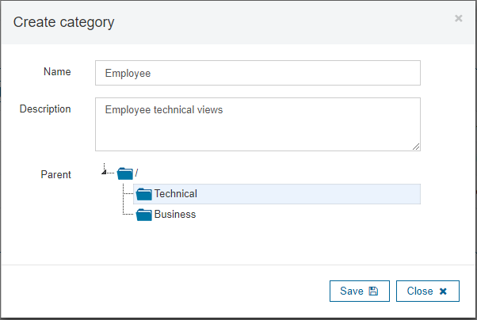
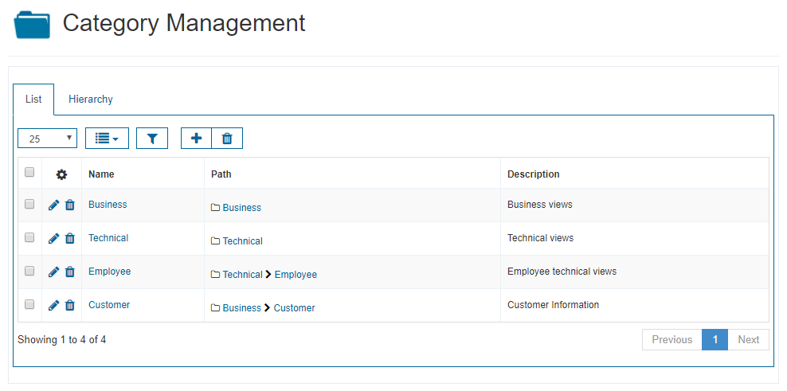
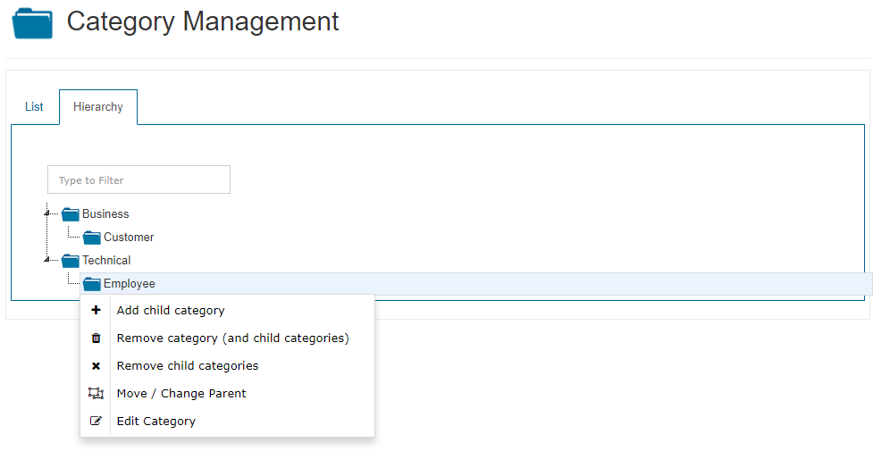
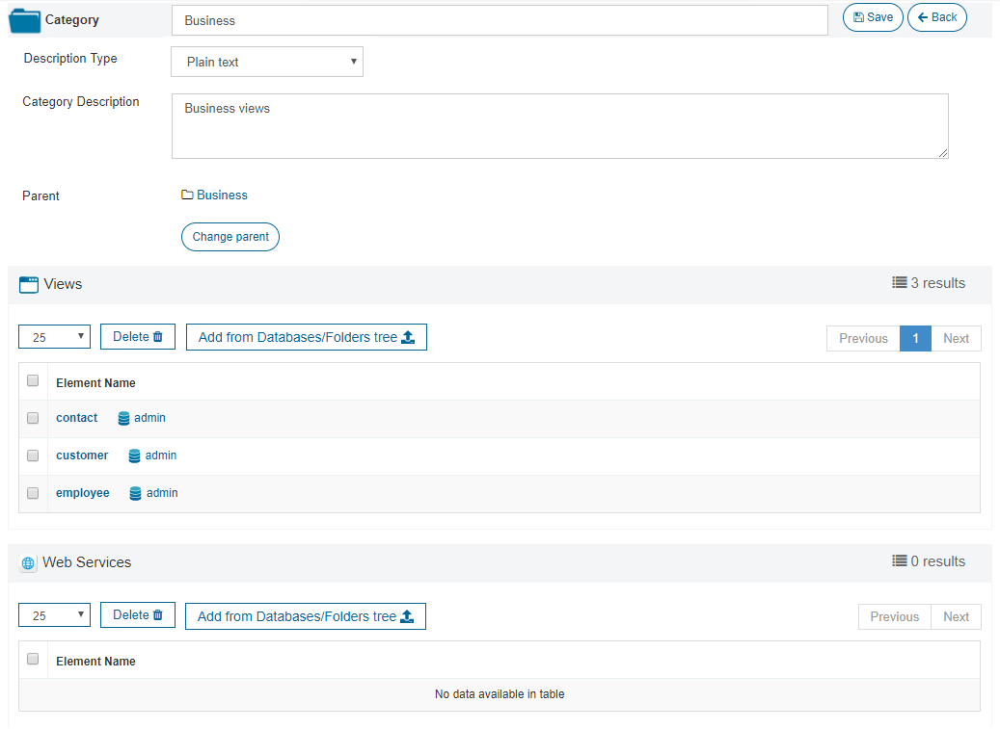
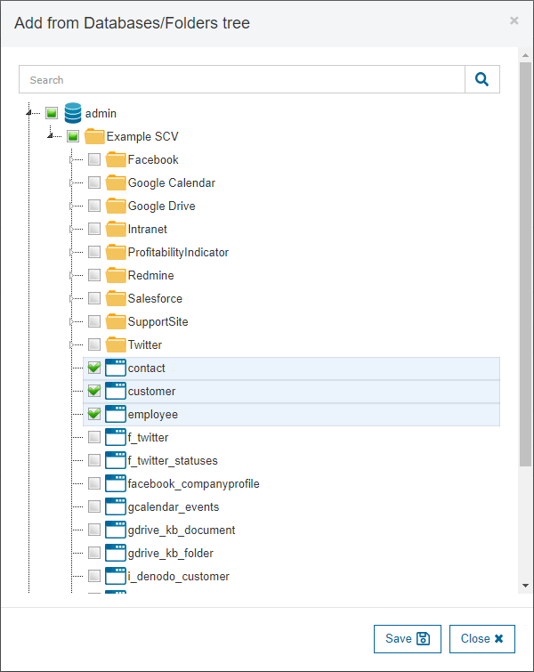

=========================
Categories Configuration
=========================

Categories are part of the catalog metadata. They are a way to classify views and web services 
into discrete groups of similar or related items according to some criteria (for instance, "business" views and "technical" views).
Each category can be seen as a strategic business unit.

In the “Category Management” section you can manage the categories: create new ones, edit the existing ones or remove them. Each category can have an undetermined
number of ancestors (which results in a "category path"), so they can be graphically seen as a list of categories or as a tree (hierarchy view).

When creating a new category, its path can be specified by selecting its parent node.

   Create a category

   Categories list
   
In the screen shown in the previous image, you can click on any part of the path of categories to see
the list of elements (views and web services from any database) assigned to that category (see section :ref:`Categories`).

   Categories hierarchy

Edit Categories
---------------
      
By clicking on the *Edit* icon, you will see a window like the one in `Edit Category`_, where you can modify:

- Its name.
- Its description.
- Its path, by modifying its parent.

Assigning Categories
--------------------

You can also see the list of elements that are classified inside that category, and remove them or add new ones, as shown in the following image:

   Add views from Databases/Folders tree to a Category
   
Here, you can click on any element name to browse it.
