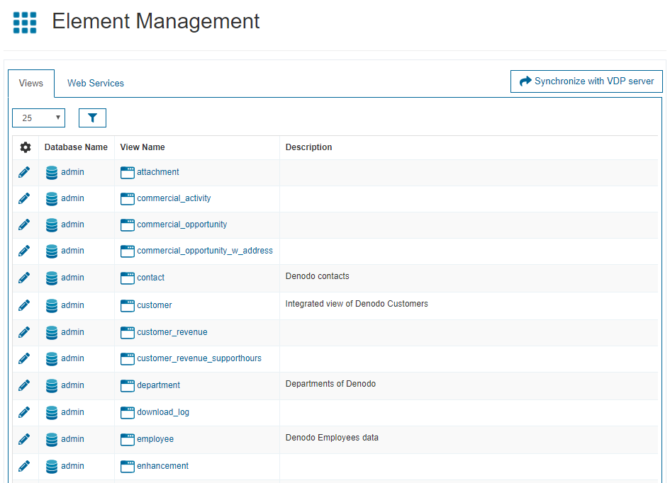
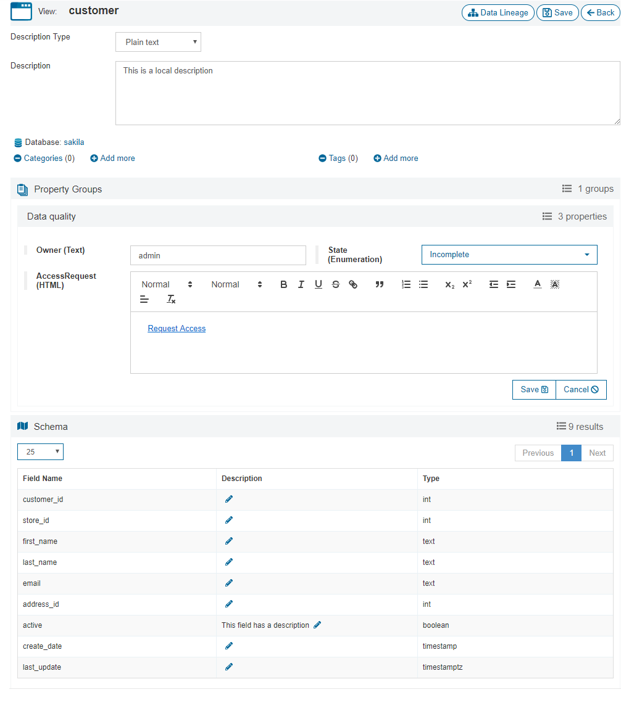
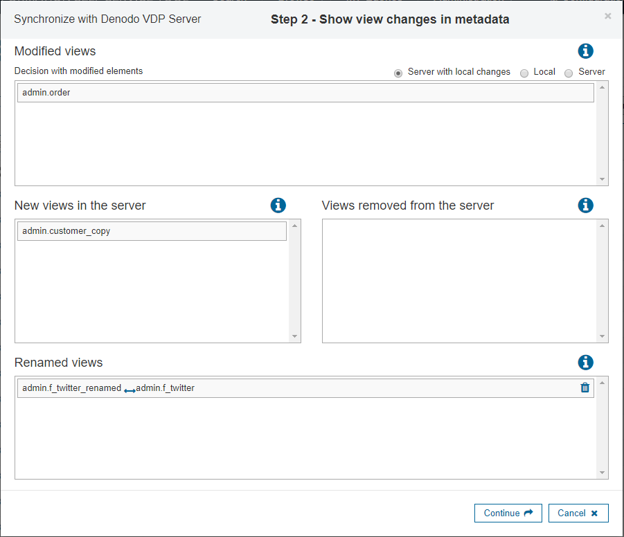

========================
Elements Configuration
========================

In the “Elements Management” section you have a list of all the elements (views and web services) you have synchronized with the Virtual DataPort server.
These are the elements you can classify by grouping them into categories (see :ref:`Categories Configuration`) or by assigning tags (see :ref:`Tags Configuration`) to them.

.. note:: This screen will be empty until you synchronize the server metadata. It is highly recommended to synchronize the metadata as the first step.

   Elements list

You can click on any :doc:`database </vdp/data_catalog/browse/databases_browse/databases_browse>`, :doc:`view </vdp/data_catalog/browse/views_browse/views_browse>` 
or :doc:`web service </vdp/data_catalog/browse/web_services_browse/web_services_browse>` to see its details. It redirects you to the respective screen in the :ref:`Browse <Browse>` section. 

|

Edit Elements
-------------

The button to edit a view or a web service is only visible if the user has administration privileges. In that case, you can edit a view or a web service to:

- Set a more meaningful description to them, that can be different from the description in the Virtual DataPort server. 
- Set a more meaningful description to each field of the schema, that can be different from the description in the Virtual DataPort server. 
- If it has properties groups assigned, you can modify their values.

In the following image, the view “customer” has a local description and the field “active” does too, whereas the same view in Virtual DataPort has no descriptions (as it is explained later in this section, when synchronizing elements with the Virtual DataPort server, you can choose whether to keep the local descriptions or replace them with the ones from the server).

   Editing a view

.. _data-catalog-synchronize-elements-with-the-server:

Synchronize Elements with the Server
------------------------------------

At any time, you can synchronize the metadata with the Virtual DataPort server, in order to keep this tool synchronized with it.
To do this, click on the button *Synchronize with VDP server*, and a process to check the local changes and missing elements would start.

.. note:: It is recommended to synchronize the Data Catalog every time a new deployment is executed from :ref:`Solution Manager <Deploying Revisions>`
   and some of its revisions contain elements for the Virtual DataPort server to which the Data Catalog is connected. 

Only the global administrators of the server and the users with the role *data_catalog_admin* can synchronize the elements.

   Synchronize Metadata with Denodo VDP Server

Next image shows the step 2 of this process, where there are several options:

-  **Modified views**: This list shows the views previously synchronized, that still exist in the Virtual DataPort server, but contain some differences of the following types:

   - Its schema has changed.
   - Its description or the description of any of its fields has changed.

   After synchronizing, the schemas will be updated to reflect the current ones of the server, and the descriptions can be updated in three different ways:

   -  If you choose the *Server* option, then the descriptions will be overwritten with the ones from the server.
   -  If you choose the *Local* option, all the descriptions of the Data Catalog will be preserved.
   -  If you choose the *Server with local changes* option, then the descriptions will be overwritten with the ones from the server, except the ones that have been edited from the Data Catalog (that will be preserved).

-  **New views in the server**: This list shows the views of the server that did not exist the last time the synchronize was executed. So, they currently do not exist in the Data Catalog and they will be created after synchronizing.

-  **Views removed from the server**: This list shows the views synchronized previously that currently does not exist in the server. So, they will be removed from the Data Catalog after synchronizing.

-  **Renamed views**: If a view previously synchronized has been renamed in the Virtual DataPort server, it will appear in the list of new views in the server (with its new name) and in the list of views removed from the server (with its old name). To preserve the Data Catalog changes in its description or the descriptions of its fields, you should indicate the correspondence between those two views by dragging one of them and dropping it into the other one.

Once the views are synchronized, the process to synchronize the web services starts, which has the same considerations explained above.

It is important to note that the user performing this operation should have (at least) metadata permissions over all the elements (in the Virtual DataPort server). If the user only has metadata permissions over some elements, then the synchronization will be executed as if the server would contain only those elements (i.e. if there is an element in the Data Catalog, previously synchronized by another user, which is still present in the VDP server, but the user does not have metadata permissions over that element, it will be removed from the Data Catalog).

.. note::
   The :ref:`Solution Manager <Solution Manager Administration Guide>` can be used to synchronize the elements when :ref:`promoting an environment <Data Catalog Server Synchronization>`.
   
