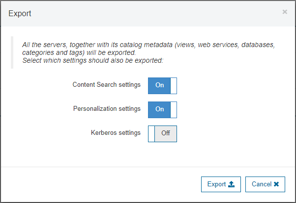
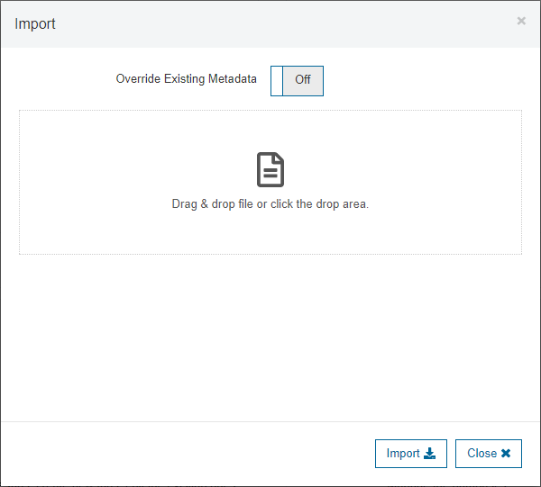

=======================================
Import and Export Data Catalog Metadata
=======================================

You can export and import the Data Catalog's configuration and metadata 
(categories, tags, saved queries, etc.) as a collection of JSON files packed 
in a zip file. There are three ways of doing this:

a. From the UI
#. With a script
#. Using the :ref:`API of the Data Catalog <data-catalog-rest-api-export-metadata>`.

They are all equivalent. The last two are useful to automate the promotion of categories and tags between environments (e.g. from testing to production).

Import and Export Data Catalog Metadata from the UI
===================================================

To export the metadata from the UI, click |image1|. The **Export** dialog will appear. All the servers, 
together with its catalog metadata (views, web services, databases, 
categories and tags) will be exported. You can choose additional settings to be
exported by checking the corresponding options: **Content Search settings**, 
**Personalization settings** and **Kerberos settings**.

   Export Dialog

To import the metadata from the UI, click |image0|. The **Import** dialog will appear. Here you can drag &
drop a metadata file or select one in a file chooser by clicking the drop area.
You can choose to **Override Existing Metadata** if you check the corresponding
option.

   Import Dialog

Import and Export Data Catalog Metadata Using a Script
======================================================

To export and import the metadata of the Data Catalog use the script ``export`` and ``import`` located at :file:`{<DENODO_HOME>}/tools/data-catalog`.

.. rubric:: Export Data Catalog Metadata

Usage:

.. code-block:: bnf

    export -h <host> -p <port> -l <login> [ -P <password> ] 
           [ -s <Virtual DataPort server> ] 
           -f <output file> 
           [ -contentSearch ] [ -personalization ] [ -kerberos ]

Execute ``export ?`` to see the syntax to invoke this tool.
 
.. table:: Parameters of the export script

   +-------------------------+---------------------------------------------------+
   | Parameter Name          | Description                                       |
   +=========================+===================================================+
   | ?                       | Shows the help.                                   |
   +-------------------------+---------------------------------------------------+
   | -h                      | Host name or IP of the Data Catalog               |
   +-------------------------+---------------------------------------------------+
   | -p                      | Port of the Data Catalog (by default is 9090)     |
   +-------------------------+---------------------------------------------------+
   | -l                      | Login to connect to the Data Catalog              |
   +-------------------------+---------------------------------------------------+
   | -P                      | Password to connect to the Data Catalog           |
   |                         |                                                   |
   |                         | You can encrypt your                              |
   |                         | password using the                                |
   |                         | script                                            |
   |                         | :file:`{<DENODO_HOME>}/tools/data-catalog\        |
   |                         | /encrypt_password`                                |
   |                         |                                                   |
   |                         | That way you can avoid                            |
   |                         | entering it in plain                              |
   |                         | text.                                             |
   |                         | If the password is encrypted, prefix it with      |
   |                         | ``encrypted:``.                                   |
   |                         |                                                   |
   |                         | E.g.                                              |
   |                         | ``--password encrypted:Gr16MjvuXhRzPtPH/yTXHw==`` |
   +-------------------------+---------------------------------------------------+
   | -s                      | Virtual DataPort server. You have to specify this |
   |                         | if there is more than one server registered with  |
   |                         | the Data Catalog. Otherwise, it is optional.      |
   +-------------------------+---------------------------------------------------+
   | -f                      | Output file                                       |
   +-------------------------+---------------------------------------------------+
   | -contentSearch          | Export the content search settings.               |
   +-------------------------+---------------------------------------------------+
   | -personalization        | Export the personalization settings.              |
   +-------------------------+---------------------------------------------------+
   | -kerberos               | Export the Kerberos settings.                     |
   +-------------------------+---------------------------------------------------+

.. rubric:: Example

.. code-block:: bash 

   export -h localhost -p 9090 -l admin -P encrypted:xxxxxxx -f data_catalog_metadata.zip -contentSearch -personalization

.. rubric:: Import Data Catalog Metadata

Usage:

.. code-block:: bnf 

    import -h <host> -p <port> -l <login> [ -P <password> ] [ -s <Virtual DataPort server> ] -f <input file> [ -override ]

Execute ``import ?`` to see the syntax to invoke this tool.

.. table:: Parameters of the import script

   +-------------------------+---------------------------------------------------+
   | Parameter Name          | Description                                       |
   +=========================+===================================================+
   | ?                       | Shows the help.                                   |
   +-------------------------+---------------------------------------------------+
   | -h                      | Host name or IP of the Data Catalog               |
   +-------------------------+---------------------------------------------------+
   | -p                      | Port of the Data Catalog (by default is 9090)     |
   +-------------------------+---------------------------------------------------+
   | -l                      | Login to connect to the Data Catalog              |
   +-------------------------+---------------------------------------------------+
   | -P                      | Password to connect to the Data Catalog           |
   |                         |                                                   |
   |                         | You can encrypt your                              |
   |                         | password using the                                |
   |                         | script                                            |
   |                         | :file:`{<DENODO_HOME>}/tools/data-catalog\        |
   |                         | /encrypt_password`                                |
   |                         |                                                   |
   |                         | That way you can avoid                            |
   |                         | entering it in plain                              |
   |                         | text.                                             |
   |                         | If the password is encrypted, prefix it with      |
   |                         | ``encrypted:``.                                   |
   |                         |                                                   |
   |                         | E.g.                                              |
   |                         | ``--password encrypted:Gr16MjvuXhRzPtPH/yTXHw==`` |
   +-------------------------+---------------------------------------------------+
   | -s                      | Virtual DataPort server. You have to specify this |
   |                         | if there is more than one server registered with  |
   |                         | the Data Catalog. Otherwise, it is optional.      |
   +-------------------------+---------------------------------------------------+
   | -f                      | Input file                                        |
   +-------------------------+---------------------------------------------------+
   | -override               | Add this to override the Data Catalog metadata    |
   |                         | and configuration parameters.                     |
   +-------------------------+---------------------------------------------------+

Example:

.. code-block:: bash 

   import -h localhost -p 9090 -l jsmith -P encrypted:xxxxxxx -f data_catalog_metadata.zip -override

