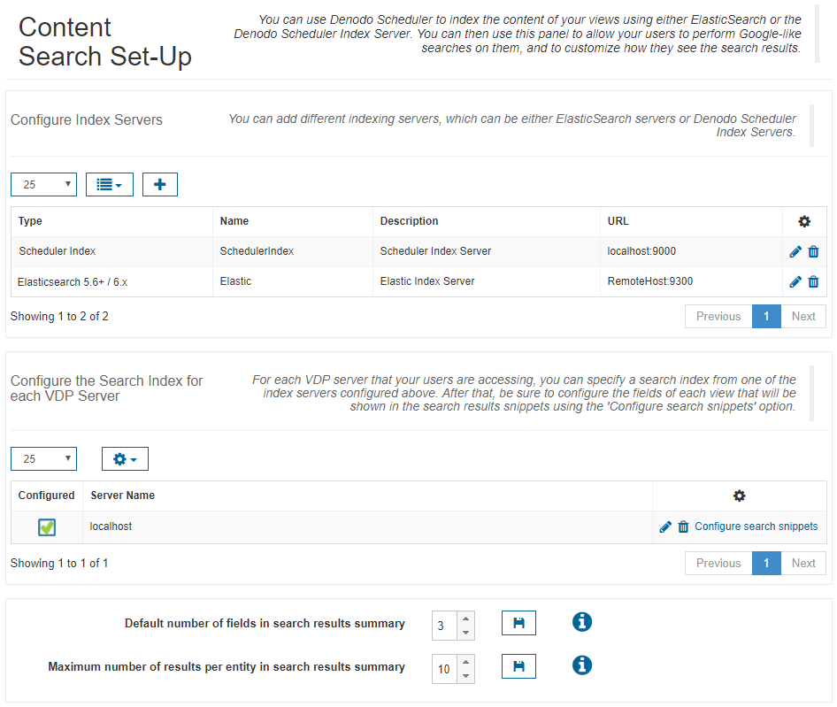
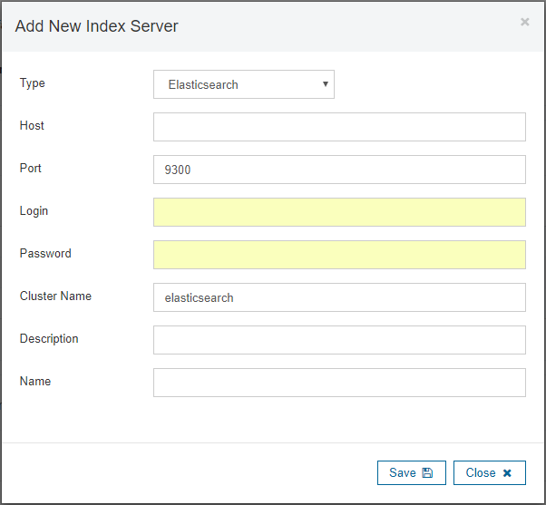
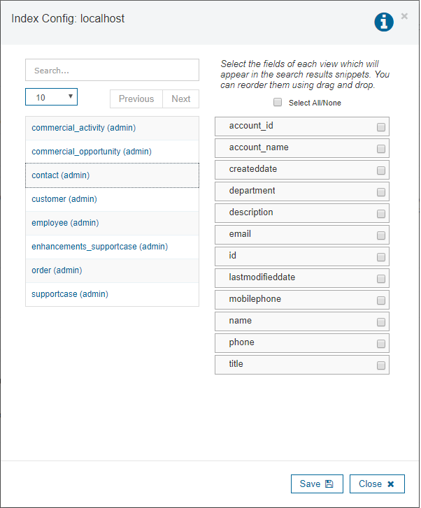

====================
Search Configuration
====================

In the “Search configuration” tab you configure the search index for
the server, that will allow you to do quick searches over all the data
of the databases’ views in that server.

There are two types of supported indexes:

-  *Scheduler Index*: you have to specify a Scheduler Index server and the
   name of an index contained in that server.
-  *Elasticsearch*: you have to specify an `Elasticsearch <https://www.elastic.co/>`_ server and the name of
   an index contained in that server. This is the recommended option for
   big indices, using an Elasticsearch server running on cluster. 
   Elasticsearch indexes are divided into two types, according to the Elasticsearch server's version:
   
   - *Elasticsearch 2.x*: You have to choose this one when the server has version 2.x.
   - *Elasticsearch 5.6.+ / 6.x*: You have to choose this type when the Elasticsearch server has version 5.6.0 or later.

Note that, in order to use Scheduler Index or Elasticsearch indices, you first
have to add the index server, as shown in the figure `Search Configuration Wizard`_.

To enable the search feature over a server, follow these steps:

#. Index the desired databases from the server by using the VDPIndexer job type (see 
   section :ref:`Configuring New Jobs` of the 
   Scheduler Administration Guide).

#. In the “Search configuration” tab:

   a. First you need to add the index
      server to be used. Once you click the icon to add a new index server
      (see `Search Configuration Wizard`_), a dialog is opened to specify the server
      configuration parameters (see `Adding a new index server`_).

      i.   First you have to choose the **Type** of index server: *Scheduler Index*, *Elasticsearch 2.x* or *Elasticsearch 5.6.+ / 6.x*.
      ii.  The following parameters are common to both types or servers:

           1. **Name** and **Description** (optional) to be assigned to the server.
           #. **Host** and **port** where it is running.
           #. **Login** (optional) and **password** (optional) to connect to the
              server.

      iii. In the case of the Elasticsearch servers you also may configure the
           **Cluster Name** (optional) which contains the index to be used.

           .. note:: At any moment you can edit or delete the index servers using
              the corresponding icons of the *Actions* column of the table.

   b. Click the edit icon of the pertinent server in the **Edit** column of
      the table and

      i.   Select the **Index Type**: *Scheduler Index*, *Elasticsearch 2.x* or *Elasticsearch 5.6.+ / 6.x*.
      ii.  Select the
           **Index Server** previously configured (the dropdown will show only
           the names of the servers of the selected type) and enter the
           **Index Name**.

The two configuration options in the top of the Search tab allow
configuring how many fields and results will be shown, by default, per
each view, in the search results summary (see section :doc:`/vdp/data_catalog/search/search`). The
fields will be selected randomly. It is possible to configure the fields
to be shown per each view by clicking the icon of the column **Select
view fields**. A dialog similar to the one of the `Selecting view
fields`_ will be shown. This dialog shows, on the left side, the list of
views contained in the index. Clicking the view name will show, on the
right side, the fields of that view. Then, you can select the fields to
be shown in the search results summary (clicking the check boxes) and its
order (dragging and dropping them).

   Search Configuration Wizard

   Adding a new index server

   Selecting view fields

Note that the index configured for a server may not contain all its
views (i.e. some views could have been indexed, but not all of them), or
all the data of all the views (i.e. some views could have been indexed
partially). In this case, the searches will be
restricted to the indexed views and tuples.
