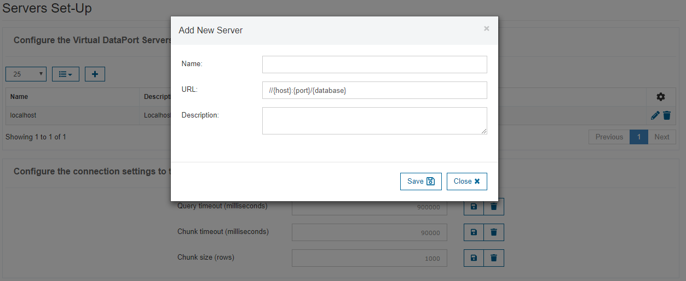
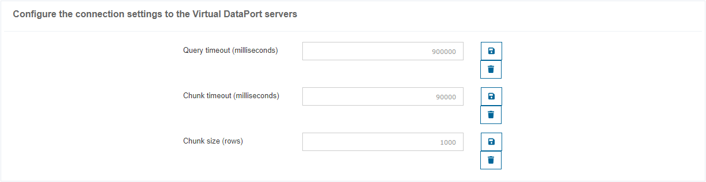

=====================
Servers Configuration
=====================

Configure the Virtual DataPort Servers
--------------------------------------

In the “Servers Configuration” tab you configure the Virtual DataPort
servers that are listed in the login dialog.

If you add/modify a server, its URL has to contain a database, which
will be used to authenticate the users.

From this section you can add, edit and delete the servers.

   Servers Configuration: adding a new server

.. note:: The :ref:`saved queries <Saved Queries>` are
   stored per user and Virtual DataPort server. The servers are identified
   by an internal identifier, so if a server is edited, it will maintain
   the same queries associated to it. However, if the server is removed,
   the queries are removed too.

Configure the Connection Settings to the Virtual DataPort Servers
-----------------------------------------------------------------
   
You can also configure the following global parameters of the connections created to execute queries 
against the Virtual DataPort Servers:

- Query timeout: maximum time (in milliseconds) that the query will wait for the
  statement to be completed. If not indicated (or the value 0 is received), then
  it waits until execution is complete (by default 900000).
- Chunk timeout: maximum time (in milliseconds) that the query will wait until 
  it arrives a new chunk of results. Where this time is exceeded, Virtual DataPort
  returns the results extracted up to that moment. If not specified (or the value 
  0 is received), Virtual DataPort returns all the results together at the end of
  the statement run (by default 90000).
- Chunk size: number of results that make up a chunk of results. When
  Virtual DataPort Tool obtains this number of results, it will return them to the 
  Data Catalog, even though the *Chunk Timeout* has not been reached 
  (by default 1000).

  

   Servers Configuration: connection settings to the Virtual DataPort servers

Configure the Internal Database Used by the Data Catalog
--------------------------------------------------------

Denodo Data Catalog comes with an out-of-the-box embedded database (Apache Derby) where it stores all of its metadata.
But you can specify another database to store them. To do that, you have to provide the following information:

-  **Database**. Select the database you want to use to store the metadata. You can choose among these ones:

   -  Derby Embedded
   
   -  MySQL 5.7
   
   -  Oracle 12c
   
   -  PostgreSQL 9.5
   
   -  SQL Server 2014
   
   -  Amazon Aurora for MySQL 5.7 and PostgreSQL 9.5
   
-  **Driver Class**. Name of the Java class of the JDBC adapter to be used. This field is automatically filled depending on the selected database.
-  **URI**. Database access URI.  This field is automatically filled  with a template depending on the selected database.
-  **Username** (optional). Username for accessing the external database.
-  **Password** (optional). User password for accessing the external database.
-  **Max Active Connections** (optional). Maximum number of active connections that can be managed by the pool at the same time (zero means no limit).
-  **Max Idle Connections** (optional). Maximum number of active connections that can remain idle in the (zero implies no limit).
-  **Max Wait Time (milliseconds)** (optional). Maximum amount of time to wait for an idle object when the pool is exhausted (-1 means no limit).
-  **Ping Query** (optional). SQL query used by the pool to verify the status of the connections that are cached. The query should be simple, and the table in question should exist. For instance: ``select * from dual()``.

.. note:: 
   -  When the selected database is ``Derby Embedded``, the fields *Driver Class*, *URI*, *Username* and *Password* are not editable.
   -  When the selected database is ``MySQL 5.6``, make sure that MySQL - or the database in MySQL you are going to use - is configured with the options "Default Charset = utf8" and "Collation = utf8_unicode_ci".

Prior to configure these settings, copy the database driver/s to the directory 
:file:`{<DENODO_HOME>}/lib/data-catalog-extensions` or in the directory :file:`{<TOMCAT>}/lib` if you are using an external Apache Tomcat to deploy the Data Catalog. Then restart the Data Catalog.

As a summary of the needed steps:

#. :ref:`Export <Import and Export Data Catalog Metadata>` all your current metadata first, so that you can later import it in the new configured database. 
   This is **highly recommended** if you want to keep your current metadata in the new database.

#. Copy the database driver/s to the directory
   :file:`{<DENODO_HOME>}/lib/data-catalog-extensions`
      
   For instance, if you want Oracle 12 to be the new database for the Data Catalog metadata, copy the files ojdbc6.jar and orai18n.jar from :file:`{<DENODO_HOME>}/lib/extensions/jdbc-drivers/oracle-12c` to :file:`{<DENODO_HOME>}/lib/data-catalog-extensions`. 
    
   Similar steps should be done with any other of the supported databases.

#. Restart the server
    
   #. Execute the script 

      .. code-block:: bash
        
         <DENODO_HOME>/bin/webcontainer_shutdown

   #. Open the Virtual DataPort administration tool and log in as an
      administrator user.

   #. Open the VQL Shell and execute

      .. code-block:: vql
       
         WEBCONTAINER STATUS

      In the first line of the result, you should see *Web Container:
      stopped* (if not, wait for half a minute and try again).

   #. From the VQL Shell, execute:

      .. code-block:: vql
          
         WEBCONTAINER START

      This will start the web container, including all the Denodo SOAP and
      REST web services.

#. Start the Denodo web administration tools you use and the Data Catalog as usual.

#. Launch the Data Catalog and configure the database settings through its :ref:`form <Servers Configuration: configure the internal database>`.

   .. figure:: InformationSelfServiceTool-server-database.png
      :align: center
      :alt: Servers Configuration: configure the internal database
      :name: Servers Configuration: configure the internal database

      Servers Configuration: configure the internal database

   When saving, the Data Catalog checks that it can reach this database. You will be prompted to create the necessary tables if they do not exist yet. 
   
   If you click *Yes*, they will be created automatically
        
   To execute the script, you can specify a different user from the one configured in the form. This is useful if the configured one does not have the required privileges to create the tables.
    
   Alternatively, you can create them manually using the scripts (:file:`.sql`) of the directory 
   :file:`{<DENODO_HOME>}/resources/apache-tomcat/webapps/denodo-data-catalog/WEB-INF/classes`.

   .. note:: In the case you are configuring clustering, you would only have to manually create the tables once.
   
#. Changes will be applied after restarting the server.

#. If you exported the metadata in step 1, :ref:`import <Import and Export Data Catalog Metadata>` it in the new database.
