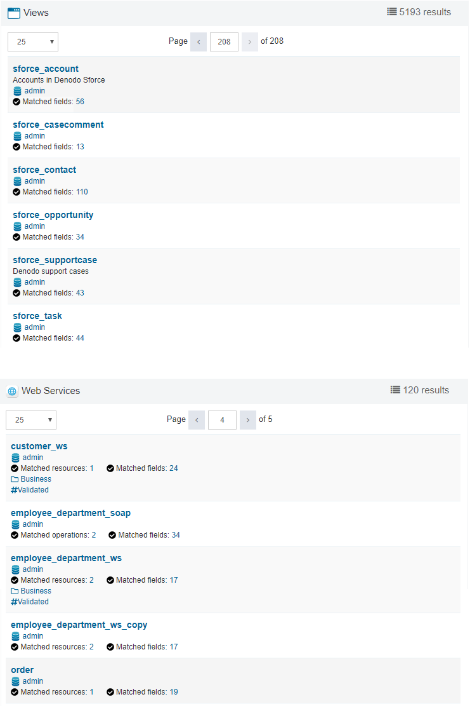

======
Browse
======

The menu *Browse* has four submenus:

1. :ref:`Databases/Folders <Databases>`
#. :ref:`Categories <Categories>`
#. :ref:`Tags <Tags>`
#. :ref:`relationships <Relationships>`

The main purpose of this section is to find a view or web service by navigating through the different types of elements: databases, categories or tags.

|

.. note:: When accessing the :ref:`Databases/Folders <Databases>`, the data comes directly from the Virtual DataPort server, so it is real-time data. However, when accessing the :ref:`Categories <Categories>` and :ref:`Tags <Tags>`, the data comes from the metadata currently stored in the Data Catalog, so changes in the underlying Virtual DataPort server that have not yet been synchronized are not shown.

.. note:: When accessing the :ref:`Databases/Folders <Databases>`, the Data Catalog obtains the list of folders, views and web services from the Virtual DataPort server in real time. However, when accessing the :ref:`Categories <Categories>` and :ref:`Tags <Tags>`, the data comes from the metadata stored in the Data Catalog, so if users made changes since the last time the metadata of the Data Catalog was synchronized, these changes are not reflected in these two dialogs.

By default, when accessing any of its subsections (:ref:`Databases/Folders <Databases>`, :ref:`Categories <Categories>` and :ref:`Tags <Tags>`), a list with all the elements (views and web services) is shown (see image below).
The only differences are the options on the sidebar, which depends on the element type (you can filter the results by each type of metadata element).

   Browse

Besides, you can see the :ref:`relationships <Relationships>` (associations) among the views (all the views in the server or just some filtered by database).

.. toctree::
   :hidden:

   databases_browse/databases_browse.rst
   categories_browse/categories_browse.rst
   tags_browse/tags_browse.rst
   associations_browse/associations_browse.rst
   views_browse/views_browse.rst
   web_services_browse/web_services_browse.rst