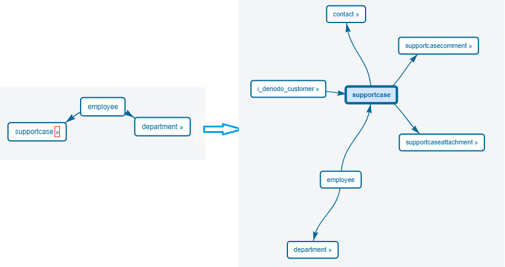

=====================
Associations of Views
=====================

Associations were already explained in the section :ref:`Relationships`.

The “Relationships” tab displays the associations of the current view
(see `Associations of selected view (a) and expanded association
(b)`_).

Click on the view with the arrow (|image0|) next to its name to see the
associations of that view. If a view does not have this arrow, it means that it does not have more associations.

   Associations of selected view (a) and expanded association (b)

