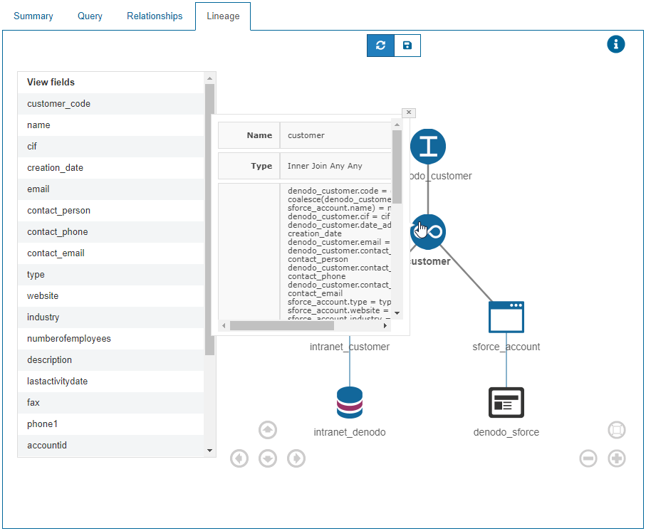
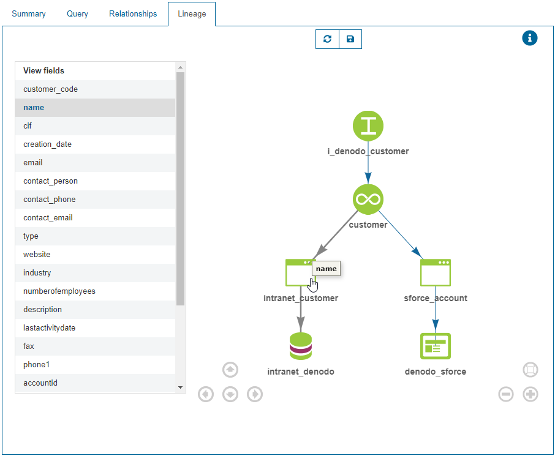
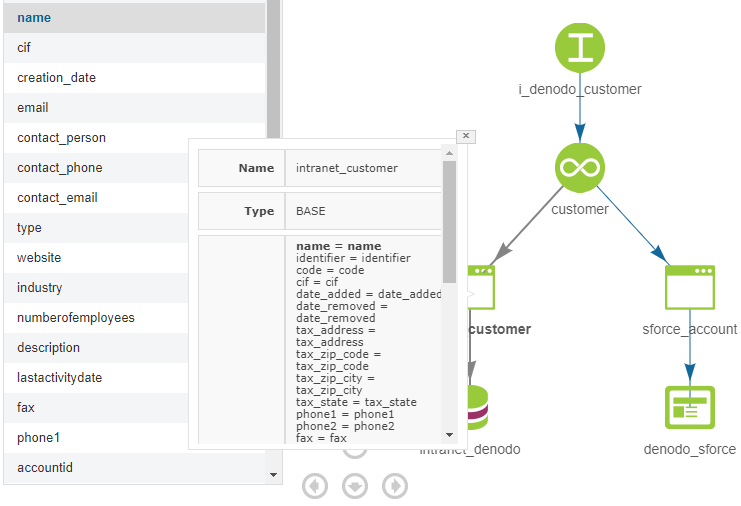

================
Lineage of Views
================

The “Lineage” tab displays a graph of the data sources and views used to
build the current view (considering it is not a base view). It also
displays the source where the information of each field comes from. As
explained in the graph for associations, this graph allows you to zoom in/out and to move
through it with the mouse or with the arrows in the image. You can also
export the current image.

By clicking on a node, you can see all its data: name, type, projected
fields, where conditions, join conditions, etc., as shown in `Data
lineage for Customer view`_.

   Data lineage for Customer view

You can also inspect the data lineage for a specific field. On the left
side of the dialog, there is a list of all the view’s fields. By
clicking on one of the fields, all the views and data sources that
participate in the creation of this field will be highlighted (in
green). For instance, if a field *f* is obtained by evaluating an
expression involving two fields *f1* and *f2* from different data
sources, Virtual DataPort will highlight the data sources (and their associated
views) providing *f1* and *f2*, and the view where the expression to
obtain the value of *f* is defined. As an example, if you select the
field *name*, only the left side of the tree is highlighted (green
color). On mouse over (see `Data lineage for a field: mouse over`_), you
can see the name of the field of the view involved in the lineage and if
you click on the node (see `Data lineage for a field: information about
a node`_), the same information as shown in `Data lineage for Customer
view`_ appears, but with the field involved in the lineage highlighted
(bold font).

   Data lineage for a field: mouse over

   Data lineage for a field: information about a node

It is important to note that the information shown within the data
lineage depends on the permissions of the current user. This way:

-  To see the data sources, the user must have (at least) ``METADATA`` privileges over
   them; otherwise, they will not appear in the graph.   
-  To see the views, the user must have (at least) ``METADATA`` privileges over
   them; otherwise, a node with the legend “No Privileges” will appear.

