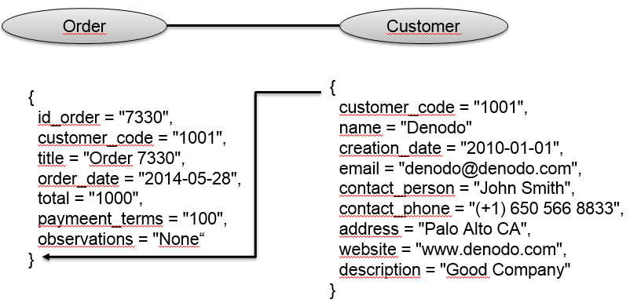

==============
Query of Views
==============

From the “Query” tab, you can query the view.

The page is divided into two sections:

- :ref:`Query Definition`: helps you to build the query.
- :ref:`Query Results`: shows the results after executing the built query. 

To display all the data of the view, select some output columns and click |image0|. You can also add
conditions to filter the data obtained from the view.

Query Definition
----------------

It is the graphical way of building a query. It is divided in two parts:

   Query Definition

-  The left side (red) contains the fields to work with:

   -  **Fields**: contains the list of all the fields of the view (they can be sorted alphabetically and/or filtered). You can multi-select some fields and drag-and-drop them to the right side.
      In addition to the fields of the view, a special field called 
      ``NUMBER_OF_RECORDS`` is available as a shortcut for adding a ``count(*)`` 
      field to the output.

      .. figure:: query-setup-fields.png
         :align: center
         :alt: Query Definition - Fields
         :name: Query Definition - Fields

         Query Definition - Fields

   -  **Relationship Fields**: contains the list of fields that are used in the condition mapping of an 
      association with cardinality 1. In this case, you can select which fields of the associated view you want to add to the
      result.

      For example, if you are querying the view “employee” and you want to see the data of the view “department” and there is an association between “employee” and “department” with cardinality 1 in the end point of the “department” view, you can select the fields of the “department” view you want to add to the result. You can also order the results by these fields.

      .. figure:: query-setup-fields-relationship-fields.png
         :align: center
         :alt: Query Definition - Relationship Fields
         :name: Query Definition - Relationship Fields

         Query Definition - Relationship Fields

-  The right side (green) is the working area, where you add the fields from the left side and edit them to configure the final query.

   -  **Outputs**: shows the list of fields that will conform the output schema of the query and in which 
      order they appear. You change the order by drag-and-drop a field to
      the position you want. After adding a field to this section,
      you can edit in (contextual menu), to change its name or to create an expression.

      Click **Add new field** to add a new field to the output. The tool will automatically detect whether it is a *derived* or an *aggregation* field. 
      
      -  If it is a derived field, you cannot use expanded fields in the expression assigned.
      -  If it is an aggregation field, a ``GROUP BY`` expression is automatically added to the query.

      .. note:: Because the syntaxis for the expanded fields is ``<role_name>/<field>``, the ``/`` cannot be used as an operator. The function ``DIV`` has to be used instead.

      .. figure:: query-setup-output.png
         :align: center
         :alt: Query Definition - Output
         :name: Query Definition - Output

         Query Definition - Output

   -  **Filters**: complex conditions to filter the data of the view. If the view contains mandatory fields, 
      the wizard will automatically create a filter for each one. If they are deleted, 
      another filter or expression must be created to give value to that field. 
      The user would only have to complete their expressions.

      You can use ``date``, ``time`` and ``timestamp`` literals in your queries. 
      If the selected field is of date type, an example value with the appropriate format (taking into account the subtype of the field) is shown.

      .. figure:: query-timestamp.png
         :align: center
         :alt: Query date
         :name: Query date

         Query date

   -  **Order by**: order the results by one or more fields. You can drag-and-drop fields from the list of "Fields" or
      from the "Outputs". Once a field is added to this section, you can change its order mode (ascendant/descendant)
      by clicking on the arrow.

      .. figure:: query-setup-order.png
         :align: center
         :alt: Query Definition - Order By
         :name: Query Definition - Order By

         Query Definition - Order By

.. note:: You can use :ref:`expanded fields <Expanding Associations>` (of associations with 
   cardinality 1) in the following places of the query:

   -  Outputs

   -  Filters

   -  Order By

   -  GROUP BY clause (automatically generated)

   The expanded fields are used in the same way as 
   the fields of the view being queried and will be 
   shown with the syntax ``<role_name>/<field>``.

After building the query, click |image0| to execute it. At any time, you can stop the query execution.

.. figure:: query-stop.png
   :align: center
   :alt: Cancel a query
   :name: Cancel a query

   Cancel a query

In these wizards, the expression editor provides the autocomplete
functionality and highlights the different elements that make up the
expression with different colors (function names, fields, literals,
operators, etc.). Besides, the fragments not identified as any of the
possible element types, will be highlighted in red.

At the right side of the **Query Definition** bar, there is a link 
(|image3|) to save the query executed to obtain these results. It is associated
to the current user and server and will be shown in the saved queries
section (see section :ref:`Saved Queries`). This is useful if the executed
query is complex and you are going to execute it often or if you want to
deploy it to the Virtual DataPort server.

You can obtain the VQL that will be generated for the current query by clicking
|image5|.

Finally, you can export the results to a file by clicking |image4|. You
can select the following:

-  The output format: CSV, HTML, Excel or Tableau (the administrator can disable these options).

-  The number of exported results:

   -  All results.
   -  Only visible results. I.e. the part of the results you are currently
      seeing.
   -  Only the first *n* results.
   

   Export options

.. note::  If the view contains compound fields or expanded associations
   “to Many” (see section :ref:`Expanding Associations` for more information),
   those fields are going to be exported as a JSON string.

.. note:: When exporting to Excel the maximum number of results that will 
   be exported is 1.048.576

Query Results
-------------

Regarding the results, there are two special cases:

-  Compound fields: click the icon to see the value of its subfields on a
   pop-up.

-  Binary fields are shown as “[BINARY DATA]” and cannot be downloaded.

If the queried view has associations with other views and you included the links in the *Relationship Links* section of the *Query Definition*, you can browse
them by clicking |image1|. A new pop-up will be opened with the data at
the other side of the associations. It is also possible to expand
associations (see section :ref:`Expanding Associations` for more
information).

   Query results for Department view

In each cell of the table, if the content is too long, it will not
increase the height of the row, but a tool-tip will be used to show the
rest of the content and the height will be kept uniform for all the
rows.

The first column of each row contains an icon (|image2|) that shows in
a dialog (`Transposed table for first row`_) the data from that row in a
vertical format (it can be helpful when a table has too many columns,
because it is difficult to see the results of a complete row).

   Transposed table for first row

Expanding Associations
=================================================================================

Expanding an association between two entities means that related
tuples/entities are included inline in the results. For instance,
suppose a scenario with entities *Order* and *Customer*, as shown in
`Expanding an association (“to One”)`_. Each tuple in *Order* is
associated with a tuple in *Customer* (thanks to PK-FK relationship).
This way, when querying an order, you can eagerly retrieve the data from
the customer that ordered it. The same way, when querying a customer,
you can retrieve all his/her orders.

   Expanding an association (“to One”)

Following with this example, you can have two scenarios:

#. Associations “to One”: like in the former example, where an order
   belongs to a customer (and only to that customer). This way, as
   conceptually shown in `Expanding an association (“to One”)`_, you can
   select the fields from the associated view (*Customer*) you want to
   eagerly retrieve when retrieving the data from the order. To do that,
   you have to select the fields you want to expand (see `Selecting fields
   from an association to be expanded`_) and they will appear in the result
   (see `Association expanded`_).

   Selecting fields from an association to be expanded

   Association expanded

2. Associations “to Many”: a tuple in a view is related to one or more
   tuples in other view. It is the case of a customer that may have done
   several orders. This way, you can traverse the association and see
   all orders done by a particular customer. To do that, you have to
   select the fields you want to expand (see `Selecting fields to expand
   the orders of a customer`_) and an icon to expand the association
   will be added to the table (see `Link to expand the orders for a
   customer`_). You can click on the icon |image1| and a new pop-up will be displayed with 
   the orders for the desired customer.

.. figure:: InformationSelfServiceTool-41.png
   :align: center
   :alt: Selecting fields to expand the orders of a customer
   :name: Selecting fields to expand the orders of a customer

   Selecting fields to expand the orders of a customer

   Link to expand the orders for a customer

   Pop-up with the expanded association

.. |image1| image:: ../../common_images/browse_association.png

.. |image3| image:: save_query.png

