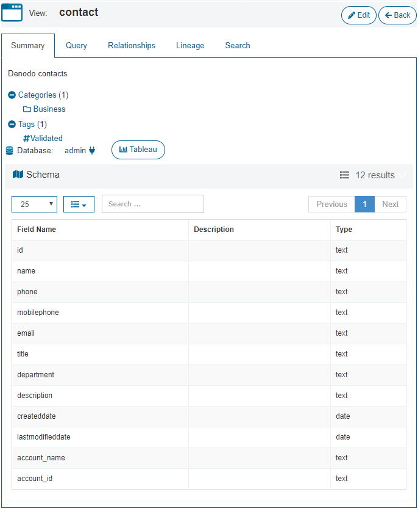
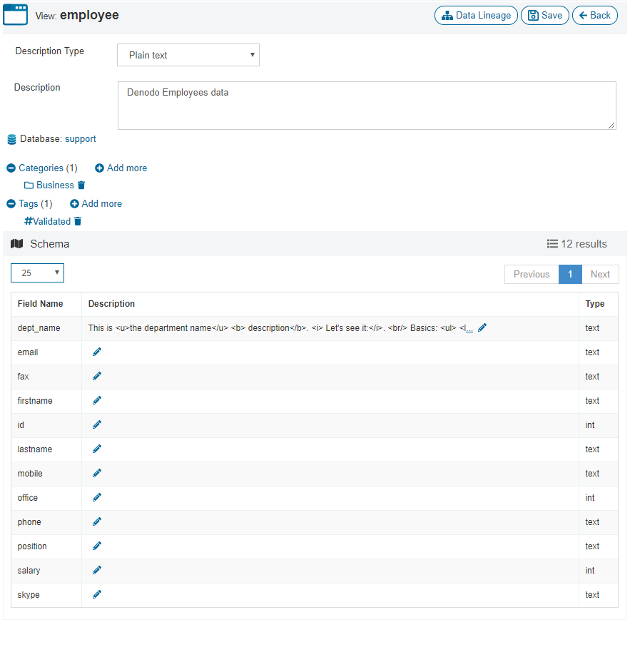
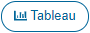

================
Summary of Views
================

The “Summary” tab shows the metadata of the selected view:

-  Name of the view, its description and its database.

-  The categories it belongs to. Click on a category to see the views and web services of that category.

-  The tags it has assigned. Click on a tag to see the views and web services that have that tag assigned.
   
-  Click the button |image0| to obtain the URIs to connect to the Denodo server to query this data, using different protocols. The administrator may have disabled this option. 

-  Click the button |image1| to obtain a file with ``tds`` extension. Load this file in Tableau Desktop to query this view from there. The connection will be established using the Tableau's named connector for Denodo.

   If you do not see this button is because you do not have the necessary privileges to query this view.

   .. note:: To load this file, you need Tableau Desktop 10.5.0 or later.

-  The schema of the view: list of fields, their name, description and type. If you modify the description of a field, you can use HTML syntax.
   

   View summary

If you are an administrator, click **Edit** (at the top) to change the following:

-  The description of the view. If you want to use HTML syntax, in the box **Description type**, select **HTML**.
-  The description of each field.
-  Add/remove the view from categories and assign tags to the view.

   View edit
   

   