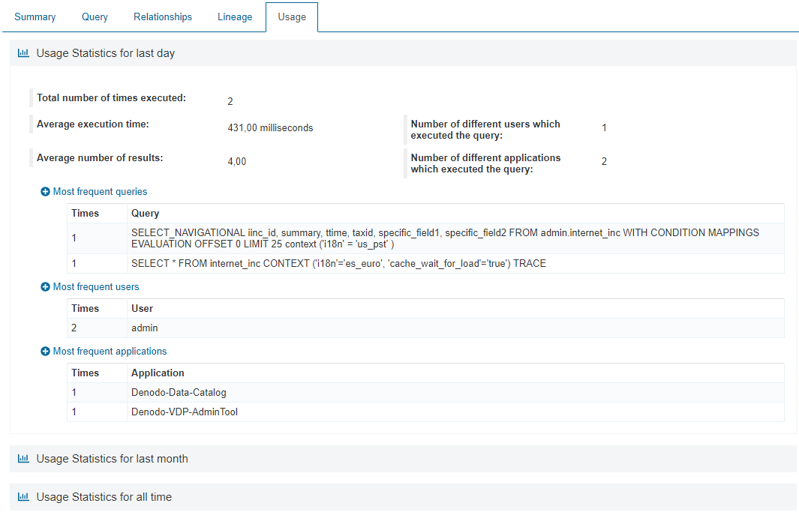

==============
Usage of Views
==============

The Data Catalog allows showing usage statistics of the views by analyzing the usage data collected by Denodo Virtual DataPort.
This feature requires some :ref:`preparation steps <Steps to configure the gathering of statistics>`, that will have to be performed 
by an user with administration privileges.

This tab is only visible when the administrator configures the Data Catalog to collect statistics and the computed ones contain
some information about this view.

These statistics include the following information for the selected periods (*Last day*, *Last month* and/or *All time*):

- Number of times the view was executed.
	
- Average execution time.

- Average number of results.

- Number of different users which executed the query.

- Number of different applications which executed the query.

- Ten more frequent queries (if enabled in the configuration of the usage statistics).

- Three more frequent users (if enabled in the configuration of the usage statistics).

- Three more frequent applications (if user agent is enabled in the configuration of the usage statistics).

   
   Usage tab with statistics

.. note:: These options will only work as expected if the activity information about the specified periods is available.
   