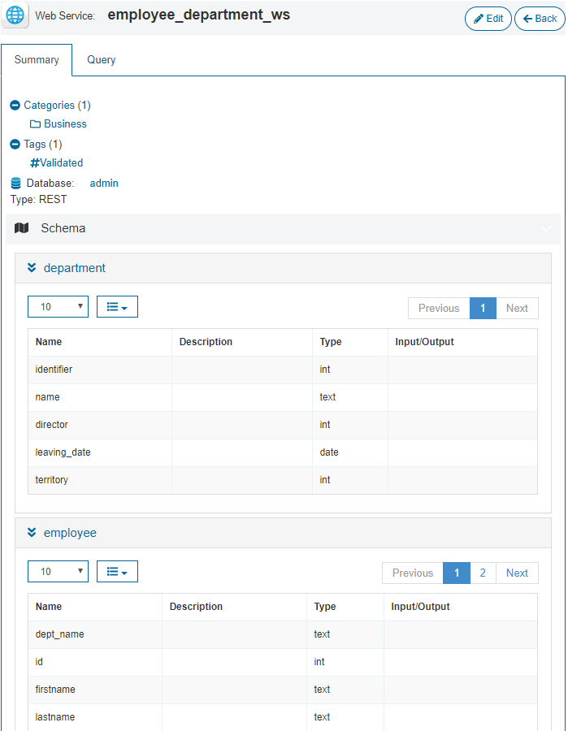
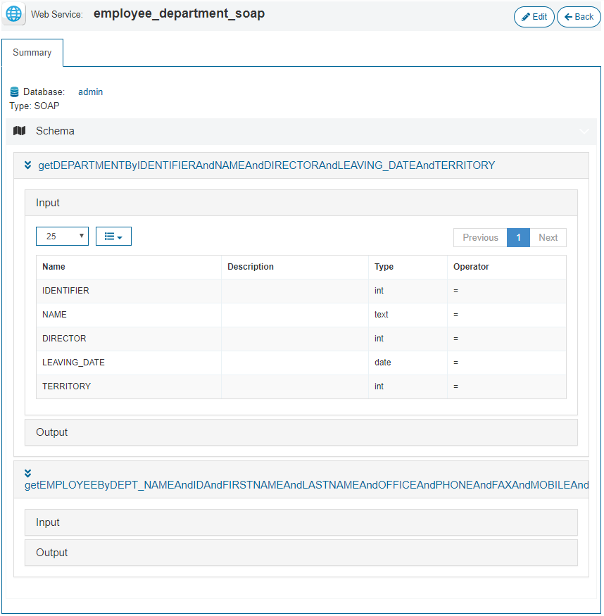
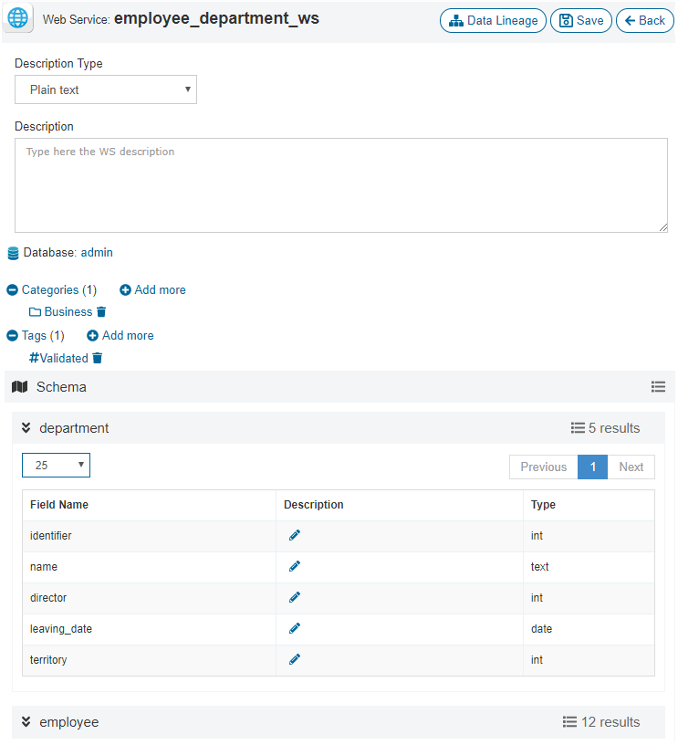

=======================
Summary of Web Services
=======================

The “Summary” tab shows the metadata of the selected view:

-  Its name.
-  Its description.
-  The list of the categories it belongs to.

   - You can click on any of the category names to browse the views and web services grouped in that category.
-  The list of the tags it has assigned.

   - You can click on any of the tag names to browse the views and web services that have that tag assigned.
-  The database name.

   - You can click it to browse the views and web services within that database.

-  Its type: REST or SOAP.
-  Its schema: the list of its fields, with their name, description and type.
   
   - The description may contain HTML markup.
   

   Web Service REST summary
   

   Web Service SOAP summary

The button to edit the web service is only visible if the user has administration privileges.
In that case, you can modify:

- Its description.
- Add or remove categories and tags.
- The description of each field.

   Web Service edit
   