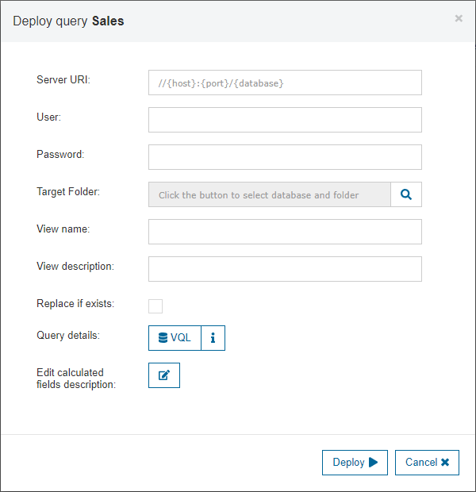
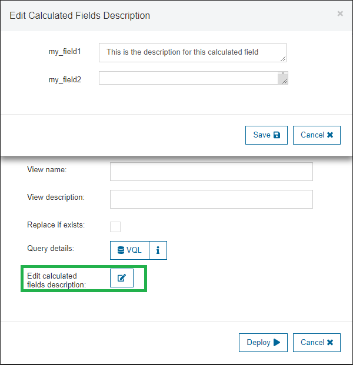
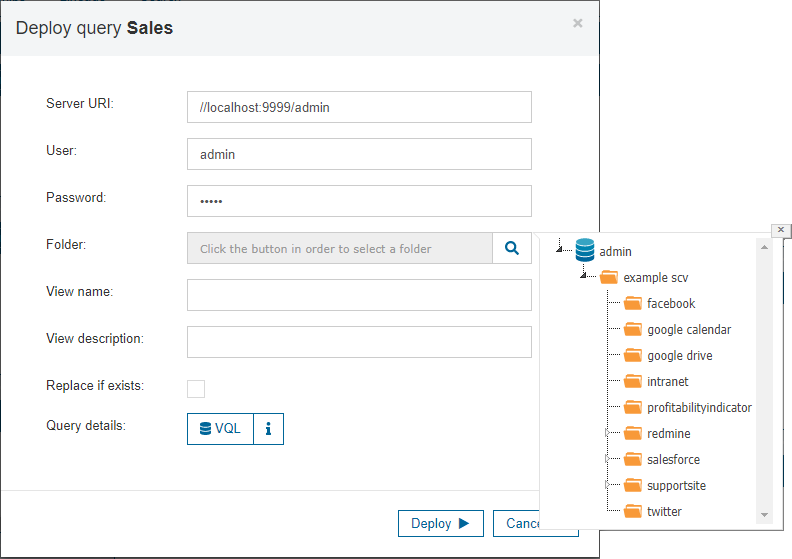

=======================
Deploying Saved Queries
=======================

Click the icon |image0| associated to each query to create a derived
view in the Virtual DataPort server, with the VQL sent by the tool to
the server to execute that query. When you click this icon, you
will see a dialog like the one in `Deploying a query to the Virtual
DataPort server`_, where you have to fill in the following information:

-  **Server URI**: connection URI to the server where the query is going
   to be deployed as a view.
-  **User**: username for connecting to the Virtual DataPort server.
-  **Password**: password associated with the specified user.
-  **Folder** (optional): the folder where the view is going to be
   created. If empty, the view will be created at the root of the
   database. By clicking |image1| you can see the structure of folders 
   within the selected database and server, and select the desired one.
   
-  **View Name**: the name of the view that is going to be created.
-  **View Description** (optional): a description for the view that is
   going to be created.
-  **Replace if exists** (optional): check to indicate if the view
   should be replaced if it already exists in the server.
-  **Edit calculated fields description** (optional): this option is only shown 
   if the query to be deployed has calculated fields (i.e. fields created by 
   the user in the output section when building the query). In this case, you can 
   give a description to each calculated field, which will be saved in the 
   deployed view in the Virtual DataPort server.

   Deploying a query to the Virtual DataPort server
   
   

   Giving descriptions to calculated fields

   Showing folders when deploying a query

Clicking the icon |image0| in the dialog of the `Deploying a query to
the Virtual DataPort server`_ the user can see the VQL which will be
used to create the view (i.e. the VQL sent by the tool to server to
execute the query).

.. note:: The purpose of the feature "Deploy queries" is to foster a collaborative 
   environment in which Business Users suggest the views they would like to have 
   available in the production environment. They can create the views themselves, 
   instead of asking the IT department to create them.
   
   Using the "Deploy queries" dialog, the business users can deploy their queries on a 
   Denodo development server. Afterwards, the IT department can review these new views, 
   and they can decide to promote them from the development server to the testing and/or 
   production environment, following the regular procedures.
   
.. important:: This feature is not intended to allow users of the Data Catalog to create views on the production servers. We discourage this use, 
   even if the user has creation privileges on the production server.
