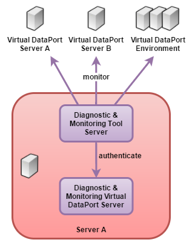
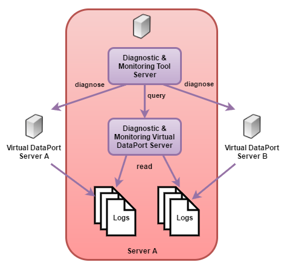

============
Architecture
============

The Diagnostic & Monitoring Tool is a web application that relies on a
Virtual DataPort server to operate.

The figure below shows the main architecture when it is used to monitor several
servers, i.e., when it is used to display real-time information about the
status of several Denodo servers.

   Architecture of the Diagnostic & Monitoring Tool when monitoring some servers

The components of this architecture are:

-  The Denodo servers you are going to monitor.

-  The Diagnostic & Monitoring Tool web application. It connects to the
   :ref:`JMX interface <Monitoring with a Java Management Extensions (JMX) Agent>`
   of the Denodo servers to gather real-time information about their status.

-  The Virtual DataPort server of the same Denodo installation where this
   Tool is installed (in the diagram, “Diagnostic & Monitoring Virtual
   DataPort Server”).

   The Tool uses this Virtual DataPort server to:
   
   -  Authenticate its users: to log in, users have to provide the same
      credentials they use when they connect to Virtual DataPort using the
      JDBC driver or the administration tool.
   -  During a diagnostic of a Denodo server, to query the logging data
      generated by that Denodo server and the Denodo Monitor that is
      monitoring that server.

The next figure shows the architecture of the Diagnostic & Monitoring Tool
when is used to diagnose several Virtual DataPort servers.

   Architecture of the Diagnostic & Monitoring Tool when diagnoses several servers

During a diagnostic, the Tool creates several data sources and views on
the local Virtual DataPort server to process the logs of the Virtual
DataPort server (vdp.log, vdp.log.1…) and the logs produced by the
Denodo Monitor that is monitoring this server (vdp-threads.log,
vdp-resources.log…). During the diagnostic tasks, the Tool sends queries
to the local Virtual DataPort server to obtain information from the
logs.
